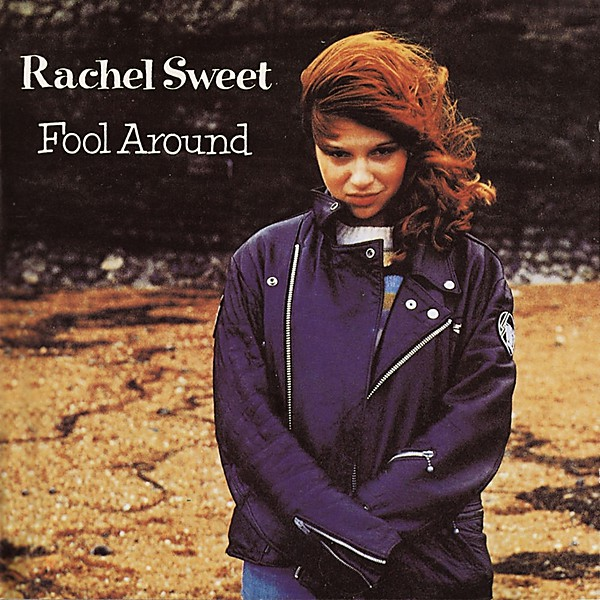

# Fool Around

By **Rachel Sweet**

## Album Data

- **Catalog:** Beets
- **Format:** Digital, Album
- **Album:** Fool Around
- **Artist:** Rachel Sweet
- **Albumartist:** Rachel Sweet
- **Genre:** New Wave
- **MusicBrainz Album Artist ID:** [0c085548-8a13-4c6a-ad32-2e773cc81717](https://musicbrainz.org/artist/0c085548-8a13-4c6a-ad32-2e773cc81717)
- **MusicBrainz Album ID:** [61a9b887-0f99-4704-bdd0-4428cd0176b9](https://musicbrainz.org/release/61a9b887-0f99-4704-bdd0-4428cd0176b9)
- **MusicBrainz Release Group ID:** [0411bfc0-8355-3964-ae69-e374b8ca825d](https://musicbrainz.org/release-group/0411bfc0-8355-3964-ae69-e374b8ca825d)
- **Year:** 2007
- **Catalog #:** 
- **Label:** Stiff Records
- **Total Tracks:** 16

## Album Tracks

### Track 01 - B‐A‐B‐Y

- **Artist:** Rachel Sweet
- **Format:** AAC
- **Genre:** New Wave
- **Length:** 3:09
- **MusicBrainz Track ID:** [7e95325d-9967-4ddf-90e4-cce55b48d33e](https://musicbrainz.org/recording/7e95325d-9967-4ddf-90e4-cce55b48d33e)
- **Title:** B‐A‐B‐Y
- **Track:** 01
- **Year:** 2007

### Track 02 - I Go to Pieces

- **Artist:** Rachel Sweet
- **Format:** AAC
- **Genre:** Pop
- **Length:** 2:45
- **MusicBrainz Track ID:** [f8692710-3cad-40ec-b778-4fe3fb2c9487](https://musicbrainz.org/recording/f8692710-3cad-40ec-b778-4fe3fb2c9487)
- **Title:** I Go to Pieces
- **Track:** 02
- **Year:** 2007

### Track 03 - Who Does Lisa Like

- **Artist:** Rachel Sweet
- **Format:** AAC
- **Genre:** Rock
- **Length:** 3:03
- **MusicBrainz Track ID:** [ac554a3f-3387-4369-933c-1c0dd0bfbf3e](https://musicbrainz.org/recording/ac554a3f-3387-4369-933c-1c0dd0bfbf3e)
- **Title:** Who Does Lisa Like
- **Track:** 03
- **Year:** 2007

### Track 04 - Wildwood Saloon

- **Artist:** Rachel Sweet
- **Format:** AAC
- **Genre:** New Wave
- **Length:** 3:58
- **MusicBrainz Track ID:** [8c165c87-af8c-4ec6-83c2-ce22276cb763](https://musicbrainz.org/recording/8c165c87-af8c-4ec6-83c2-ce22276cb763)
- **Title:** Wildwood Saloon
- **Track:** 04
- **Year:** 2007

### Track 05 - Stay Awhile

- **Artist:** Rachel Sweet
- **Format:** AAC
- **Genre:** Pop
- **Length:** 3:06
- **MusicBrainz Track ID:** [7db87c28-90b3-4c70-a2e6-55922c603cff](https://musicbrainz.org/recording/7db87c28-90b3-4c70-a2e6-55922c603cff)
- **Title:** Stay Awhile
- **Track:** 05
- **Year:** 2007

### Track 06 - Suspended Animation

- **Artist:** Rachel Sweet
- **Format:** AAC
- **Genre:** Rock
- **Length:** 3:21
- **MusicBrainz Track ID:** [a1a4f661-c0b2-416c-aaad-80e0fade73b4](https://musicbrainz.org/recording/a1a4f661-c0b2-416c-aaad-80e0fade73b4)
- **Title:** Suspended Animation
- **Track:** 06
- **Year:** 2007

### Track 07 - Sad Song

- **Artist:** Rachel Sweet
- **Format:** AAC
- **Genre:** Pop
- **Length:** 2:55
- **MusicBrainz Track ID:** [cb497c34-9b80-4aab-88f5-5d30d6405d6d](https://musicbrainz.org/recording/cb497c34-9b80-4aab-88f5-5d30d6405d6d)
- **Title:** Sad Song
- **Track:** 07
- **Year:** 2007

### Track 08 - It’s So Different Here

- **Artist:** Rachel Sweet
- **Format:** AAC
- **Genre:** New Wave
- **Length:** 2:50
- **MusicBrainz Track ID:** [885cba7b-e75f-4612-b87e-8cd6593aec5a](https://musicbrainz.org/recording/885cba7b-e75f-4612-b87e-8cd6593aec5a)
- **Title:** It’s So Different Here
- **Track:** 08
- **Year:** 2007

### Track 09 - Cuckoo Clock

- **Artist:** Rachel Sweet
- **Format:** AAC
- **Genre:** New Wave
- **Length:** 2:48
- **MusicBrainz Track ID:** [82b5baf4-31e8-450d-a91a-c3e74cf35b4a](https://musicbrainz.org/recording/82b5baf4-31e8-450d-a91a-c3e74cf35b4a)
- **Title:** Cuckoo Clock
- **Track:** 09
- **Year:** 2007

### Track 10 - Stranger in the House

- **Artist:** Rachel Sweet
- **Format:** AAC
- **Genre:** New Wave
- **Length:** 4:09
- **MusicBrainz Track ID:** [c7f79752-e300-457c-84dc-c83170192cc8](https://musicbrainz.org/recording/c7f79752-e300-457c-84dc-c83170192cc8)
- **Title:** Stranger in the House
- **Track:** 10
- **Year:** 2007

### Track 11 - Pin a Medal on Mary

- **Artist:** Rachel Sweet
- **Format:** AAC
- **Genre:** Rock
- **Length:** 3:10
- **MusicBrainz Track ID:** [abee85d0-1eb1-4c32-aacc-c8ac33333475](https://musicbrainz.org/recording/abee85d0-1eb1-4c32-aacc-c8ac33333475)
- **Title:** Pin a Medal on Mary
- **Track:** 11
- **Year:** 2007

### Track 12 - Just My Style

- **Artist:** Rachel Sweet
- **Format:** AAC
- **Genre:** Rock
- **Length:** 3:17
- **MusicBrainz Track ID:** [2b35b58d-32c4-4991-95cf-cb02ab1ac414](https://musicbrainz.org/recording/2b35b58d-32c4-4991-95cf-cb02ab1ac414)
- **Title:** Just My Style
- **Track:** 12
- **Year:** 2007

### Track 13 - Girl With a Synthesizer

- **Artist:** Rachel Sweet
- **Format:** AAC
- **Genre:** New Wave
- **Length:** 2:38
- **MusicBrainz Track ID:** [bb2c4c84-8bca-42d3-8991-02ef3ebc7fac](https://musicbrainz.org/recording/bb2c4c84-8bca-42d3-8991-02ef3ebc7fac)
- **Title:** Girl With a Synthesizer
- **Track:** 13
- **Year:** 2007

### Track 14 - Truckstop Queen

- **Artist:** Rachel Sweet
- **Format:** AAC
- **Genre:** Rock
- **Length:** 3:12
- **MusicBrainz Track ID:** [43ea4256-5fa8-4a31-bb18-e792baa9d1ca](https://musicbrainz.org/recording/43ea4256-5fa8-4a31-bb18-e792baa9d1ca)
- **Title:** Truckstop Queen
- **Track:** 14
- **Year:** 2007

### Track 15 - Tourist Boys

- **Artist:** Rachel Sweet
- **Format:** AAC
- **Genre:** Rock
- **Length:** 3:56
- **MusicBrainz Track ID:** [40c700d5-9fc4-43aa-a5c9-48534d514a8a](https://musicbrainz.org/recording/40c700d5-9fc4-43aa-a5c9-48534d514a8a)
- **Title:** Tourist Boys
- **Track:** 15
- **Year:** 2007

### Track 16 - Be Stiff

- **Artist:** Rachel Sweet
- **Format:** AAC
- **Genre:** Pop
- **Length:** 2:31
- **MusicBrainz Track ID:** [e3c8c4b8-04b9-40e0-b6cb-7ee49d50d093](https://musicbrainz.org/recording/e3c8c4b8-04b9-40e0-b6cb-7ee49d50d093)
- **Title:** Be Stiff
- **Track:** 16
- **Year:** 2007

## See also

- [Roon: Fool Around](../../Roon/Rachel_Sweet/Fool_Around.md)
