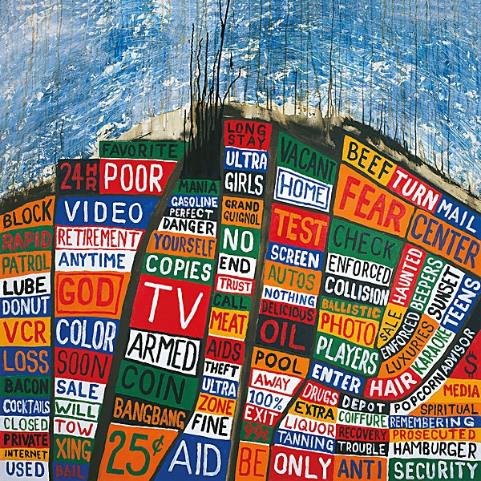

# Hail To the Thief

By **Radiohead**

## Album Data

- **Catalog:** Beets
- **Format:** Digital, Album
- **Album:** Hail To the Thief
- **Artist:** Radiohead
- **Albumartist:** Radiohead
- **Genre:** Alternative Rock
- **MusicBrainz Album Artist ID:** [https](https://musicbrainz.org/artist/https)
- **MusicBrainz Album ID:** [https](https://musicbrainz.org/release/https)
- **MusicBrainz Release Group ID:** 
- **Year:** 2003
- **Catalog #:** 
- **Label:** 
- **Total Tracks:** 10

## Album Tracks

### Track 01 - 15 Step

- **Artist:** Radiohead
- **Format:** ALAC
- **Genre:** Indie Rock
- **Length:** 3:58
- **MusicBrainz Track ID:** [faea2aa0-80a9-41be-9b1e-3b994f4f76ac](https://musicbrainz.org/recording/faea2aa0-80a9-41be-9b1e-3b994f4f76ac)
- **Title:** 15 Step
- **Track:** 01
- **Year:** 2007

### Track 02 - Bodysnatchers

- **Artist:** Radiohead
- **Format:** ALAC
- **Genre:** Indie Rock
- **Length:** 4:02
- **MusicBrainz Track ID:** [94a1d84a-66ce-4fc9-88a5-c46263c54d9a](https://musicbrainz.org/recording/94a1d84a-66ce-4fc9-88a5-c46263c54d9a)
- **Title:** Bodysnatchers
- **Track:** 02
- **Year:** 2007

### Track 03 - Nude

- **Artist:** Radiohead
- **Format:** ALAC
- **Genre:** Indie Rock
- **Length:** 4:15
- **MusicBrainz Track ID:** [f3bea96c-5ebf-4d37-990d-14f1bc281459](https://musicbrainz.org/recording/f3bea96c-5ebf-4d37-990d-14f1bc281459)
- **Title:** Nude
- **Track:** 03
- **Year:** 2007

### Track 04 - Weird Fishes/Arpeggi

- **Artist:** Radiohead
- **Format:** ALAC
- **Genre:** Indie Rock
- **Length:** 5:18
- **MusicBrainz Track ID:** [f74b48a6-5a60-4b5a-864d-3ecb7e983c31](https://musicbrainz.org/recording/f74b48a6-5a60-4b5a-864d-3ecb7e983c31)
- **Title:** Weird Fishes/Arpeggi
- **Track:** 04
- **Year:** 2007

### Track 05 - All I Need

- **Artist:** Radiohead
- **Format:** ALAC
- **Genre:** Indie Rock
- **Length:** 3:48
- **MusicBrainz Track ID:** [72c6b4d3-71a8-4c70-bf50-da11c0149089](https://musicbrainz.org/recording/72c6b4d3-71a8-4c70-bf50-da11c0149089)
- **Title:** All I Need
- **Track:** 05
- **Year:** 2007

### Track 06 - Faust Arp

- **Artist:** Radiohead
- **Format:** ALAC
- **Genre:** Indie Rock
- **Length:** 2:09
- **MusicBrainz Track ID:** [ffac3cb1-a5e9-4f31-952d-45323f3640d5](https://musicbrainz.org/recording/ffac3cb1-a5e9-4f31-952d-45323f3640d5)
- **Title:** Faust Arp
- **Track:** 06
- **Year:** 2007

### Track 07 - Reckoner

- **Artist:** Radiohead
- **Format:** ALAC
- **Genre:** Indie Rock
- **Length:** 4:50
- **MusicBrainz Track ID:** [d9b46ecb-5472-4dcd-8fa4-dd6723189e27](https://musicbrainz.org/recording/d9b46ecb-5472-4dcd-8fa4-dd6723189e27)
- **Title:** Reckoner
- **Track:** 07
- **Year:** 2007

### Track 08 - House of Cards

- **Artist:** Radiohead
- **Format:** ALAC
- **Genre:** Indie Rock
- **Length:** 5:28
- **MusicBrainz Track ID:** [29a9d792-151b-4dd4-99ae-25bc853d8895](https://musicbrainz.org/recording/29a9d792-151b-4dd4-99ae-25bc853d8895)
- **Title:** House of Cards
- **Track:** 08
- **Year:** 2007

### Track 09 - Jigsaw Falling Into Place

- **Artist:** Radiohead
- **Format:** ALAC
- **Genre:** Indie Rock
- **Length:** 4:08
- **MusicBrainz Track ID:** [31600df4-e6dd-48ca-9f6b-8804027d8d6e](https://musicbrainz.org/recording/31600df4-e6dd-48ca-9f6b-8804027d8d6e)
- **Title:** Jigsaw Falling Into Place
- **Track:** 09
- **Year:** 2007

### Track 10 - Videotape

- **Artist:** Radiohead
- **Format:** ALAC
- **Genre:** Britpop
- **Length:** 4:41
- **MusicBrainz Track ID:** [8648fe94-bbdc-44a1-9de8-c4ced7913dc2](https://musicbrainz.org/recording/8648fe94-bbdc-44a1-9de8-c4ced7913dc2)
- **Title:** Videotape
- **Track:** 10
- **Year:** 2007

## See also

- [In Rainbows](In_Rainbows.md)
- [Kid A](Kid_A.md)
- [OK Computer](OK_Computer.md)
- [Pablo Honey](Pablo_Honey.md)
- [The Bends](The_Bends.md)
- [CD: Ok Computer](../../CD/Radiohead/Ok_Computer.md)
- [CD: ](../../CD/Radiohead/Radiohead.md)
- [Roon: Amnesiac](../../Roon/Radiohead/Amnesiac.md)
- [Roon: A Moon Shaped Pool (Radiohead)](../../Roon/Radiohead/A_Moon_Shaped_Pool_Radiohead.md)
- [Roon: Creep](../../Roon/Radiohead/Creep.md)
- [Roon: Hail to the Thief](../../Roon/Radiohead/Hail_to_the_Thief.md)
- [Roon: Karma Police](../../Roon/Radiohead/Karma_Police.md)
- [Roon: Kid A](../../Roon/Radiohead/Kid_A.md)
- [Roon: No Surprises](../../Roon/Radiohead/No_Surprises.md)
- [Roon: OK Computer OKNOTOK 1997 2017](../../Roon/Radiohead/OK_Computer_OKNOTOK_1997_2017.md)
- [Roon: Pablo Honey](../../Roon/Radiohead/Pablo_Honey.md)
- [Roon: Paranoid Android](../../Roon/Radiohead/Paranoid_Android.md)
- [Roon: The Bends](../../Roon/Radiohead/The_Bends.md)
- [Roon: The King Of Limbs](../../Roon/Radiohead/The_King_Of_Limbs.md)
- [Vinyl: OK Computer](../../Vinyl/Radiohead/OK_Computer.md)
- [Vinyl: ](../../Vinyl/Radiohead/Radiohead.md)
