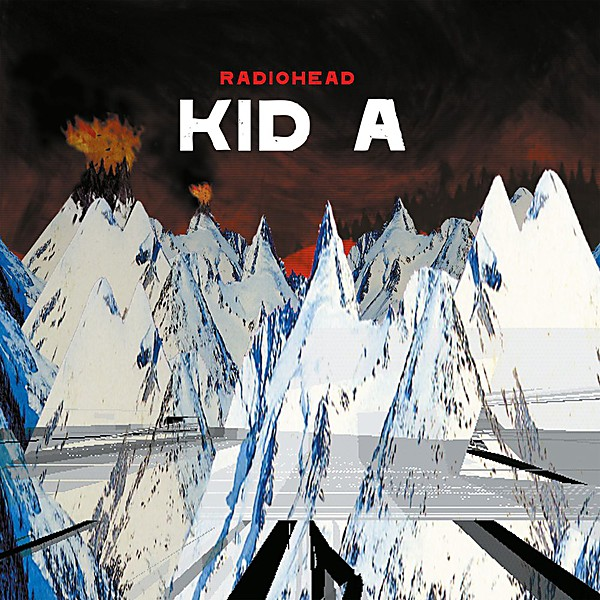

# Kid A

By **Radiohead**

## Album Data

- **Catalog:** Beets
- **Format:** Digital, Album
- **Album:** Kid A
- **Artist:** Radiohead
- **Albumartist:** Radiohead
- **Genre:** Experimental Rock
- **MusicBrainz Album Artist ID:** [a74b1b7f-71a5-4011-9441-d0b5e4122711](https://musicbrainz.org/artist/a74b1b7f-71a5-4011-9441-d0b5e4122711)
- **MusicBrainz Album ID:** [57e1d657-a38d-3de5-b33e-45b661b0d5b0](https://musicbrainz.org/release/57e1d657-a38d-3de5-b33e-45b661b0d5b0)
- **MusicBrainz Release Group ID:** [e75c0549-ad55-39e3-8025-c72c5d4a3c5d](https://musicbrainz.org/release-group/e75c0549-ad55-39e3-8025-c72c5d4a3c5d)
- **Year:** 2000
- **Catalog #:** 
- **Label:** XL Recordings
- **Total Tracks:** 12

## Album Tracks

### Track 01 - Airbag

- **Artist:** Radiohead
- **Format:** ALAC
- **Genre:** Indie Rock
- **Length:** 4:44
- **MusicBrainz Track ID:** [https](https://musicbrainz.org/recording/https)
- **Title:** Airbag
- **Track:** 01
- **Year:** 1997

### Track 02 - Paranoid Android

- **Artist:** Radiohead
- **Format:** ALAC
- **Genre:** Indie Rock
- **Length:** 6:23
- **MusicBrainz Track ID:** [https](https://musicbrainz.org/recording/https)
- **Title:** Paranoid Android
- **Track:** 02
- **Year:** 1997

### Track 03 - Subterranean Homesick Alien

- **Artist:** Radiohead
- **Format:** ALAC
- **Genre:** Indie Rock
- **Length:** 4:27
- **MusicBrainz Track ID:** [https](https://musicbrainz.org/recording/https)
- **Title:** Subterranean Homesick Alien
- **Track:** 03
- **Year:** 1997

### Track 04 - Exit Music (For A Film)

- **Artist:** Radiohead
- **Format:** ALAC
- **Genre:** Indie Rock
- **Length:** 4:24
- **MusicBrainz Track ID:** [https](https://musicbrainz.org/recording/https)
- **Title:** Exit Music (For A Film)
- **Track:** 04
- **Year:** 1997

### Track 05 - Let Down

- **Artist:** Radiohead
- **Format:** ALAC
- **Genre:** Indie Rock
- **Length:** 4:59
- **MusicBrainz Track ID:** [https](https://musicbrainz.org/recording/https)
- **Title:** Let Down
- **Track:** 05
- **Year:** 1997

### Track 06 - Karma Police

- **Artist:** Radiohead
- **Format:** ALAC
- **Genre:** Indie Rock
- **Length:** 4:21
- **MusicBrainz Track ID:** [https](https://musicbrainz.org/recording/https)
- **Title:** Karma Police
- **Track:** 06
- **Year:** 1997

### Track 07 - Fitter Happier

- **Artist:** Radiohead
- **Format:** ALAC
- **Genre:** Indie Rock
- **Length:** 1:57
- **MusicBrainz Track ID:** [https](https://musicbrainz.org/recording/https)
- **Title:** Fitter Happier
- **Track:** 07
- **Year:** 1997

### Track 08 - Electioneering

- **Artist:** Radiohead
- **Format:** ALAC
- **Genre:** Indie Rock
- **Length:** 3:50
- **MusicBrainz Track ID:** [https](https://musicbrainz.org/recording/https)
- **Title:** Electioneering
- **Track:** 08
- **Year:** 1997

### Track 09 - Climbing Up the Walls

- **Artist:** Radiohead
- **Format:** ALAC
- **Genre:** Indie Rock
- **Length:** 4:45
- **MusicBrainz Track ID:** [https](https://musicbrainz.org/recording/https)
- **Title:** Climbing Up the Walls
- **Track:** 09
- **Year:** 1997

### Track 10 - No Surprises

- **Artist:** Radiohead
- **Format:** ALAC
- **Genre:** Indie Rock
- **Length:** 3:48
- **MusicBrainz Track ID:** [https](https://musicbrainz.org/recording/https)
- **Title:** No Surprises
- **Track:** 10
- **Year:** 1997

### Track 11 - Lucky

- **Artist:** Radiohead
- **Format:** ALAC
- **Genre:** Indie Rock
- **Length:** 4:19
- **MusicBrainz Track ID:** [https](https://musicbrainz.org/recording/https)
- **Title:** Lucky
- **Track:** 11
- **Year:** 1997

### Track 12 - The Tourist

- **Artist:** Radiohead
- **Format:** ALAC
- **Genre:** Indie Rock
- **Length:** 5:24
- **MusicBrainz Track ID:** [https](https://musicbrainz.org/recording/https)
- **Title:** The Tourist
- **Track:** 12
- **Year:** 1997

## See also

- [Hail To the Thief](Hail_To_the_Thief.md)
- [In Rainbows](In_Rainbows.md)
- [OK Computer](OK_Computer.md)
- [Pablo Honey](Pablo_Honey.md)
- [The Bends](The_Bends.md)
- [CD: Ok Computer](../../CD/Radiohead/Ok_Computer.md)
- [CD: ](../../CD/Radiohead/Radiohead.md)
- [Roon: Amnesiac](../../Roon/Radiohead/Amnesiac.md)
- [Roon: A Moon Shaped Pool (Radiohead)](../../Roon/Radiohead/A_Moon_Shaped_Pool_Radiohead.md)
- [Roon: Creep](../../Roon/Radiohead/Creep.md)
- [Roon: Hail to the Thief](../../Roon/Radiohead/Hail_to_the_Thief.md)
- [Roon: Karma Police](../../Roon/Radiohead/Karma_Police.md)
- [Roon: Kid A](../../Roon/Radiohead/Kid_A.md)
- [Roon: No Surprises](../../Roon/Radiohead/No_Surprises.md)
- [Roon: OK Computer OKNOTOK 1997 2017](../../Roon/Radiohead/OK_Computer_OKNOTOK_1997_2017.md)
- [Roon: Pablo Honey](../../Roon/Radiohead/Pablo_Honey.md)
- [Roon: Paranoid Android](../../Roon/Radiohead/Paranoid_Android.md)
- [Roon: The Bends](../../Roon/Radiohead/The_Bends.md)
- [Roon: The King Of Limbs](../../Roon/Radiohead/The_King_Of_Limbs.md)
- [Vinyl: OK Computer](../../Vinyl/Radiohead/OK_Computer.md)
- [Vinyl: ](../../Vinyl/Radiohead/Radiohead.md)
