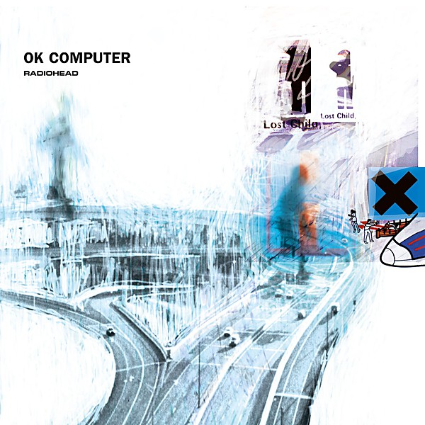

# OK Computer

By **Radiohead**

## Album Data

- **Catalog:** Beets
- **Format:** Digital, Album
- **Album:** OK Computer
- **Artist:** Radiohead
- **Albumartist:** Radiohead
- **Genre:** Art Rock
- **MusicBrainz Album Artist ID:** [https](https://musicbrainz.org/artist/https)
- **MusicBrainz Album ID:** [https](https://musicbrainz.org/release/https)
- **MusicBrainz Release Group ID:** 
- **Year:** 1997
- **Catalog #:** E2 0777 7 81409 2 4
- **Label:** EMI Music Canada
- **Total Tracks:** 13

## Album Tracks

### Track 01 - You

- **Artist:** Radiohead
- **Format:** MP3
- **Genre:** Indie Rock
- **Length:** 3:27
- **MusicBrainz Track ID:** [abb8911f-ad4d-493c-9f56-a34f67f4eeac](https://musicbrainz.org/recording/abb8911f-ad4d-493c-9f56-a34f67f4eeac)
- **Title:** You
- **Track:** 01
- **Year:** 1993

### Track 02 - Creep

- **Artist:** Radiohead
- **Format:** MP3
- **Genre:** Indie Rock
- **Length:** 3:55
- **MusicBrainz Track ID:** [70595637-9310-45f2-a266-58f8de4874a7](https://musicbrainz.org/recording/70595637-9310-45f2-a266-58f8de4874a7)
- **Title:** Creep
- **Track:** 02
- **Year:** 1993

### Track 03 - How Do You?

- **Artist:** Radiohead
- **Format:** MP3
- **Genre:** Indie Rock
- **Length:** 2:11
- **MusicBrainz Track ID:** [174e57b1-0a79-4103-92c2-ec3d109347c1](https://musicbrainz.org/recording/174e57b1-0a79-4103-92c2-ec3d109347c1)
- **Title:** How Do You?
- **Track:** 03
- **Year:** 1993

### Track 04 - Stop Whispering

- **Artist:** Radiohead
- **Format:** MP3
- **Genre:** Indie Rock
- **Length:** 5:25
- **MusicBrainz Track ID:** [e4e67aad-31f7-49cd-a3d4-65c4f7fbe66e](https://musicbrainz.org/recording/e4e67aad-31f7-49cd-a3d4-65c4f7fbe66e)
- **Title:** Stop Whispering
- **Track:** 04
- **Year:** 1993

### Track 05 - Thinking About You

- **Artist:** Radiohead
- **Format:** MP3
- **Genre:** Indie Rock
- **Length:** 2:41
- **MusicBrainz Track ID:** [2f795d53-4034-4704-bf4b-aa54a12ba187](https://musicbrainz.org/recording/2f795d53-4034-4704-bf4b-aa54a12ba187)
- **Title:** Thinking About You
- **Track:** 05
- **Year:** 1993

### Track 06 - Anyone Can Play Guitar

- **Artist:** Radiohead
- **Format:** MP3
- **Genre:** Indie Rock
- **Length:** 3:37
- **MusicBrainz Track ID:** [4e934b0e-4e35-418a-a620-109ba80c4476](https://musicbrainz.org/recording/4e934b0e-4e35-418a-a620-109ba80c4476)
- **Title:** Anyone Can Play Guitar
- **Track:** 06
- **Year:** 1993

### Track 07 - Ripcord

- **Artist:** Radiohead
- **Format:** MP3
- **Genre:** Indie Rock
- **Length:** 3:09
- **MusicBrainz Track ID:** [b20fd3d0-1ec5-40ed-93cd-5f82fd3727a6](https://musicbrainz.org/recording/b20fd3d0-1ec5-40ed-93cd-5f82fd3727a6)
- **Title:** Ripcord
- **Track:** 07
- **Year:** 1993

### Track 08 - Vegetable

- **Artist:** Radiohead
- **Format:** MP3
- **Genre:** Indie Rock
- **Length:** 3:12
- **MusicBrainz Track ID:** [6afeef75-2c2b-48c0-905b-af1ca5c3f23a](https://musicbrainz.org/recording/6afeef75-2c2b-48c0-905b-af1ca5c3f23a)
- **Title:** Vegetable
- **Track:** 08
- **Year:** 1993

### Track 09 - Prove Yourself

- **Artist:** Radiohead
- **Format:** MP3
- **Genre:** Indie Rock
- **Length:** 2:25
- **MusicBrainz Track ID:** [3b53ea59-7270-4339-88df-8f2cc7a2fb44](https://musicbrainz.org/recording/3b53ea59-7270-4339-88df-8f2cc7a2fb44)
- **Title:** Prove Yourself
- **Track:** 09
- **Year:** 1993

### Track 10 - I Can’t

- **Artist:** Radiohead
- **Format:** MP3
- **Genre:** Indie Rock
- **Length:** 4:13
- **MusicBrainz Track ID:** [1a9cf8b6-8edf-44b4-bdf8-17dcd8459ee1](https://musicbrainz.org/recording/1a9cf8b6-8edf-44b4-bdf8-17dcd8459ee1)
- **Title:** I Can’t
- **Track:** 10
- **Year:** 1993

### Track 11 - Lurgee

- **Artist:** Radiohead
- **Format:** MP3
- **Genre:** Indie Rock
- **Length:** 3:07
- **MusicBrainz Track ID:** [c17a2b44-8b59-4575-a557-b0bfa03df868](https://musicbrainz.org/recording/c17a2b44-8b59-4575-a557-b0bfa03df868)
- **Title:** Lurgee
- **Track:** 11
- **Year:** 1993

### Track 12 - Blow Out

- **Artist:** Radiohead
- **Format:** MP3
- **Genre:** Shoegaze
- **Length:** 4:41
- **MusicBrainz Track ID:** [64cc6006-e1f4-4528-9789-5162c0c82e50](https://musicbrainz.org/recording/64cc6006-e1f4-4528-9789-5162c0c82e50)
- **Title:** Blow Out
- **Track:** 12
- **Year:** 1993

### Track 13 - Creep (radio edit)

- **Artist:** Radiohead
- **Format:** MP3
- **Genre:** Indie Rock
- **Length:** 3:59
- **MusicBrainz Track ID:** [fec5d8cf-3281-46b4-9681-14b72ff6488e](https://musicbrainz.org/recording/fec5d8cf-3281-46b4-9681-14b72ff6488e)
- **Title:** Creep (radio edit)
- **Track:** 13
- **Year:** 1993

## See also

- [Hail To the Thief](Hail_To_the_Thief.md)
- [In Rainbows](In_Rainbows.md)
- [Kid A](Kid_A.md)
- [Pablo Honey](Pablo_Honey.md)
- [The Bends](The_Bends.md)
- [CD: Ok Computer](../../CD/Radiohead/Ok_Computer.md)
- [CD: ](../../CD/Radiohead/Radiohead.md)
- [Roon: Amnesiac](../../Roon/Radiohead/Amnesiac.md)
- [Roon: A Moon Shaped Pool (Radiohead)](../../Roon/Radiohead/A_Moon_Shaped_Pool_Radiohead.md)
- [Roon: Creep](../../Roon/Radiohead/Creep.md)
- [Roon: Hail to the Thief](../../Roon/Radiohead/Hail_to_the_Thief.md)
- [Roon: Karma Police](../../Roon/Radiohead/Karma_Police.md)
- [Roon: Kid A](../../Roon/Radiohead/Kid_A.md)
- [Roon: No Surprises](../../Roon/Radiohead/No_Surprises.md)
- [Roon: OK Computer OKNOTOK 1997 2017](../../Roon/Radiohead/OK_Computer_OKNOTOK_1997_2017.md)
- [Roon: Pablo Honey](../../Roon/Radiohead/Pablo_Honey.md)
- [Roon: Paranoid Android](../../Roon/Radiohead/Paranoid_Android.md)
- [Roon: The Bends](../../Roon/Radiohead/The_Bends.md)
- [Roon: The King Of Limbs](../../Roon/Radiohead/The_King_Of_Limbs.md)
- [Vinyl: OK Computer](../../Vinyl/Radiohead/OK_Computer.md)
- [Vinyl: ](../../Vinyl/Radiohead/Radiohead.md)
