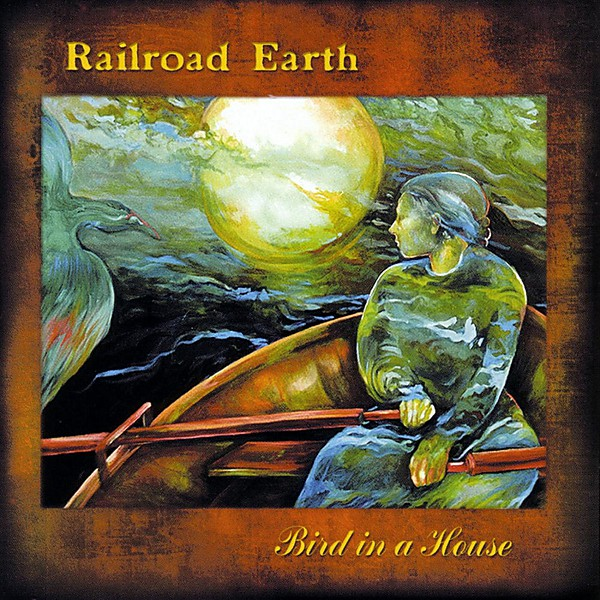

# Bird in a House

By **Railroad Earth**

## Album Data

- **Catalog:** Beets
- **Format:** Digital, Album
- **Album:** Bird in a House
- **Artist:** Railroad Earth
- **Albumartist:** Railroad Earth
- **Genre:** Bluegrass
- **MusicBrainz Album Artist ID:** [b2e2abfa-fb1e-4be0-b500-56c4584f41cd](https://musicbrainz.org/artist/b2e2abfa-fb1e-4be0-b500-56c4584f41cd)
- **MusicBrainz Album ID:** [80a8e978-cc15-4413-9dd1-6648db0d9087](https://musicbrainz.org/release/80a8e978-cc15-4413-9dd1-6648db0d9087)
- **MusicBrainz Release Group ID:** [ebd13c1f-29d7-39d8-a146-48b978da965d](https://musicbrainz.org/release-group/ebd13c1f-29d7-39d8-a146-48b978da965d)
- **Year:** 2002
- **Catalog #:** 
- **Label:** 
- **Total Tracks:** 06

## Album Tracks

### Track 01 - Long Way To Go

- **Artist:** Railroad Earth
- **Format:** ALAC
- **Genre:** Country Rock
- **Length:** 6:20
- **MusicBrainz Track ID:** 
- **Title:** Long Way To Go
- **Track:** 01
- **Year:** 2006

### Track 02 - Colorado

- **Artist:** Railroad Earth
- **Format:** ALAC
- **Genre:** Bluegrass
- **Length:** 9:26
- **MusicBrainz Track ID:** 
- **Title:** Colorado
- **Track:** 02
- **Year:** 2006

### Track 03 - Bird In A House

- **Artist:** Railroad Earth
- **Format:** ALAC
- **Genre:** Bluegrass
- **Length:** 7:22
- **MusicBrainz Track ID:** 
- **Title:** Bird In A House
- **Track:** 03
- **Year:** 2006

### Track 04 - The Hunting Song

- **Artist:** Railroad Earth
- **Format:** ALAC
- **Genre:** Rock
- **Length:** 11:56
- **MusicBrainz Track ID:** 
- **Title:** The Hunting Song
- **Track:** 04
- **Year:** 2006

### Track 05 - Old Man And The Land

- **Artist:** Railroad Earth
- **Format:** ALAC
- **Genre:** Bluegrass
- **Length:** 6:57
- **MusicBrainz Track ID:** 
- **Title:** Old Man And The Land
- **Track:** 05
- **Year:** 2006

### Track 06 - Head

- **Artist:** Railroad Earth
- **Format:** ALAC
- **Genre:** Southern Rock
- **Length:** 15:41
- **MusicBrainz Track ID:** 
- **Title:** Head
- **Track:** 06
- **Year:** 2006

## See also

- [Elko [Live] [Disc 1]](Elko_[Live]_[Disc_1].md)
- [Elko [Live] [Disc 2]](Elko_[Live]_[Disc_2].md)
- [The Last of the Outlaws](The_Last_of_the_Outlaws.md)
- [Roon: Bird In A House](../../Roon/Railroad_Earth/Bird_In_A_House.md)
- [Roon: Captain Nowhere](../../Roon/Railroad_Earth/Captain_Nowhere.md)
- [Roon: Railroad Earth Live](../../Roon/Railroad_Earth/Railroad_Earth_Live.md)
- [Roon: Railroad Earth](../../Roon/Railroad_Earth/Railroad_Earth.md)
- [Roon: The Good Life](../../Roon/Railroad_Earth/The_Good_Life.md)
