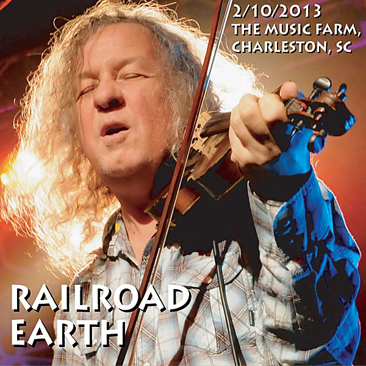

# Elko [Live] [Disc 1]

By **Railroad Earth**

## Album Data

- **Catalog:** Beets
- **Format:** Digital, Album
- **Album:** Elko [Live] [Disc 1]
- **Artist:** Railroad Earth
- **Albumartist:** Railroad Earth
- **Genre:** Progressive Bluegrass
- **MusicBrainz Album Artist ID:** 
- **MusicBrainz Album ID:** 
- **MusicBrainz Release Group ID:** 
- **Year:** 2006
- **Catalog #:** 
- **Label:** 
- **Total Tracks:** 06

## Album Tracks

### Track 01 - Elko

- **Artist:** Railroad Earth
- **Format:** ALAC
- **Genre:** Bluegrass
- **Length:** 8:59
- **MusicBrainz Track ID:** 
- **Title:** Elko
- **Track:** 01
- **Year:** 2005

### Track 02 - Mighty River

- **Artist:** Railroad Earth
- **Format:** ALAC
- **Genre:** Bluegrass
- **Length:** 7:54
- **MusicBrainz Track ID:** 
- **Title:** Mighty River
- **Track:** 02
- **Year:** 2005

### Track 03 - Like A Buddha

- **Artist:** Railroad Earth
- **Format:** ALAC
- **Genre:** Country Rock
- **Length:** 16:00
- **MusicBrainz Track ID:** 
- **Title:** Like A Buddha
- **Track:** 03
- **Year:** 2005

### Track 04 - Warhead Boogie

- **Artist:** Railroad Earth
- **Format:** ALAC
- **Genre:** Southern Rock
- **Length:** 15:05
- **MusicBrainz Track ID:** 
- **Title:** Warhead Boogie
- **Track:** 04
- **Year:** 2005

### Track 05 - Railroad Earth

- **Artist:** Railroad Earth
- **Format:** ALAC
- **Genre:** Bluegrass
- **Length:** 6:00
- **MusicBrainz Track ID:** 
- **Title:** Railroad Earth
- **Track:** 05
- **Year:** 2005

### Track 06 - Seven Story Mountain

- **Artist:** Railroad Earth
- **Format:** ALAC
- **Genre:** Bluegrass
- **Length:** 14:10
- **MusicBrainz Track ID:** 
- **Title:** Seven Story Mountain
- **Track:** 06
- **Year:** 2005

## See also

- [Bird in a House](Bird_in_a_House.md)
- [Elko [Live] [Disc 2]](Elko_[Live]_[Disc_2].md)
- [The Last of the Outlaws](The_Last_of_the_Outlaws.md)
- [Roon: Bird In A House](../../Roon/Railroad_Earth/Bird_In_A_House.md)
- [Roon: Captain Nowhere](../../Roon/Railroad_Earth/Captain_Nowhere.md)
- [Roon: Railroad Earth Live](../../Roon/Railroad_Earth/Railroad_Earth_Live.md)
- [Roon: Railroad Earth](../../Roon/Railroad_Earth/Railroad_Earth.md)
- [Roon: The Good Life](../../Roon/Railroad_Earth/The_Good_Life.md)
