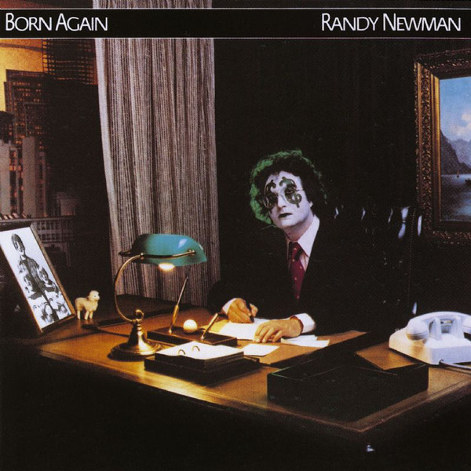

# Born Again

By **Randy Newman**

## Album Data

- **Catalog:** Beets
- **Format:** Digital, Album
- **Album:** Born Again
- **Artist:** Randy Newman
- **Albumartist:** Randy Newman
- **Genre:** Pop Rock
- **MusicBrainz Album Artist ID:** 
- **MusicBrainz Album ID:** 
- **MusicBrainz Release Group ID:** 
- **Year:** 1979
- **Catalog #:** 
- **Label:** 
- **Total Tracks:** 11

## Album Tracks

### Track 07 - Laughing Boy

- **Artist:** Randy Newman
- **Format:** AAC
- **Genre:** Rock
- **Length:** 2:04
- **MusicBrainz Track ID:** 
- **Title:** Laughing Boy
- **Track:** 07
- **Year:** 0000

### Track 08 - Cowboy

- **Artist:** Randy Newman
- **Format:** AAC
- **Genre:** Rock
- **Length:** 2:45
- **MusicBrainz Track ID:** 
- **Title:** Cowboy
- **Track:** 08
- **Year:** 0000

### Track 09 - The Beehive State

- **Artist:** Randy Newman
- **Format:** AAC
- **Genre:** Rock
- **Length:** 1:54
- **MusicBrainz Track ID:** 
- **Title:** The Beehive State
- **Track:** 09
- **Year:** 0000

### Track 10 - I Think It's Going To Rain Today

- **Artist:** Randy Newman
- **Format:** AAC
- **Genre:** Soft Rock
- **Length:** 3:03
- **MusicBrainz Track ID:** 
- **Title:** I Think It's Going To Rain Today
- **Track:** 10
- **Year:** 0000

### Track 11 - Davy The Fat Boy

- **Artist:** Randy Newman
- **Format:** AAC
- **Genre:** Rock
- **Length:** 3:01
- **MusicBrainz Track ID:** 
- **Title:** Davy The Fat Boy
- **Track:** 11
- **Year:** 0000

## See also

- [Good Old Boys](Good_Old_Boys.md)
- [Little Criminals](Little_Criminals.md)
- [Randy Newman](Randy_Newman.md)
- [Randy Newman's Faust](Randy_Newmans_Faust.md)
- [Sail Away](Sail_Away.md)
- [The Randy Newman Songbook](The_Randy_Newman_Songbook.md)
- [Roon: Born Again](../../Roon/Randy_Newman/Born_Again.md)
- [Roon: Faust (Deluxe Edition)](../../Roon/Randy_Newman/Faust_Deluxe_Edition.md)
- [Roon: Sail Away (Expanded & Remastered Edition)](../../Roon/Randy_Newman/Sail_Away_Expanded_and_Remastered_Edition.md)
- [Roon: The Randy Newman Songbook, Vol. 1](../../Roon/Randy_Newman/The_Randy_Newman_Songbook__Vol_1.md)
- [Vinyl: ](../../Vinyl/Randy_Newman/Randy_Newman.md)
- [Vinyl: The Randy Newman Songbook](../../Vinyl/Randy_Newman/The_Randy_Newman_Songbook.md)
