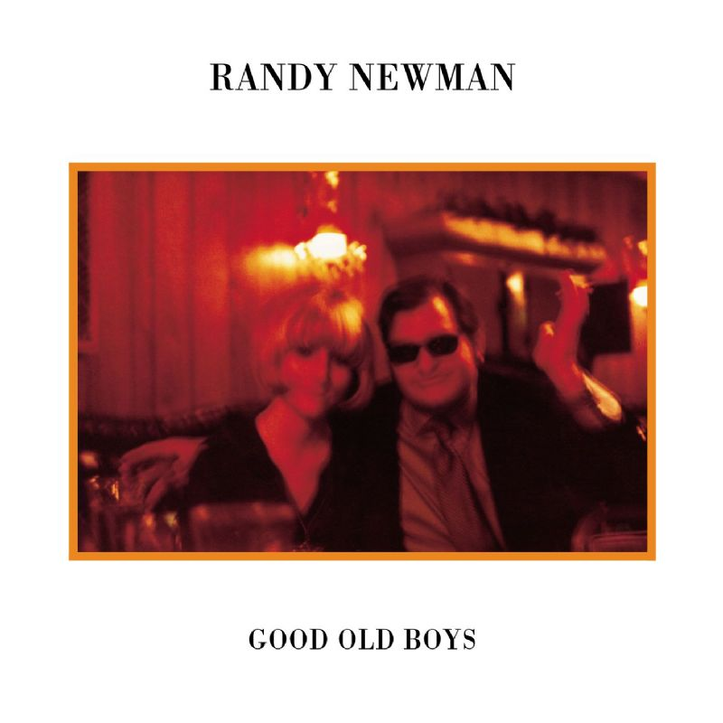

# Good Old Boys

By **Randy Newman**

## Album Data

- **Catalog:** Beets
- **Format:** Digital, Album
- **Album:** Good Old Boys
- **Artist:** Randy Newman
- **Albumartist:** Randy Newman
- **Genre:** Soft Rock
- **MusicBrainz Album Artist ID:** [da7bb7d8-557d-4635-9ca1-e6e985525bd5](https://musicbrainz.org/artist/da7bb7d8-557d-4635-9ca1-e6e985525bd5)
- **MusicBrainz Album ID:** [6c566fc3-63eb-3eca-97d0-d34262aa8026](https://musicbrainz.org/release/6c566fc3-63eb-3eca-97d0-d34262aa8026)
- **MusicBrainz Release Group ID:** [bb1a6e55-7d0a-3d48-b447-49b86cdcca7a](https://musicbrainz.org/release-group/bb1a6e55-7d0a-3d48-b447-49b86cdcca7a)
- **Year:** 1988
- **Catalog #:** 7599-27321-2
- **Label:** Warner Bros. Records
- **Total Tracks:** 12

## Album Tracks

### Track 01 - Short People

- **Artist:** Randy Newman
- **Format:** ALAC
- **Genre:** Pop Rock
- **Length:** 2:57
- **MusicBrainz Track ID:** [15e58a9f-5c9e-4808-899f-f8daa5277708](https://musicbrainz.org/recording/15e58a9f-5c9e-4808-899f-f8daa5277708)
- **Title:** Short People
- **Track:** 01
- **Year:** 1987

### Track 02 - You Can't Fool the Fat Man

- **Artist:** Randy Newman
- **Format:** ALAC
- **Genre:** Rock
- **Length:** 2:54
- **MusicBrainz Track ID:** [530d9e91-23fc-4ef4-9701-eac77a8ac59c](https://musicbrainz.org/recording/530d9e91-23fc-4ef4-9701-eac77a8ac59c)
- **Title:** You Can't Fool the Fat Man
- **Track:** 02
- **Year:** 1987

### Track 03 - Little Criminals

- **Artist:** Randy Newman
- **Format:** ALAC
- **Genre:** Rock
- **Length:** 3:07
- **MusicBrainz Track ID:** [3f17cfb0-6752-4939-9245-2c7de196314a](https://musicbrainz.org/recording/3f17cfb0-6752-4939-9245-2c7de196314a)
- **Title:** Little Criminals
- **Track:** 03
- **Year:** 1987

### Track 04 - Texas Girl at the Funeral of Her Father

- **Artist:** Randy Newman
- **Format:** ALAC
- **Genre:** Rock
- **Length:** 2:50
- **MusicBrainz Track ID:** [73b75ea1-e161-4a26-897a-9d636c305541](https://musicbrainz.org/recording/73b75ea1-e161-4a26-897a-9d636c305541)
- **Title:** Texas Girl at the Funeral of Her Father
- **Track:** 04
- **Year:** 1987

### Track 05 - Jolly Coppers on Parade

- **Artist:** Randy Newman
- **Format:** ALAC
- **Genre:** Americana
- **Length:** 3:49
- **MusicBrainz Track ID:** [a7a6f513-e5aa-47f8-9fb4-05b0f732e634](https://musicbrainz.org/recording/a7a6f513-e5aa-47f8-9fb4-05b0f732e634)
- **Title:** Jolly Coppers on Parade
- **Track:** 05
- **Year:** 1987

### Track 06 - In Germany Before the War

- **Artist:** Randy Newman
- **Format:** ALAC
- **Genre:** Rock
- **Length:** 3:52
- **MusicBrainz Track ID:** [44bca0de-8dd1-4e37-931a-1d3984b9ee11](https://musicbrainz.org/recording/44bca0de-8dd1-4e37-931a-1d3984b9ee11)
- **Title:** In Germany Before the War
- **Track:** 06
- **Year:** 1987

### Track 07 - Sigmund Freud's Impersonation of Albert Einstein in America

- **Artist:** Randy Newman
- **Format:** ALAC
- **Genre:** Soft Rock
- **Length:** 2:57
- **MusicBrainz Track ID:** [5a891ac2-8a97-4121-9718-ce6147c00693](https://musicbrainz.org/recording/5a891ac2-8a97-4121-9718-ce6147c00693)
- **Title:** Sigmund Freud's Impersonation of Albert Einstein in America
- **Track:** 07
- **Year:** 1987

### Track 08 - Baltimore

- **Artist:** Randy Newman
- **Format:** ALAC
- **Genre:** Soft Rock
- **Length:** 4:08
- **MusicBrainz Track ID:** [2a176b4e-8a93-43c8-8d90-dcd260ea737c](https://musicbrainz.org/recording/2a176b4e-8a93-43c8-8d90-dcd260ea737c)
- **Title:** Baltimore
- **Track:** 08
- **Year:** 1987

### Track 09 - I'll Be Home

- **Artist:** Randy Newman
- **Format:** ALAC
- **Genre:** Rock
- **Length:** 2:55
- **MusicBrainz Track ID:** [7c287c2a-20b5-44ab-8f76-e3ab35b868d4](https://musicbrainz.org/recording/7c287c2a-20b5-44ab-8f76-e3ab35b868d4)
- **Title:** I'll Be Home
- **Track:** 09
- **Year:** 1987

### Track 10 - Rider in the Rain

- **Artist:** Randy Newman
- **Format:** ALAC
- **Genre:** Soft Rock
- **Length:** 3:58
- **MusicBrainz Track ID:** [511f3d4f-3a99-47b1-89c0-3d13f7b4f844](https://musicbrainz.org/recording/511f3d4f-3a99-47b1-89c0-3d13f7b4f844)
- **Title:** Rider in the Rain
- **Track:** 10
- **Year:** 1987

### Track 11 - Kathleen (Catholicism Made Easier)

- **Artist:** Randy Newman
- **Format:** ALAC
- **Genre:** Soft Rock
- **Length:** 3:39
- **MusicBrainz Track ID:** [01456da1-bad0-4feb-86da-6f2e084eafc2](https://musicbrainz.org/recording/01456da1-bad0-4feb-86da-6f2e084eafc2)
- **Title:** Kathleen (Catholicism Made Easier)
- **Track:** 11
- **Year:** 1987

### Track 12 - Old Man on the Farm

- **Artist:** Randy Newman
- **Format:** ALAC
- **Genre:** Rock
- **Length:** 2:27
- **MusicBrainz Track ID:** [07af19b5-4f84-4a2e-80a3-d1ec97d7c3be](https://musicbrainz.org/recording/07af19b5-4f84-4a2e-80a3-d1ec97d7c3be)
- **Title:** Old Man on the Farm
- **Track:** 12
- **Year:** 1987

## See also

- [Born Again](Born_Again.md)
- [Little Criminals](Little_Criminals.md)
- [Randy Newman](Randy_Newman.md)
- [Randy Newman's Faust](Randy_Newmans_Faust.md)
- [Sail Away](Sail_Away.md)
- [The Randy Newman Songbook](The_Randy_Newman_Songbook.md)
- [Roon: Born Again](../../Roon/Randy_Newman/Born_Again.md)
- [Roon: Faust (Deluxe Edition)](../../Roon/Randy_Newman/Faust_Deluxe_Edition.md)
- [Roon: Sail Away (Expanded & Remastered Edition)](../../Roon/Randy_Newman/Sail_Away_Expanded_and_Remastered_Edition.md)
- [Roon: The Randy Newman Songbook, Vol. 1](../../Roon/Randy_Newman/The_Randy_Newman_Songbook__Vol_1.md)
- [Vinyl: ](../../Vinyl/Randy_Newman/Randy_Newman.md)
- [Vinyl: The Randy Newman Songbook](../../Vinyl/Randy_Newman/The_Randy_Newman_Songbook.md)
