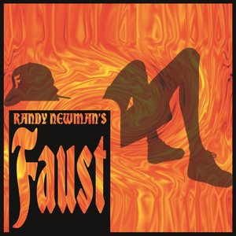

# Randy Newman's Faust

By **Randy Newman**

## Album Data

- **Catalog:** Beets
- **Format:** Digital, Album
- **Album:** Randy Newman's Faust
- **Artist:** Randy Newman
- **Albumartist:** Randy Newman
- **Genre:** Rock
- **MusicBrainz Album Artist ID:** [da7bb7d8-557d-4635-9ca1-e6e985525bd5](https://musicbrainz.org/artist/da7bb7d8-557d-4635-9ca1-e6e985525bd5)
- **MusicBrainz Album ID:** [af5dade3-3251-4a1c-bfb5-0533d56e3e3f](https://musicbrainz.org/release/af5dade3-3251-4a1c-bfb5-0533d56e3e3f)
- **MusicBrainz Release Group ID:** [4fa2347c-2931-3112-872b-6e63579db348](https://musicbrainz.org/release-group/4fa2347c-2931-3112-872b-6e63579db348)
- **Year:** 1995
- **Catalog #:** 2064-2
- **Label:** Reprise Records
- **Total Tracks:** 12

## Album Tracks

### Track 01 - Sail Away

- **Artist:** Randy Newman
- **Format:** ALAC
- **Genre:** Soft Rock
- **Length:** 2:58
- **MusicBrainz Track ID:** [3713c925-cd34-49e9-9037-c84c80e4c11d](https://musicbrainz.org/recording/3713c925-cd34-49e9-9037-c84c80e4c11d)
- **Title:** Sail Away
- **Track:** 01
- **Year:** 1990

### Track 02 - Lonely at the Top

- **Artist:** Randy Newman
- **Format:** ALAC
- **Genre:** Soft Rock
- **Length:** 2:39
- **MusicBrainz Track ID:** [c26cec25-76bc-46b7-8726-eca18d7ab214](https://musicbrainz.org/recording/c26cec25-76bc-46b7-8726-eca18d7ab214)
- **Title:** Lonely at the Top
- **Track:** 02
- **Year:** 1990

### Track 03 - He Gives Us All His Love

- **Artist:** Randy Newman
- **Format:** ALAC
- **Genre:** Soft Rock
- **Length:** 1:57
- **MusicBrainz Track ID:** [21f5dc26-0b74-438d-8683-d55c0d5fa93d](https://musicbrainz.org/recording/21f5dc26-0b74-438d-8683-d55c0d5fa93d)
- **Title:** He Gives Us All His Love
- **Track:** 03
- **Year:** 1990

### Track 04 - Last Night I Had a Dream

- **Artist:** Randy Newman
- **Format:** ALAC
- **Genre:** Soft Rock
- **Length:** 3:04
- **MusicBrainz Track ID:** [b2391269-2c9a-4021-afc1-e4025209194f](https://musicbrainz.org/recording/b2391269-2c9a-4021-afc1-e4025209194f)
- **Title:** Last Night I Had a Dream
- **Track:** 04
- **Year:** 1990

### Track 05 - Simon Smith and the Amazing Dancing Bear

- **Artist:** Randy Newman
- **Format:** ALAC
- **Genre:** Soft Rock
- **Length:** 2:09
- **MusicBrainz Track ID:** [036a376f-02f9-49d6-ad05-04edcdd0182d](https://musicbrainz.org/recording/036a376f-02f9-49d6-ad05-04edcdd0182d)
- **Title:** Simon Smith and the Amazing Dancing Bear
- **Track:** 05
- **Year:** 1990

### Track 06 - Old Man

- **Artist:** Randy Newman
- **Format:** ALAC
- **Genre:** Soft Rock
- **Length:** 2:47
- **MusicBrainz Track ID:** [ad8318e2-3d5f-41a7-8de1-b67c6468fc37](https://musicbrainz.org/recording/ad8318e2-3d5f-41a7-8de1-b67c6468fc37)
- **Title:** Old Man
- **Track:** 06
- **Year:** 1990

### Track 07 - Political Science

- **Artist:** Randy Newman
- **Format:** ALAC
- **Genre:** Soft Rock
- **Length:** 2:07
- **MusicBrainz Track ID:** [b86ad532-49e2-4636-ab37-5a3323596da3](https://musicbrainz.org/recording/b86ad532-49e2-4636-ab37-5a3323596da3)
- **Title:** Political Science
- **Track:** 07
- **Year:** 1990

### Track 08 - Burn On

- **Artist:** Randy Newman
- **Format:** ALAC
- **Genre:** Soft Rock
- **Length:** 2:36
- **MusicBrainz Track ID:** [08e682a3-b583-45cf-a99a-c802884bffda](https://musicbrainz.org/recording/08e682a3-b583-45cf-a99a-c802884bffda)
- **Title:** Burn On
- **Track:** 08
- **Year:** 1990

### Track 09 - Memo to My Son

- **Artist:** Randy Newman
- **Format:** ALAC
- **Genre:** Soft Rock
- **Length:** 1:57
- **MusicBrainz Track ID:** [4dcc2e96-a034-4c18-a959-dc147a898cc5](https://musicbrainz.org/recording/4dcc2e96-a034-4c18-a959-dc147a898cc5)
- **Title:** Memo to My Son
- **Track:** 09
- **Year:** 1990

### Track 10 - Dayton, Ohio – 1903

- **Artist:** Randy Newman
- **Format:** ALAC
- **Genre:** Soft Rock
- **Length:** 1:54
- **MusicBrainz Track ID:** [d1867760-46af-4686-99af-82613fbff177](https://musicbrainz.org/recording/d1867760-46af-4686-99af-82613fbff177)
- **Title:** Dayton, Ohio – 1903
- **Track:** 10
- **Year:** 1990

### Track 11 - You Can Leave Your Hat On

- **Artist:** Randy Newman
- **Format:** ALAC
- **Genre:** Soft Rock
- **Length:** 3:23
- **MusicBrainz Track ID:** [11843cea-889e-4abf-ad01-3c3e383e08e6](https://musicbrainz.org/recording/11843cea-889e-4abf-ad01-3c3e383e08e6)
- **Title:** You Can Leave Your Hat On
- **Track:** 11
- **Year:** 1990

### Track 12 - God’s Song (That’s Why I Love Mankind)

- **Artist:** Randy Newman
- **Format:** ALAC
- **Genre:** Soft Rock
- **Length:** 3:43
- **MusicBrainz Track ID:** [9a315e63-769c-4f59-ac44-c7efb4659d96](https://musicbrainz.org/recording/9a315e63-769c-4f59-ac44-c7efb4659d96)
- **Title:** God’s Song (That’s Why I Love Mankind)
- **Track:** 12
- **Year:** 1990

## See also

- [Born Again](Born_Again.md)
- [Good Old Boys](Good_Old_Boys.md)
- [Little Criminals](Little_Criminals.md)
- [Randy Newman](Randy_Newman.md)
- [Sail Away](Sail_Away.md)
- [The Randy Newman Songbook](The_Randy_Newman_Songbook.md)
- [Roon: Born Again](../../Roon/Randy_Newman/Born_Again.md)
- [Roon: Faust (Deluxe Edition)](../../Roon/Randy_Newman/Faust_Deluxe_Edition.md)
- [Roon: Sail Away (Expanded & Remastered Edition)](../../Roon/Randy_Newman/Sail_Away_Expanded_and_Remastered_Edition.md)
- [Roon: The Randy Newman Songbook, Vol. 1](../../Roon/Randy_Newman/The_Randy_Newman_Songbook__Vol_1.md)
- [Vinyl: ](../../Vinyl/Randy_Newman/Randy_Newman.md)
- [Vinyl: The Randy Newman Songbook](../../Vinyl/Randy_Newman/The_Randy_Newman_Songbook.md)
