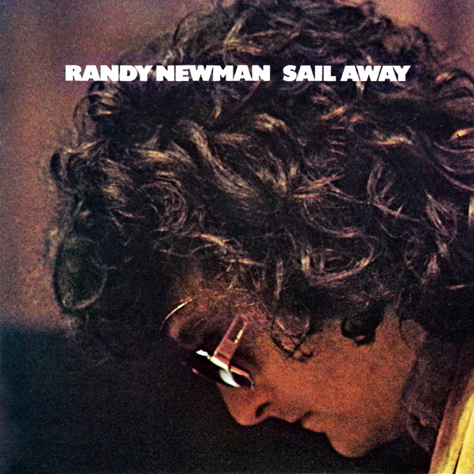

# Sail Away

By **Randy Newman**

## Album Data

- **Catalog:** Beets
- **Format:** Digital, Album
- **Album:** Sail Away
- **Artist:** Randy Newman
- **Albumartist:** Randy Newman
- **Genre:** Soft Rock
- **MusicBrainz Album Artist ID:** [da7bb7d8-557d-4635-9ca1-e6e985525bd5](https://musicbrainz.org/artist/da7bb7d8-557d-4635-9ca1-e6e985525bd5)
- **MusicBrainz Album ID:** [2f9a2535-d1b7-354d-ba64-c00818d723af](https://musicbrainz.org/release/2f9a2535-d1b7-354d-ba64-c00818d723af)
- **MusicBrainz Release Group ID:** [d1c0b3db-6b93-3b9d-9479-0d60486120cb](https://musicbrainz.org/release-group/d1c0b3db-6b93-3b9d-9479-0d60486120cb)
- **Year:** 1990
- **Catalog #:** 
- **Label:** Nonesuch
- **Total Tracks:** 55

## Album Tracks

### Track 01 - It's Lonely at the Top

- **Artist:** Randy Newman
- **Format:** MP3
- **Genre:** Rock
- **Length:** 2:16
- **MusicBrainz Track ID:** [10dd6712-1944-4235-9726-51ca53a171c5](https://musicbrainz.org/recording/10dd6712-1944-4235-9726-51ca53a171c5)
- **Title:** It's Lonely at the Top
- **Track:** 01
- **Year:** 2016

### Track 02 - God's Song (That's Why I Love Mankind)

- **Artist:** Randy Newman
- **Format:** MP3
- **Genre:** Soft Rock
- **Length:** 3:24
- **MusicBrainz Track ID:** [faf6b457-4eda-44f6-9d77-0ef50d1807cf](https://musicbrainz.org/recording/faf6b457-4eda-44f6-9d77-0ef50d1807cf)
- **Title:** God's Song (That's Why I Love Mankind)
- **Track:** 02
- **Year:** 2016

### Track 03 - Louisiana 1927

- **Artist:** Randy Newman
- **Format:** MP3
- **Genre:** Honky Tonk
- **Length:** 2:56
- **MusicBrainz Track ID:** [51d8e7d7-f5a4-458d-a0f9-13cbb535c6e9](https://musicbrainz.org/recording/51d8e7d7-f5a4-458d-a0f9-13cbb535c6e9)
- **Title:** Louisiana 1927
- **Track:** 03
- **Year:** 2016

### Track 04 - Let Me Go

- **Artist:** Randy Newman
- **Format:** MP3
- **Genre:** Rock
- **Length:** 2:37
- **MusicBrainz Track ID:** [fa731b96-567e-4fc0-b32e-290b360ff214](https://musicbrainz.org/recording/fa731b96-567e-4fc0-b32e-290b360ff214)
- **Title:** Let Me Go
- **Track:** 04
- **Year:** 2016

### Track 05 - Rednecks

- **Artist:** Randy Newman
- **Format:** MP3
- **Genre:** Honky Tonk
- **Length:** 3:05
- **MusicBrainz Track ID:** [accfbe9f-08e2-45c0-b8c2-5daada8121c2](https://musicbrainz.org/recording/accfbe9f-08e2-45c0-b8c2-5daada8121c2)
- **Title:** Rednecks
- **Track:** 05
- **Year:** 2016

### Track 06 - Avalon

- **Artist:** Randy Newman
- **Format:** MP3
- **Genre:** Rock
- **Length:** 0:58
- **MusicBrainz Track ID:** [3b232621-80f3-4c5f-844d-b0df1ad722ad](https://musicbrainz.org/recording/3b232621-80f3-4c5f-844d-b0df1ad722ad)
- **Title:** Avalon
- **Track:** 06
- **Year:** 2016

### Track 07 - Living Without You

- **Artist:** Randy Newman
- **Format:** MP3
- **Genre:** Rock
- **Length:** 2:16
- **MusicBrainz Track ID:** [574f487f-15be-49a4-b0db-df2a7ab6856f](https://musicbrainz.org/recording/574f487f-15be-49a4-b0db-df2a7ab6856f)
- **Title:** Living Without You
- **Track:** 07
- **Year:** 2016

### Track 08 - I Think It's Going to Rain Today

- **Artist:** Randy Newman
- **Format:** MP3
- **Genre:** Soft Rock
- **Length:** 2:57
- **MusicBrainz Track ID:** [88523f20-6db7-4823-ad88-e2e732543b2e](https://musicbrainz.org/recording/88523f20-6db7-4823-ad88-e2e732543b2e)
- **Title:** I Think It's Going to Rain Today
- **Track:** 08
- **Year:** 2016

### Track 09 - You Can Leave Your Hat On

- **Artist:** Randy Newman
- **Format:** MP3
- **Genre:** Soft Rock
- **Length:** 2:31
- **MusicBrainz Track ID:** [ed3ce5ea-b732-4c53-a25e-e7d7bc7c44bf](https://musicbrainz.org/recording/ed3ce5ea-b732-4c53-a25e-e7d7bc7c44bf)
- **Title:** You Can Leave Your Hat On
- **Track:** 09
- **Year:** 2016

### Track 10 - It's Money That I Love

- **Artist:** Randy Newman
- **Format:** MP3
- **Genre:** Rock
- **Length:** 2:16
- **MusicBrainz Track ID:** [8f72f402-f0fa-4e2c-a695-7b0fc246eae8](https://musicbrainz.org/recording/8f72f402-f0fa-4e2c-a695-7b0fc246eae8)
- **Title:** It's Money That I Love
- **Track:** 10
- **Year:** 2016

### Track 11 - Marie

- **Artist:** Randy Newman
- **Format:** MP3
- **Genre:** Soft Rock
- **Length:** 2:56
- **MusicBrainz Track ID:** [83853e78-c710-4d7d-8bf9-0104d89fff72](https://musicbrainz.org/recording/83853e78-c710-4d7d-8bf9-0104d89fff72)
- **Title:** Marie
- **Track:** 11
- **Year:** 2016

### Track 12 - When She Loved Me

- **Artist:** Randy Newman
- **Format:** MP3
- **Genre:** Rock
- **Length:** 1:03
- **MusicBrainz Track ID:** [a1d720cc-d351-40b9-9e53-9b2a82c44cdd](https://musicbrainz.org/recording/a1d720cc-d351-40b9-9e53-9b2a82c44cdd)
- **Title:** When She Loved Me
- **Track:** 12
- **Year:** 2016

### Track 13 - Sail Away

- **Artist:** Randy Newman
- **Format:** MP3
- **Genre:** Soft Rock
- **Length:** 2:58
- **MusicBrainz Track ID:** [0f8d235c-b45b-4c8d-8547-b5fb7cecb63c](https://musicbrainz.org/recording/0f8d235c-b45b-4c8d-8547-b5fb7cecb63c)
- **Title:** Sail Away
- **Track:** 13
- **Year:** 2016

### Track 14 - The World Isn't Fair

- **Artist:** Randy Newman
- **Format:** MP3
- **Genre:** Humor
- **Length:** 3:07
- **MusicBrainz Track ID:** [fedc246a-29b9-442f-a1bb-24f6f1ff4e85](https://musicbrainz.org/recording/fedc246a-29b9-442f-a1bb-24f6f1ff4e85)
- **Title:** The World Isn't Fair
- **Track:** 14
- **Year:** 2016

### Track 15 - Political Science

- **Artist:** Randy Newman
- **Format:** MP3
- **Genre:** Soft Rock
- **Length:** 2:02
- **MusicBrainz Track ID:** [76d3edc9-42ee-4aa9-9755-46fb20ba2c98](https://musicbrainz.org/recording/76d3edc9-42ee-4aa9-9755-46fb20ba2c98)
- **Title:** Political Science
- **Track:** 15
- **Year:** 2016

### Track 16 - The Great Nations of Europe

- **Artist:** Randy Newman
- **Format:** MP3
- **Genre:** Rock
- **Length:** 3:24
- **MusicBrainz Track ID:** [984407ac-1d56-440a-bf02-e1713f5cbf26](https://musicbrainz.org/recording/984407ac-1d56-440a-bf02-e1713f5cbf26)
- **Title:** The Great Nations of Europe
- **Track:** 16
- **Year:** 2016

### Track 17 - In Germany Before the War

- **Artist:** Randy Newman
- **Format:** MP3
- **Genre:** Rock
- **Length:** 3:49
- **MusicBrainz Track ID:** [f9883ee9-fed0-4d80-b05b-1f21251aed76](https://musicbrainz.org/recording/f9883ee9-fed0-4d80-b05b-1f21251aed76)
- **Title:** In Germany Before the War
- **Track:** 17
- **Year:** 2016

### Track 18 - Ragtime

- **Artist:** Randy Newman
- **Format:** MP3
- **Genre:** Rock
- **Length:** 1:25
- **MusicBrainz Track ID:** [1a303ef2-13dd-47ed-8f1d-935a49acc554](https://musicbrainz.org/recording/1a303ef2-13dd-47ed-8f1d-935a49acc554)
- **Title:** Ragtime
- **Track:** 18
- **Year:** 2016

### Track 19 - Dixie Flyer

- **Artist:** Randy Newman
- **Format:** MP3
- **Genre:** Pop
- **Length:** 3:20
- **MusicBrainz Track ID:** [e51d9ae9-4515-442c-af04-d7343019e092](https://musicbrainz.org/recording/e51d9ae9-4515-442c-af04-d7343019e092)
- **Title:** Dixie Flyer
- **Track:** 19
- **Year:** 2016

### Track 20 - Yellow Man

- **Artist:** Randy Newman
- **Format:** MP3
- **Genre:** Rock
- **Length:** 2:02
- **MusicBrainz Track ID:** [4430289f-4583-4679-87c7-f8d4c5120fc4](https://musicbrainz.org/recording/4430289f-4583-4679-87c7-f8d4c5120fc4)
- **Title:** Yellow Man
- **Track:** 20
- **Year:** 2016

### Track 21 - Suzanne

- **Artist:** Randy Newman
- **Format:** MP3
- **Genre:** Rock
- **Length:** 2:46
- **MusicBrainz Track ID:** [d93e0fda-700f-4414-a8aa-224aa07a770a](https://musicbrainz.org/recording/d93e0fda-700f-4414-a8aa-224aa07a770a)
- **Title:** Suzanne
- **Track:** 21
- **Year:** 2016

### Track 22 - The Girls in My Life (Pt. 1)

- **Artist:** Randy Newman
- **Format:** MP3
- **Genre:** Rock
- **Length:** 1:46
- **MusicBrainz Track ID:** [6f2cb091-c33f-4609-b341-6c5b89ea2cc5](https://musicbrainz.org/recording/6f2cb091-c33f-4609-b341-6c5b89ea2cc5)
- **Title:** The Girls in My Life (Pt. 1)
- **Track:** 22
- **Year:** 2016

### Track 23 - Kingfish

- **Artist:** Randy Newman
- **Format:** MP3
- **Genre:** Soft Rock
- **Length:** 2:11
- **MusicBrainz Track ID:** [8ad3ff92-ed89-49bb-9206-527ee242d61e](https://musicbrainz.org/recording/8ad3ff92-ed89-49bb-9206-527ee242d61e)
- **Title:** Kingfish
- **Track:** 23
- **Year:** 2016

### Track 24 - Losing You

- **Artist:** Randy Newman
- **Format:** MP3
- **Genre:** Jazz
- **Length:** 2:44
- **MusicBrainz Track ID:** [50740874-6b60-4679-9b9b-f30bb709e5ee](https://musicbrainz.org/recording/50740874-6b60-4679-9b9b-f30bb709e5ee)
- **Title:** Losing You
- **Track:** 24
- **Year:** 2016

### Track 25 - Sandman's Coming

- **Artist:** Randy Newman
- **Format:** MP3
- **Genre:** Rock
- **Length:** 2:17
- **MusicBrainz Track ID:** [7e75709f-4fa6-4fdb-b79d-1d2c3b6fe9d6](https://musicbrainz.org/recording/7e75709f-4fa6-4fdb-b79d-1d2c3b6fe9d6)
- **Title:** Sandman's Coming
- **Track:** 25
- **Year:** 2016

### Track 26 - My Life Is Good

- **Artist:** Randy Newman
- **Format:** MP3
- **Genre:** Rock
- **Length:** 3:25
- **MusicBrainz Track ID:** [6fc254f5-a1f7-405d-97af-29abdf5fd02e](https://musicbrainz.org/recording/6fc254f5-a1f7-405d-97af-29abdf5fd02e)
- **Title:** My Life Is Good
- **Track:** 26
- **Year:** 2016

### Track 27 - Birmingham

- **Artist:** Randy Newman
- **Format:** MP3
- **Genre:** Soft Rock
- **Length:** 2:21
- **MusicBrainz Track ID:** [0950cce1-698a-42cd-93f4-c0dd0ab63d4f](https://musicbrainz.org/recording/0950cce1-698a-42cd-93f4-c0dd0ab63d4f)
- **Title:** Birmingham
- **Track:** 27
- **Year:** 2016

### Track 28 - Last Night I Had a Dream

- **Artist:** Randy Newman
- **Format:** MP3
- **Genre:** Soft Rock
- **Length:** 1:54
- **MusicBrainz Track ID:** [3fa64002-a920-403e-8b12-3581f9a142f0](https://musicbrainz.org/recording/3fa64002-a920-403e-8b12-3581f9a142f0)
- **Title:** Last Night I Had a Dream
- **Track:** 28
- **Year:** 2016

### Track 29 - Same Girl

- **Artist:** Randy Newman
- **Format:** MP3
- **Genre:** Soft Rock
- **Length:** 2:46
- **MusicBrainz Track ID:** [6728f398-d3ca-4521-bb4b-1344c6ccfa52](https://musicbrainz.org/recording/6728f398-d3ca-4521-bb4b-1344c6ccfa52)
- **Title:** Same Girl
- **Track:** 29
- **Year:** 2016

### Track 30 - Baltimore

- **Artist:** Randy Newman
- **Format:** MP3
- **Genre:** Soft Rock
- **Length:** 3:03
- **MusicBrainz Track ID:** [d42d5125-ee47-4873-9f7c-d9883b283eb1](https://musicbrainz.org/recording/d42d5125-ee47-4873-9f7c-d9883b283eb1)
- **Title:** Baltimore
- **Track:** 30
- **Year:** 2016

### Track 31 - Laugh and Be Happy

- **Artist:** Randy Newman
- **Format:** MP3
- **Genre:** Rock
- **Length:** 2:20
- **MusicBrainz Track ID:** [c104fb04-2d35-46c7-8eb6-ee35f47d221b](https://musicbrainz.org/recording/c104fb04-2d35-46c7-8eb6-ee35f47d221b)
- **Title:** Laugh and Be Happy
- **Track:** 31
- **Year:** 2016

### Track 32 - Lucinda

- **Artist:** Randy Newman
- **Format:** MP3
- **Genre:** Rock
- **Length:** 1:35
- **MusicBrainz Track ID:** [e89e1c99-9e1a-4924-b3ff-a4c3ecac586a](https://musicbrainz.org/recording/e89e1c99-9e1a-4924-b3ff-a4c3ecac586a)
- **Title:** Lucinda
- **Track:** 32
- **Year:** 2016

### Track 33 - Dayton, Ohio - 1903

- **Artist:** Randy Newman
- **Format:** MP3
- **Genre:** Soft Rock
- **Length:** 1:52
- **MusicBrainz Track ID:** [cf3171ff-c2e7-4402-a06e-2a0569d12eb4](https://musicbrainz.org/recording/cf3171ff-c2e7-4402-a06e-2a0569d12eb4)
- **Title:** Dayton, Ohio - 1903
- **Track:** 33
- **Year:** 2016

### Track 34 - Cowboy

- **Artist:** Randy Newman
- **Format:** MP3
- **Genre:** Rock
- **Length:** 2:23
- **MusicBrainz Track ID:** [b3299287-5f1b-43e1-8228-75e4960c30a2](https://musicbrainz.org/recording/b3299287-5f1b-43e1-8228-75e4960c30a2)
- **Title:** Cowboy
- **Track:** 34
- **Year:** 2016

### Track 35 - Short People

- **Artist:** Randy Newman
- **Format:** MP3
- **Genre:** Pop Rock
- **Length:** 2:09
- **MusicBrainz Track ID:** [e9ed86e6-e9a3-40c0-8034-3d982cd407d9](https://musicbrainz.org/recording/e9ed86e6-e9a3-40c0-8034-3d982cd407d9)
- **Title:** Short People
- **Track:** 35
- **Year:** 2016

### Track 36 - Mama Told Me Not to Come

- **Artist:** Randy Newman
- **Format:** MP3
- **Genre:** Americana
- **Length:** 1:53
- **MusicBrainz Track ID:** [90e61e3a-1174-4505-9f76-6d37e085c267](https://musicbrainz.org/recording/90e61e3a-1174-4505-9f76-6d37e085c267)
- **Title:** Mama Told Me Not to Come
- **Track:** 36
- **Year:** 2016

### Track 37 - Love Story

- **Artist:** Randy Newman
- **Format:** MP3
- **Genre:** Pop
- **Length:** 3:04
- **MusicBrainz Track ID:** [b759c300-5a43-4817-a8a9-82200395c447](https://musicbrainz.org/recording/b759c300-5a43-4817-a8a9-82200395c447)
- **Title:** Love Story
- **Track:** 37
- **Year:** 2016

### Track 38 - Burn On

- **Artist:** Randy Newman
- **Format:** MP3
- **Genre:** Soft Rock
- **Length:** 2:28
- **MusicBrainz Track ID:** [2b695eab-84b0-488c-a3dc-0b17886a137a](https://musicbrainz.org/recording/2b695eab-84b0-488c-a3dc-0b17886a137a)
- **Title:** Burn On
- **Track:** 38
- **Year:** 2016

### Track 39 - You've Got a Friend in Me

- **Artist:** Randy Newman
- **Format:** MP3
- **Genre:** Pop
- **Length:** 2:04
- **MusicBrainz Track ID:** [cabd1298-4617-4c0e-b6fa-a763a31f08d1](https://musicbrainz.org/recording/cabd1298-4617-4c0e-b6fa-a763a31f08d1)
- **Title:** You've Got a Friend in Me
- **Track:** 39
- **Year:** 2016

### Track 40 - Rollin'

- **Artist:** Randy Newman
- **Format:** MP3
- **Genre:** Honky Tonk
- **Length:** 2:31
- **MusicBrainz Track ID:** [cc2cfde4-8f6a-4346-89ca-6e9fbffff984](https://musicbrainz.org/recording/cc2cfde4-8f6a-4346-89ca-6e9fbffff984)
- **Title:** Rollin'
- **Track:** 40
- **Year:** 2016

### Track 41 - Guilty

- **Artist:** Randy Newman
- **Format:** MP3
- **Genre:** Honky Tonk
- **Length:** 2:44
- **MusicBrainz Track ID:** [8d3e4791-23f3-41c6-8823-8f52d8e9b764](https://musicbrainz.org/recording/8d3e4791-23f3-41c6-8823-8f52d8e9b764)
- **Title:** Guilty
- **Track:** 41
- **Year:** 2016

### Track 42 - Simon Smith and the Amazing Dancing Bear

- **Artist:** Randy Newman
- **Format:** MP3
- **Genre:** Soft Rock
- **Length:** 1:46
- **MusicBrainz Track ID:** [8bf12649-0994-4bea-b8b6-d8a18319d155](https://musicbrainz.org/recording/8bf12649-0994-4bea-b8b6-d8a18319d155)
- **Title:** Simon Smith and the Amazing Dancing Bear
- **Track:** 42
- **Year:** 2016

### Track 43 - Davy the Fat Boy

- **Artist:** Randy Newman
- **Format:** MP3
- **Genre:** Rock
- **Length:** 2:38
- **MusicBrainz Track ID:** [16d4363d-48b3-408d-82cd-f83d204703de](https://musicbrainz.org/recording/16d4363d-48b3-408d-82cd-f83d204703de)
- **Title:** Davy the Fat Boy
- **Track:** 43
- **Year:** 2016

### Track 44 - Red Bandana

- **Artist:** Randy Newman
- **Format:** MP3
- **Genre:** Rock
- **Length:** 2:19
- **MusicBrainz Track ID:** [33fb7ca2-08a3-4fa1-a206-ef35a724d9b7](https://musicbrainz.org/recording/33fb7ca2-08a3-4fa1-a206-ef35a724d9b7)
- **Title:** Red Bandana
- **Track:** 44
- **Year:** 2016

### Track 45 - Old Man

- **Artist:** Randy Newman
- **Format:** MP3
- **Genre:** Soft Rock
- **Length:** 2:35
- **MusicBrainz Track ID:** [a8183be7-66e0-4c6a-ac67-251000941014](https://musicbrainz.org/recording/a8183be7-66e0-4c6a-ac67-251000941014)
- **Title:** Old Man
- **Track:** 45
- **Year:** 2016

### Track 46 - Real Emotional Girl

- **Artist:** Randy Newman
- **Format:** MP3
- **Genre:** Rock
- **Length:** 2:31
- **MusicBrainz Track ID:** [bf965952-a055-491c-8e7d-73494aff274c](https://musicbrainz.org/recording/bf965952-a055-491c-8e7d-73494aff274c)
- **Title:** Real Emotional Girl
- **Track:** 46
- **Year:** 2016

### Track 47 - I Love to See You Smile

- **Artist:** Randy Newman
- **Format:** MP3
- **Genre:** Rock
- **Length:** 2:25
- **MusicBrainz Track ID:** [c0f869b6-b613-4af9-92dd-3bfa998ab157](https://musicbrainz.org/recording/c0f869b6-b613-4af9-92dd-3bfa998ab157)
- **Title:** I Love to See You Smile
- **Track:** 47
- **Year:** 2016

### Track 48 - I Love L.A.

- **Artist:** Randy Newman
- **Format:** MP3
- **Genre:** Soft Rock
- **Length:** 2:31
- **MusicBrainz Track ID:** [226c90dc-c31e-4b35-83a9-4956bbf29e2c](https://musicbrainz.org/recording/226c90dc-c31e-4b35-83a9-4956bbf29e2c)
- **Title:** I Love L.A.
- **Track:** 48
- **Year:** 2016

### Track 49 - Bad News from Home

- **Artist:** Randy Newman
- **Format:** MP3
- **Genre:** Rock
- **Length:** 2:58
- **MusicBrainz Track ID:** [cf0cf0fb-896f-49ee-8ada-b1b8147be8e3](https://musicbrainz.org/recording/cf0cf0fb-896f-49ee-8ada-b1b8147be8e3)
- **Title:** Bad News from Home
- **Track:** 49
- **Year:** 2016

### Track 50 - I'll Be Home

- **Artist:** Randy Newman
- **Format:** MP3
- **Genre:** Rock
- **Length:** 2:23
- **MusicBrainz Track ID:** [e6f24f38-0e3a-42ae-914f-c7f19a098b33](https://musicbrainz.org/recording/e6f24f38-0e3a-42ae-914f-c7f19a098b33)
- **Title:** I'll Be Home
- **Track:** 50
- **Year:** 2016

### Track 51 - Feels Like Home

- **Artist:** Randy Newman
- **Format:** MP3
- **Genre:** Rock
- **Length:** 4:53
- **MusicBrainz Track ID:** [538bbfe7-9a85-474f-896b-c3e90f63801b](https://musicbrainz.org/recording/538bbfe7-9a85-474f-896b-c3e90f63801b)
- **Title:** Feels Like Home
- **Track:** 51
- **Year:** 2016

### Track 52 - A Wedding in Cherokee County

- **Artist:** Randy Newman
- **Format:** MP3
- **Genre:** Soft Rock
- **Length:** 2:56
- **MusicBrainz Track ID:** [f55c2ba2-f216-4c46-8f81-28ff83e46a4d](https://musicbrainz.org/recording/f55c2ba2-f216-4c46-8f81-28ff83e46a4d)
- **Title:** A Wedding in Cherokee County
- **Track:** 52
- **Year:** 2016

### Track 53 - Family Album

- **Artist:** Randy Newman
- **Format:** MP3
- **Genre:** Rock
- **Length:** 1:02
- **MusicBrainz Track ID:** [ffabb5e2-2041-48b4-aabe-f579012a7987](https://musicbrainz.org/recording/ffabb5e2-2041-48b4-aabe-f579012a7987)
- **Title:** Family Album
- **Track:** 53
- **Year:** 2016

### Track 54 - A Few Words in Defense of Our Country

- **Artist:** Randy Newman
- **Format:** MP3
- **Genre:** Rock
- **Length:** 4:06
- **MusicBrainz Track ID:** [fd067db9-6932-4e1e-9f03-c3db264e31d0](https://musicbrainz.org/recording/fd067db9-6932-4e1e-9f03-c3db264e31d0)
- **Title:** A Few Words in Defense of Our Country
- **Track:** 54
- **Year:** 2016

### Track 55 - I'm Dreaming

- **Artist:** Randy Newman
- **Format:** MP3
- **Genre:** Rock
- **Length:** 3:11
- **MusicBrainz Track ID:** [c1b0551e-4b3e-4909-9b9b-b808491c302c](https://musicbrainz.org/recording/c1b0551e-4b3e-4909-9b9b-b808491c302c)
- **Title:** I'm Dreaming
- **Track:** 55
- **Year:** 2016

## See also

- [Born Again](Born_Again.md)
- [Good Old Boys](Good_Old_Boys.md)
- [Little Criminals](Little_Criminals.md)
- [Randy Newman](Randy_Newman.md)
- [Randy Newman's Faust](Randy_Newmans_Faust.md)
- [The Randy Newman Songbook](The_Randy_Newman_Songbook.md)
- [Roon: Born Again](../../Roon/Randy_Newman/Born_Again.md)
- [Roon: Faust (Deluxe Edition)](../../Roon/Randy_Newman/Faust_Deluxe_Edition.md)
- [Roon: Sail Away (Expanded & Remastered Edition)](../../Roon/Randy_Newman/Sail_Away_Expanded_and_Remastered_Edition.md)
- [Roon: The Randy Newman Songbook, Vol. 1](../../Roon/Randy_Newman/The_Randy_Newman_Songbook__Vol_1.md)
- [Vinyl: ](../../Vinyl/Randy_Newman/Randy_Newman.md)
- [Vinyl: The Randy Newman Songbook](../../Vinyl/Randy_Newman/The_Randy_Newman_Songbook.md)
