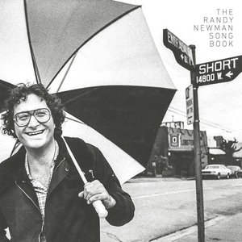

# The Randy Newman Songbook

By **Randy Newman**

## Album Data

- **Catalog:** Beets
- **Format:** Digital, Album
- **Album:** The Randy Newman Songbook
- **Artist:** Randy Newman
- **Albumartist:** Randy Newman
- **Genre:** Rock
- **MusicBrainz Album Artist ID:** [da7bb7d8-557d-4635-9ca1-e6e985525bd5](https://musicbrainz.org/artist/da7bb7d8-557d-4635-9ca1-e6e985525bd5)
- **MusicBrainz Album ID:** [d4f6928a-3873-43e3-a2b7-e1a90dc9c2f8](https://musicbrainz.org/release/d4f6928a-3873-43e3-a2b7-e1a90dc9c2f8)
- **MusicBrainz Release Group ID:** [8a078d31-9d93-44ad-b5f8-347af4098f23](https://musicbrainz.org/release-group/8a078d31-9d93-44ad-b5f8-347af4098f23)
- **Year:** 2016
- **Catalog #:** 
- **Label:** 
- **Total Tracks:** 11

## Album Tracks

### Track 01 - It's Money That I Love

- **Artist:** Randy Newman
- **Format:** AAC
- **Genre:** Rock
- **Length:** 3:49
- **MusicBrainz Track ID:** 
- **Title:** It's Money That I Love
- **Track:** 01
- **Year:** 1979

### Track 02 - The Story Of A Rock And Roll Band

- **Artist:** Randy Newman
- **Format:** AAC
- **Genre:** Pop Rock
- **Length:** 2:59
- **MusicBrainz Track ID:** 
- **Title:** The Story Of A Rock And Roll Band
- **Track:** 02
- **Year:** 1979

### Track 03 - Pretty Boy

- **Artist:** Randy Newman
- **Format:** AAC
- **Genre:** Rock
- **Length:** 4:10
- **MusicBrainz Track ID:** 
- **Title:** Pretty Boy
- **Track:** 03
- **Year:** 1979

### Track 04 - Mr. Sheep

- **Artist:** Randy Newman
- **Format:** AAC
- **Genre:** Pop Rock
- **Length:** 4:03
- **MusicBrainz Track ID:** 
- **Title:** Mr. Sheep
- **Track:** 04
- **Year:** 1979

### Track 05 - Ghosts

- **Artist:** Randy Newman
- **Format:** AAC
- **Genre:** Pop Rock
- **Length:** 2:36
- **MusicBrainz Track ID:** 
- **Title:** Ghosts
- **Track:** 05
- **Year:** 1979

### Track 06 - They Just Got Married

- **Artist:** Randy Newman
- **Format:** AAC
- **Genre:** Pop Rock
- **Length:** 2:59
- **MusicBrainz Track ID:** 
- **Title:** They Just Got Married
- **Track:** 06
- **Year:** 1979

## See also

- [Born Again](Born_Again.md)
- [Good Old Boys](Good_Old_Boys.md)
- [Little Criminals](Little_Criminals.md)
- [Randy Newman](Randy_Newman.md)
- [Randy Newman's Faust](Randy_Newmans_Faust.md)
- [Sail Away](Sail_Away.md)
- [Roon: Born Again](../../Roon/Randy_Newman/Born_Again.md)
- [Roon: Faust (Deluxe Edition)](../../Roon/Randy_Newman/Faust_Deluxe_Edition.md)
- [Roon: Sail Away (Expanded & Remastered Edition)](../../Roon/Randy_Newman/Sail_Away_Expanded_and_Remastered_Edition.md)
- [Roon: The Randy Newman Songbook, Vol. 1](../../Roon/Randy_Newman/The_Randy_Newman_Songbook__Vol_1.md)
- [Vinyl: ](../../Vinyl/Randy_Newman/Randy_Newman.md)
- [Vinyl: The Randy Newman Songbook](../../Vinyl/Randy_Newman/The_Randy_Newman_Songbook.md)
