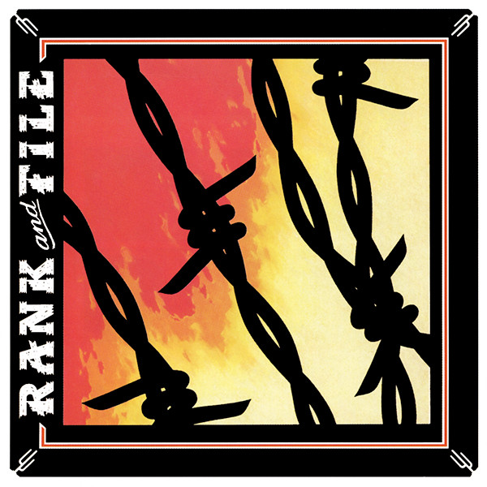

# The Slash Years

By **Rank and File**

## Album Data

- **Catalog:** Beets
- **Format:** Digital, Album
- **Album:** The Slash Years
- **Artist:** Rank And File
- **Albumartist:** Rank and File
- **Genre:** Cowpunk
- **MusicBrainz Album Artist ID:** [2ea03b2b-1826-4338-b92c-cf061f873d07](https://musicbrainz.org/artist/2ea03b2b-1826-4338-b92c-cf061f873d07)
- **MusicBrainz Album ID:** [8b330c01-09a0-4e6a-b7f7-95401866b781](https://musicbrainz.org/release/8b330c01-09a0-4e6a-b7f7-95401866b781)
- **MusicBrainz Release Group ID:** [d065dac6-dabf-3337-b881-798a481c3dea](https://musicbrainz.org/release-group/d065dac6-dabf-3337-b881-798a481c3dea)
- **Year:** 2003
- **Catalog #:** RHM 27816
- **Label:** Rhino Handmade
- **Total Tracks:** 23

## Album Tracks

### Track 01 - Amanda Ruth

- **Artist:** Rank and File
- **Format:** ALAC
- **Genre:** Country
- **Length:** 3:11
- **MusicBrainz Track ID:** [25fed004-e35d-4729-84b0-c58fceb32937](https://musicbrainz.org/recording/25fed004-e35d-4729-84b0-c58fceb32937)
- **Title:** Amanda Ruth
- **Track:** 01
- **Year:** 2003

### Track 02 - (Glad I'm) Not in Love

- **Artist:** Rank and File
- **Format:** ALAC
- **Genre:** Cowpunk
- **Length:** 2:31
- **MusicBrainz Track ID:** [2b47291a-0c84-45cb-9424-72fca9508e1a](https://musicbrainz.org/recording/2b47291a-0c84-45cb-9424-72fca9508e1a)
- **Title:** (Glad I'm) Not in Love
- **Track:** 02
- **Year:** 2003

### Track 03 - Rank and File

- **Artist:** Rank and File
- **Format:** ALAC
- **Genre:** Cowpunk
- **Length:** 4:54
- **MusicBrainz Track ID:** [bf4af0b7-6a1d-4e5b-a4eb-2db2bac0fb5b](https://musicbrainz.org/recording/bf4af0b7-6a1d-4e5b-a4eb-2db2bac0fb5b)
- **Title:** Rank and File
- **Track:** 03
- **Year:** 2003

### Track 04 - The Conductor Wore Black

- **Artist:** Rank and File
- **Format:** ALAC
- **Genre:** Cowpunk
- **Length:** 3:35
- **MusicBrainz Track ID:** [5f718729-0712-4136-8a9f-ce8254bf0f79](https://musicbrainz.org/recording/5f718729-0712-4136-8a9f-ce8254bf0f79)
- **Title:** The Conductor Wore Black
- **Track:** 04
- **Year:** 2003

### Track 05 - Sundown

- **Artist:** Rank and File
- **Format:** ALAC
- **Genre:** Americana
- **Length:** 3:06
- **MusicBrainz Track ID:** [c7586042-0493-4fd4-a114-0bd8e29f3b8a](https://musicbrainz.org/recording/c7586042-0493-4fd4-a114-0bd8e29f3b8a)
- **Title:** Sundown
- **Track:** 05
- **Year:** 2003

### Track 06 - I Went Walking

- **Artist:** Rank and File
- **Format:** ALAC
- **Genre:** Country
- **Length:** 2:57
- **MusicBrainz Track ID:** [2532764f-345d-4a89-9f08-5efc97be0645](https://musicbrainz.org/recording/2532764f-345d-4a89-9f08-5efc97be0645)
- **Title:** I Went Walking
- **Track:** 06
- **Year:** 2003

### Track 07 - Lucky Day

- **Artist:** Rank and File
- **Format:** ALAC
- **Genre:** Cowpunk
- **Length:** 3:42
- **MusicBrainz Track ID:** [c5ca55e7-544f-42c5-9f7f-7af20ff2eb36](https://musicbrainz.org/recording/c5ca55e7-544f-42c5-9f7f-7af20ff2eb36)
- **Title:** Lucky Day
- **Track:** 07
- **Year:** 2003

### Track 08 - I Don't Go Out Much Anymore

- **Artist:** Rank and File
- **Format:** ALAC
- **Genre:** Cowpunk
- **Length:** 2:18
- **MusicBrainz Track ID:** [fea54cdc-9d88-49c7-9a90-62c8fd481f17](https://musicbrainz.org/recording/fea54cdc-9d88-49c7-9a90-62c8fd481f17)
- **Title:** I Don't Go Out Much Anymore
- **Track:** 08
- **Year:** 2003

### Track 09 - Coyote

- **Artist:** Rank and File
- **Format:** ALAC
- **Genre:** Cowpunk
- **Length:** 5:10
- **MusicBrainz Track ID:** [32e3b18d-8db3-44ce-a132-56c712056b7a](https://musicbrainz.org/recording/32e3b18d-8db3-44ce-a132-56c712056b7a)
- **Title:** Coyote
- **Track:** 09
- **Year:** 2003

### Track 10 - Long Gone Dead

- **Artist:** Rank and File
- **Format:** ALAC
- **Genre:** Cowpunk
- **Length:** 2:54
- **MusicBrainz Track ID:** [f779b818-f7ec-4bbd-b60a-51c9ccc05cc6](https://musicbrainz.org/recording/f779b818-f7ec-4bbd-b60a-51c9ccc05cc6)
- **Title:** Long Gone Dead
- **Track:** 10
- **Year:** 2003

### Track 11 - I'm an Old, Old Man

- **Artist:** Rank and File
- **Format:** ALAC
- **Genre:** Cowpunk
- **Length:** 2:51
- **MusicBrainz Track ID:** [b464a794-61f1-444a-b171-7f26bfcfa397](https://musicbrainz.org/recording/b464a794-61f1-444a-b171-7f26bfcfa397)
- **Title:** I'm an Old, Old Man
- **Track:** 11
- **Year:** 2003

### Track 12 - Sound of the Rain

- **Artist:** Rank and File
- **Format:** ALAC
- **Genre:** Cowpunk
- **Length:** 3:43
- **MusicBrainz Track ID:** [f5ac1820-dd99-4bdd-ae39-0d9b7f03e2df](https://musicbrainz.org/recording/f5ac1820-dd99-4bdd-ae39-0d9b7f03e2df)
- **Title:** Sound of the Rain
- **Track:** 12
- **Year:** 2003

### Track 13 - Hot Wind

- **Artist:** Rank and File
- **Format:** ALAC
- **Genre:** Cowpunk
- **Length:** 3:49
- **MusicBrainz Track ID:** [a4f368d8-73f5-4b10-af3d-a002efa1fdf6](https://musicbrainz.org/recording/a4f368d8-73f5-4b10-af3d-a002efa1fdf6)
- **Title:** Hot Wind
- **Track:** 13
- **Year:** 2003

### Track 14 - Tell Her I Love Her

- **Artist:** Rank and File
- **Format:** ALAC
- **Genre:** Cowpunk
- **Length:** 2:31
- **MusicBrainz Track ID:** [3ae675fd-34f3-49a8-972a-c0e87a20f929](https://musicbrainz.org/recording/3ae675fd-34f3-49a8-972a-c0e87a20f929)
- **Title:** Tell Her I Love Her
- **Track:** 14
- **Year:** 2003

### Track 15 - Saddest Girl in the World

- **Artist:** Rank and File
- **Format:** ALAC
- **Genre:** Cowpunk
- **Length:** 2:39
- **MusicBrainz Track ID:** [cabecbd8-d86d-4a6e-af6a-9794034ec654](https://musicbrainz.org/recording/cabecbd8-d86d-4a6e-af6a-9794034ec654)
- **Title:** Saddest Girl in the World
- **Track:** 15
- **Year:** 2003

### Track 16 - Timeless Love

- **Artist:** Rank and File
- **Format:** ALAC
- **Genre:** Cowpunk
- **Length:** 3:24
- **MusicBrainz Track ID:** [2984de9d-ba0e-4d85-8198-3a8e7e7a4aa1](https://musicbrainz.org/recording/2984de9d-ba0e-4d85-8198-3a8e7e7a4aa1)
- **Title:** Timeless Love
- **Track:** 16
- **Year:** 2003

### Track 17 - John Brown

- **Artist:** Rank and File
- **Format:** ALAC
- **Genre:** Cowpunk
- **Length:** 3:50
- **MusicBrainz Track ID:** [147421cc-3bb1-43a7-930e-0cd6a7a2a8d3](https://musicbrainz.org/recording/147421cc-3bb1-43a7-930e-0cd6a7a2a8d3)
- **Title:** John Brown
- **Track:** 17
- **Year:** 2003

### Track 18 - Last Night I Dreamed

- **Artist:** Rank and File
- **Format:** ALAC
- **Genre:** Cowpunk
- **Length:** 3:01
- **MusicBrainz Track ID:** [b8e529f5-acd1-493f-9c8b-6c6a05217f1b](https://musicbrainz.org/recording/b8e529f5-acd1-493f-9c8b-6c6a05217f1b)
- **Title:** Last Night I Dreamed
- **Track:** 18
- **Year:** 2003

### Track 19 - It Don't Matter

- **Artist:** Rank and File
- **Format:** ALAC
- **Genre:** Cowpunk
- **Length:** 3:03
- **MusicBrainz Track ID:** [137ccf56-a9b2-4bef-a967-221c0ffab1bf](https://musicbrainz.org/recording/137ccf56-a9b2-4bef-a967-221c0ffab1bf)
- **Title:** It Don't Matter
- **Track:** 19
- **Year:** 2003

### Track 20 - Klansman

- **Artist:** Rank and File
- **Format:** ALAC
- **Genre:** Cowpunk
- **Length:** 4:45
- **MusicBrainz Track ID:** [eef997de-c0e1-4df3-9953-9e630f3c7937](https://musicbrainz.org/recording/eef997de-c0e1-4df3-9953-9e630f3c7937)
- **Title:** Klansman
- **Track:** 20
- **Year:** 2003

### Track 21 - Post Office

- **Artist:** Rank and File
- **Format:** ALAC
- **Genre:** Cowpunk
- **Length:** 1:51
- **MusicBrainz Track ID:** [26800c1a-c9ae-4e85-9ae8-d59d9e64882f](https://musicbrainz.org/recording/26800c1a-c9ae-4e85-9ae8-d59d9e64882f)
- **Title:** Post Office
- **Track:** 21
- **Year:** 2003

### Track 22 - Wabash Cannonball

- **Artist:** Rank and File
- **Format:** ALAC
- **Genre:** Cowpunk
- **Length:** 2:43
- **MusicBrainz Track ID:** [21c4b7c5-2e23-403b-a868-3cfce085e40d](https://musicbrainz.org/recording/21c4b7c5-2e23-403b-a868-3cfce085e40d)
- **Title:** Wabash Cannonball
- **Track:** 22
- **Year:** 2003

### Track 23 - White Lightnin'

- **Artist:** Rank and File
- **Format:** ALAC
- **Genre:** Cowpunk
- **Length:** 4:14
- **MusicBrainz Track ID:** [0af58367-e97c-4fcd-92ba-929cedf56f7f](https://musicbrainz.org/recording/0af58367-e97c-4fcd-92ba-929cedf56f7f)
- **Title:** White Lightnin'
- **Track:** 23
- **Year:** 2003

