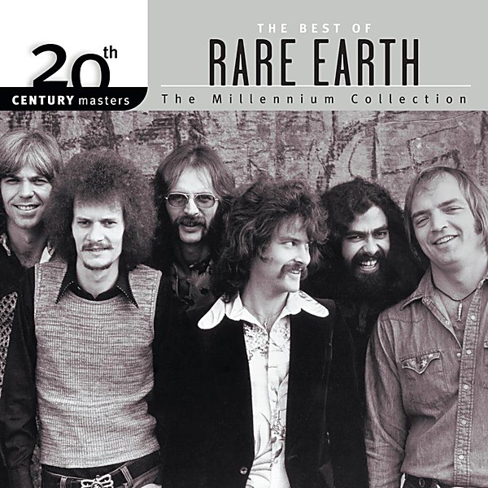

# 20th Century Masters

By **Rare Earth**

## Album Data

- **Catalog:** Beets
- **Format:** Digital, Album
- **Album:** 20th Century Masters
- **Artist:** Rare Earth
- **Albumartist:** Rare Earth
- **Genre:** Soul
- **MusicBrainz Album Artist ID:** [670cc8bc-a6e1-40cd-b20a-86753456d6fa](https://musicbrainz.org/artist/670cc8bc-a6e1-40cd-b20a-86753456d6fa)
- **MusicBrainz Album ID:** [80371302-ae48-4a83-a875-9b72e0d0f2b2](https://musicbrainz.org/release/80371302-ae48-4a83-a875-9b72e0d0f2b2)
- **MusicBrainz Release Group ID:** [722afd4d-f41f-3588-9d54-453924c614e0](https://musicbrainz.org/release-group/722afd4d-f41f-3588-9d54-453924c614e0)
- **Year:** 2001
- **Catalog #:** RS514 Rare Earth
- **Label:** Motown
- **Total Tracks:** 07

## Album Tracks

### Track 01 - Born to Wander

- **Artist:** Rare Earth
- **Format:** AAC
- **Genre:** Blue-Eyed Soul
- **Length:** 3:25
- **MusicBrainz Track ID:** [70edff7a-72e6-4eb8-94d7-a26b142a8aa8](https://musicbrainz.org/recording/70edff7a-72e6-4eb8-94d7-a26b142a8aa8)
- **Title:** Born to Wander
- **Track:** 01
- **Year:** 1970

### Track 02 - Long Time Leavin'

- **Artist:** Rare Earth
- **Format:** AAC
- **Genre:** Blue-Eyed Soul
- **Length:** 4:48
- **MusicBrainz Track ID:** [9ff8b16a-9b93-40c7-a447-161ed4bc4055](https://musicbrainz.org/recording/9ff8b16a-9b93-40c7-a447-161ed4bc4055)
- **Title:** Long Time Leavin'
- **Track:** 02
- **Year:** 1970

### Track 03 - (I Know) I'm Losing You

- **Artist:** Rare Earth
- **Format:** AAC
- **Genre:** Blue-Eyed Soul
- **Length:** 9:59
- **MusicBrainz Track ID:** [22db1ea2-6e28-4d8a-90a0-6d4a8d549340](https://musicbrainz.org/recording/22db1ea2-6e28-4d8a-90a0-6d4a8d549340)
- **Title:** (I Know) I'm Losing You
- **Track:** 03
- **Year:** 1970

### Track 04 - Satisfaction Guaranteed

- **Artist:** Rare Earth
- **Format:** AAC
- **Genre:** Blue-Eyed Soul
- **Length:** 4:36
- **MusicBrainz Track ID:** [67d0625b-b72d-4249-9cda-4033489edaf8](https://musicbrainz.org/recording/67d0625b-b72d-4249-9cda-4033489edaf8)
- **Title:** Satisfaction Guaranteed
- **Track:** 04
- **Year:** 1970

### Track 05 - Nice Place to Visit

- **Artist:** Rare Earth
- **Format:** AAC
- **Genre:** Soul
- **Length:** 4:02
- **MusicBrainz Track ID:** [845b373d-66aa-4e12-89bf-c9f97c201900](https://musicbrainz.org/recording/845b373d-66aa-4e12-89bf-c9f97c201900)
- **Title:** Nice Place to Visit
- **Track:** 05
- **Year:** 1970

### Track 06 - No. 1 Man

- **Artist:** Rare Earth
- **Format:** AAC
- **Genre:** Blue-Eyed Soul
- **Length:** 4:56
- **MusicBrainz Track ID:** [098c3254-732b-41db-8f4e-ab27c29694c8](https://musicbrainz.org/recording/098c3254-732b-41db-8f4e-ab27c29694c8)
- **Title:** No. 1 Man
- **Track:** 06
- **Year:** 1970

### Track 07 - Eleanor Rigby

- **Artist:** Rare Earth
- **Format:** AAC
- **Genre:** Soul
- **Length:** 6:45
- **MusicBrainz Track ID:** [67aab757-2fd2-4ccf-b210-2ce3e889adbc](https://musicbrainz.org/recording/67aab757-2fd2-4ccf-b210-2ce3e889adbc)
- **Title:** Eleanor Rigby
- **Track:** 07
- **Year:** 1970

## See also

- [Ecology](Ecology.md)
- [Get Ready](Get_Ready.md)
- [CD: 20th Century Masters](../../CD/Rare_Earth/20th_Century_Masters-_The_Millennium_Collection-_The_Best_Of_Rare_Earth.md)
- [CD: ](../../CD/Rare_Earth/Rare_Earth.md)
- [Roon: Dreams/Answers](../../Roon/Rare_Earth/Dreams-Answers.md)
- [Roon: Ecology](../../Roon/Rare_Earth/Ecology.md)
- [Roon: Get Ready](../../Roon/Rare_Earth/Get_Ready.md)
- [Roon: In Concert (Live In Concert, US/1971)](../../Roon/Rare_Earth/In_Concert_Live_In_Concert__US-1971.md)
- [Vinyl: Get Ready](../../Vinyl/Rare_Earth/Get_Ready.md)
- [Vinyl: ](../../Vinyl/Rare_Earth/Rare_Earth.md)
