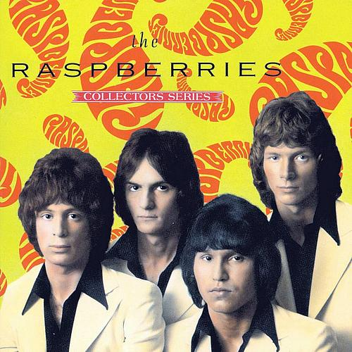

# Capitol Collectors Series

By **Raspberries**

## Album Data

- **Catalog:** Beets
- **Format:** Digital, Album
- **Album:** Capitol Collectors Series
- **Artist:** Raspberries
- **Albumartist:** Raspberries
- **Genre:** Power Pop
- **MusicBrainz Album Artist ID:** [01b405ae-8ca2-4dbe-8a30-0587b597f598](https://musicbrainz.org/artist/01b405ae-8ca2-4dbe-8a30-0587b597f598)
- **MusicBrainz Album ID:** [d7caff29-1d87-425b-863b-3047369bcc2e](https://musicbrainz.org/release/d7caff29-1d87-425b-863b-3047369bcc2e)
- **MusicBrainz Release Group ID:** [7b0b0715-0c9c-3ad2-adb6-2f95f36d0a3b](https://musicbrainz.org/release-group/7b0b0715-0c9c-3ad2-adb6-2f95f36d0a3b)
- **Year:** 1991
- **Catalog #:** CDP 7 92126 2
- **Label:** Capitol Records
- **Total Tracks:** 22

## Album Tracks

### Track 01 - Go All the Way

- **Artist:** Raspberries
- **Format:** ALAC
- **Genre:** Power Pop
- **Length:** 3:20
- **MusicBrainz Track ID:** [ae50a22d-df78-4bdb-8d97-e98441bb90fd](https://musicbrainz.org/recording/ae50a22d-df78-4bdb-8d97-e98441bb90fd)
- **Title:** Go All the Way
- **Track:** 01
- **Year:** 1991

### Track 02 - Come Around and See Me

- **Artist:** Raspberries
- **Format:** ALAC
- **Genre:** Power Pop
- **Length:** 3:08
- **MusicBrainz Track ID:** [83c80785-89eb-4f91-bf7c-c8a33f2e5894](https://musicbrainz.org/recording/83c80785-89eb-4f91-bf7c-c8a33f2e5894)
- **Title:** Come Around and See Me
- **Track:** 02
- **Year:** 1991

### Track 03 - I Saw the Light

- **Artist:** Raspberries
- **Format:** ALAC
- **Genre:** Power Pop
- **Length:** 2:41
- **MusicBrainz Track ID:** [1ac4d822-2908-428c-9e46-dd46b59fe541](https://musicbrainz.org/recording/1ac4d822-2908-428c-9e46-dd46b59fe541)
- **Title:** I Saw the Light
- **Track:** 03
- **Year:** 1991

### Track 04 - Don’t Want to Say Goodbye

- **Artist:** Raspberries
- **Format:** ALAC
- **Genre:** Power Pop
- **Length:** 5:05
- **MusicBrainz Track ID:** [eff83cee-7717-4dbb-b56c-5e390592db93](https://musicbrainz.org/recording/eff83cee-7717-4dbb-b56c-5e390592db93)
- **Title:** Don’t Want to Say Goodbye
- **Track:** 04
- **Year:** 1991

### Track 05 - I Wanna Be With You

- **Artist:** Raspberries
- **Format:** ALAC
- **Genre:** Rock And Roll
- **Length:** 3:06
- **MusicBrainz Track ID:** [4e2e70d6-73de-4014-bf66-bd4c7264226b](https://musicbrainz.org/recording/4e2e70d6-73de-4014-bf66-bd4c7264226b)
- **Title:** I Wanna Be With You
- **Track:** 05
- **Year:** 1991

### Track 06 - Let’s Pretend

- **Artist:** Raspberries
- **Format:** ALAC
- **Genre:** Power Pop
- **Length:** 3:41
- **MusicBrainz Track ID:** [97cdea39-24d5-4872-a173-081517e638c5](https://musicbrainz.org/recording/97cdea39-24d5-4872-a173-081517e638c5)
- **Title:** Let’s Pretend
- **Track:** 06
- **Year:** 1991

### Track 07 - I Reach for the Light

- **Artist:** Raspberries
- **Format:** ALAC
- **Genre:** Power Pop
- **Length:** 3:51
- **MusicBrainz Track ID:** [be6fbeaf-054b-4efd-b17e-31ca0cfebd09](https://musicbrainz.org/recording/be6fbeaf-054b-4efd-b17e-31ca0cfebd09)
- **Title:** I Reach for the Light
- **Track:** 07
- **Year:** 1991

### Track 08 - Nobody Knows

- **Artist:** Raspberries
- **Format:** ALAC
- **Genre:** Power Pop
- **Length:** 2:20
- **MusicBrainz Track ID:** [59a289f9-d0e4-4db9-98b5-ab9db39a72bc](https://musicbrainz.org/recording/59a289f9-d0e4-4db9-98b5-ab9db39a72bc)
- **Title:** Nobody Knows
- **Track:** 08
- **Year:** 1991

### Track 09 - If You Change Your Mind

- **Artist:** Raspberries
- **Format:** ALAC
- **Genre:** Power Pop
- **Length:** 3:56
- **MusicBrainz Track ID:** [fa8866bf-88f1-4f22-81a5-b1f5668d948f](https://musicbrainz.org/recording/fa8866bf-88f1-4f22-81a5-b1f5668d948f)
- **Title:** If You Change Your Mind
- **Track:** 09
- **Year:** 1991

### Track 10 - Drivin’ Around

- **Artist:** Raspberries
- **Format:** ALAC
- **Genre:** Power Pop
- **Length:** 2:58
- **MusicBrainz Track ID:** [4df6bdfc-4d49-4879-8b5b-cbb41a7c82e9](https://musicbrainz.org/recording/4df6bdfc-4d49-4879-8b5b-cbb41a7c82e9)
- **Title:** Drivin’ Around
- **Track:** 10
- **Year:** 1991

### Track 11 - Tonight

- **Artist:** Raspberries
- **Format:** ALAC
- **Genre:** Rock And Roll
- **Length:** 3:41
- **MusicBrainz Track ID:** [71b744e7-3654-4d77-9955-b5e09726042f](https://musicbrainz.org/recording/71b744e7-3654-4d77-9955-b5e09726042f)
- **Title:** Tonight
- **Track:** 11
- **Year:** 1991

### Track 12 - Last Dance

- **Artist:** Raspberries
- **Format:** ALAC
- **Genre:** Pop
- **Length:** 3:36
- **MusicBrainz Track ID:** [ea2d2f84-3100-4af8-97d5-dd736bd3f0f7](https://musicbrainz.org/recording/ea2d2f84-3100-4af8-97d5-dd736bd3f0f7)
- **Title:** Last Dance
- **Track:** 12
- **Year:** 1991

### Track 13 - Hard to Get Over a Heartbreak

- **Artist:** Raspberries
- **Format:** ALAC
- **Genre:** Power Pop
- **Length:** 4:14
- **MusicBrainz Track ID:** [492432cb-e583-4a8e-b9bc-5dd452b7b8d9](https://musicbrainz.org/recording/492432cb-e583-4a8e-b9bc-5dd452b7b8d9)
- **Title:** Hard to Get Over a Heartbreak
- **Track:** 13
- **Year:** 1991

### Track 14 - I’m a Rocker

- **Artist:** Raspberries
- **Format:** ALAC
- **Genre:** Power Pop
- **Length:** 5:10
- **MusicBrainz Track ID:** [83d24116-f0b7-4ff3-8244-a0cf75d3bcfd](https://musicbrainz.org/recording/83d24116-f0b7-4ff3-8244-a0cf75d3bcfd)
- **Title:** I’m a Rocker
- **Track:** 14
- **Year:** 1991

### Track 15 - Ecstacy

- **Artist:** Raspberries
- **Format:** ALAC
- **Genre:** Power Pop
- **Length:** 3:37
- **MusicBrainz Track ID:** [098ea94e-9c6e-4222-8039-7bb3dea3960f](https://musicbrainz.org/recording/098ea94e-9c6e-4222-8039-7bb3dea3960f)
- **Title:** Ecstacy
- **Track:** 15
- **Year:** 1991

### Track 16 - Overnight Sensation

- **Artist:** Raspberries
- **Format:** ALAC
- **Genre:** Blue-Eyed Soul
- **Length:** 5:24
- **MusicBrainz Track ID:** [ecd36c15-c75f-40a0-9224-76c1ba9f29e9](https://musicbrainz.org/recording/ecd36c15-c75f-40a0-9224-76c1ba9f29e9)
- **Title:** Overnight Sensation
- **Track:** 16
- **Year:** 1991

### Track 17 - Party’s Over

- **Artist:** Raspberries
- **Format:** ALAC
- **Genre:** Power Pop
- **Length:** 3:13
- **MusicBrainz Track ID:** [cbd9e963-d96d-456f-adf2-6600e32d5c09](https://musicbrainz.org/recording/cbd9e963-d96d-456f-adf2-6600e32d5c09)
- **Title:** Party’s Over
- **Track:** 17
- **Year:** 1991

### Track 18 - Rose Coloured Glasses

- **Artist:** Raspberries
- **Format:** ALAC
- **Genre:** Power Pop
- **Length:** 3:37
- **MusicBrainz Track ID:** [11d8ac62-95e7-4675-9a8d-b9af323efc94](https://musicbrainz.org/recording/11d8ac62-95e7-4675-9a8d-b9af323efc94)
- **Title:** Rose Coloured Glasses
- **Track:** 18
- **Year:** 1991

### Track 19 - Cruisin’ Music

- **Artist:** Raspberries
- **Format:** ALAC
- **Genre:** Power Pop
- **Length:** 3:07
- **MusicBrainz Track ID:** [f673ea7d-9ecd-43bd-aa70-0cf705b99167](https://musicbrainz.org/recording/f673ea7d-9ecd-43bd-aa70-0cf705b99167)
- **Title:** Cruisin’ Music
- **Track:** 19
- **Year:** 1991

### Track 20 - Starting Over

- **Artist:** Raspberries
- **Format:** ALAC
- **Genre:** Power Pop
- **Length:** 4:15
- **MusicBrainz Track ID:** [88c193eb-8dc0-4423-ba62-b99342729943](https://musicbrainz.org/recording/88c193eb-8dc0-4423-ba62-b99342729943)
- **Title:** Starting Over
- **Track:** 20
- **Year:** 1991

### Track 21 - Radio Promo for ‘Fresh Raspberries’

- **Artist:** Raspberries
- **Format:** ALAC
- **Genre:** Power Pop
- **Length:** 1:01
- **MusicBrainz Track ID:** [7383ab8b-1839-4f6a-8945-e15bfb7d6151](https://musicbrainz.org/recording/7383ab8b-1839-4f6a-8945-e15bfb7d6151)
- **Title:** Radio Promo for ‘Fresh Raspberries’
- **Track:** 21
- **Year:** 1991

### Track 22 - Radio Promo for ‘Starting Over’

- **Artist:** Raspberries
- **Format:** ALAC
- **Genre:** Power Pop
- **Length:** 1:00
- **MusicBrainz Track ID:** [81cdbaa4-9f60-4010-87db-ab85cf69d40b](https://musicbrainz.org/recording/81cdbaa4-9f60-4010-87db-ab85cf69d40b)
- **Title:** Radio Promo for ‘Starting Over’
- **Track:** 22
- **Year:** 1991

