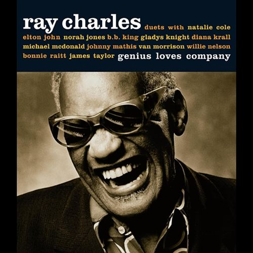

# Genius Loves Company

By **Ray Charles**

## Album Data

- **Catalog:** Beets
- **Format:** Digital, Album
- **Album:** Genius Loves Company
- **Artist:** Ray Charles
- **Albumartist:** Ray Charles
- **Genre:** Swing
- **MusicBrainz Album Artist ID:** [2ce02909-598b-44ef-a456-151ba0a3bd70](https://musicbrainz.org/artist/2ce02909-598b-44ef-a456-151ba0a3bd70)
- **MusicBrainz Album ID:** [4bc890d3-4302-43a6-b652-fd44111fecf8](https://musicbrainz.org/release/4bc890d3-4302-43a6-b652-fd44111fecf8)
- **MusicBrainz Release Group ID:** [775273bc-8a5b-3de7-8eb5-6c1ab4de8b68](https://musicbrainz.org/release-group/775273bc-8a5b-3de7-8eb5-6c1ab4de8b68)
- **Year:** 2004
- **Catalog #:** 
- **Label:** 
- **Total Tracks:** 16

## Album Tracks

### Track 01 - I Can't Stop Loving You

- **Artist:** Ray Charles
- **Format:** ALAC
- **Genre:** Soul
- **Length:** 4:13
- **MusicBrainz Track ID:** 
- **Title:** I Can't Stop Loving You
- **Track:** 01
- **Year:** 1962

### Track 02 - Georgia On My Mind

- **Artist:** Ray Charles
- **Format:** ALAC
- **Genre:** Soul
- **Length:** 3:37
- **MusicBrainz Track ID:** 
- **Title:** Georgia On My Mind
- **Track:** 02
- **Year:** 1960

### Track 03 - Take These Chains From My Heart

- **Artist:** Ray Charles
- **Format:** ALAC
- **Genre:** Soul
- **Length:** 2:56
- **MusicBrainz Track ID:** 
- **Title:** Take These Chains From My Heart
- **Track:** 03
- **Year:** 1995

### Track 04 - What'd I Say

- **Artist:** Ray Charles
- **Format:** ALAC
- **Genre:** Soul
- **Length:** 4:30
- **MusicBrainz Track ID:** 
- **Title:** What'd I Say
- **Track:** 04
- **Year:** 1995

### Track 05 - Here We Go Again

- **Artist:** Ray Charles
- **Format:** ALAC
- **Genre:** Soul
- **Length:** 3:19
- **MusicBrainz Track ID:** 
- **Title:** Here We Go Again
- **Track:** 05
- **Year:** 1995

### Track 06 - Unchain My Heart

- **Artist:** Ray Charles
- **Format:** ALAC
- **Genre:** Soul
- **Length:** 2:50
- **MusicBrainz Track ID:** 
- **Title:** Unchain My Heart
- **Track:** 06
- **Year:** 1995

### Track 07 - Ruby

- **Artist:** Ray Charles
- **Format:** ALAC
- **Genre:** Soul
- **Length:** 3:53
- **MusicBrainz Track ID:** 
- **Title:** Ruby
- **Track:** 07
- **Year:** 1995

### Track 08 - Busted

- **Artist:** Ray Charles
- **Format:** ALAC
- **Genre:** Soul
- **Length:** 2:07
- **MusicBrainz Track ID:** 
- **Title:** Busted
- **Track:** 08
- **Year:** 1995

### Track 09 - Hit The Road Jack

- **Artist:** Ray Charles
- **Format:** ALAC
- **Genre:** Soul
- **Length:** 1:59
- **MusicBrainz Track ID:** 
- **Title:** Hit The Road Jack
- **Track:** 09
- **Year:** 1961

### Track 10 - Together Again

- **Artist:** Ray Charles
- **Format:** ALAC
- **Genre:** Soul
- **Length:** 2:40
- **MusicBrainz Track ID:** 
- **Title:** Together Again
- **Track:** 10
- **Year:** 1965

### Track 11 - Born To Lose

- **Artist:** Ray Charles
- **Format:** ALAC
- **Genre:** Soul
- **Length:** 3:15
- **MusicBrainz Track ID:** 
- **Title:** Born To Lose
- **Track:** 11
- **Year:** 1995

### Track 12 - Crying Time

- **Artist:** Ray Charles
- **Format:** ALAC
- **Genre:** Soul
- **Length:** 2:58
- **MusicBrainz Track ID:** 
- **Title:** Crying Time
- **Track:** 12
- **Year:** 1995

### Track 13 - I Got A Woman

- **Artist:** Ray Charles
- **Format:** ALAC
- **Genre:** Soul
- **Length:** 6:20
- **MusicBrainz Track ID:** 
- **Title:** I Got A Woman
- **Track:** 13
- **Year:** 1995

### Track 14 - Baby, It's Cold Outside

- **Artist:** Ray Charles
- **Format:** ALAC
- **Genre:** Jazz
- **Length:** 4:10
- **MusicBrainz Track ID:** 
- **Title:** Baby, It's Cold Outside
- **Track:** 14
- **Year:** 1995

### Track 15 - Let's Go Get Stoned

- **Artist:** Ray Charles
- **Format:** ALAC
- **Genre:** Soul
- **Length:** 2:57
- **MusicBrainz Track ID:** 
- **Title:** Let's Go Get Stoned
- **Track:** 15
- **Year:** 1995

### Track 16 - Makin' Believe

- **Artist:** Ray Charles
- **Format:** ALAC
- **Genre:** Soul
- **Length:** 2:49
- **MusicBrainz Track ID:** 
- **Title:** Makin' Believe
- **Track:** 16
- **Year:** 1995

## See also

- [Hit Collection](Hit_Collection.md)
- [Modern Sounds in Country and Western Music [Bonus Tracks]](Modern_Sounds_in_Country_and_Western_Music_[Bonus_Tracks].md)
- [Unknown Album](Unknown_Album.md)
- [Roon: Genius + Soul = Jazz](../../Roon/Ray_Charles/Genius_+_Soul_=_Jazz.md)
- [Roon: True Genius](../../Roon/Ray_Charles/True_Genius.md)
