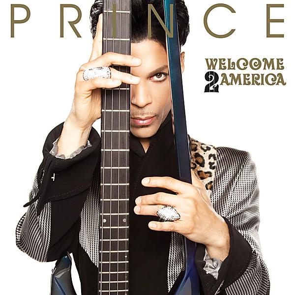

# Unknown Album

By **Ray Charles**

## Album Data

- **Catalog:** Beets
- **Format:** Digital, Album
- **Album:** Unknown Album
- **Artist:** Ray Charles
- **Albumartist:** Ray Charles
- **Genre:** Soul
- **MusicBrainz Album Artist ID:** 
- **MusicBrainz Album ID:** 
- **MusicBrainz Release Group ID:** 
- **Year:** 0000
- **Catalog #:** 
- **Label:** 
- **Total Tracks:** 00

## Album Tracks

### Track 00 - Hit The Road, Jack.[160Kb 1'59]

- **Artist:** Ray Charles
- **Format:** AAC
- **Genre:** Soul
- **Length:** 1:57
- **MusicBrainz Track ID:** 
- **Title:** Hit The Road, Jack.[160Kb 1'59]
- **Track:** 00
- **Year:** 0000

## See also

- [Genius Loves Company](Genius_Loves_Company.md)
- [Hit Collection](Hit_Collection.md)
- [Modern Sounds in Country and Western Music [Bonus Tracks]](Modern_Sounds_in_Country_and_Western_Music_[Bonus_Tracks].md)
- [Roon: Genius + Soul = Jazz](../../Roon/Ray_Charles/Genius_+_Soul_=_Jazz.md)
- [Roon: True Genius](../../Roon/Ray_Charles/True_Genius.md)
