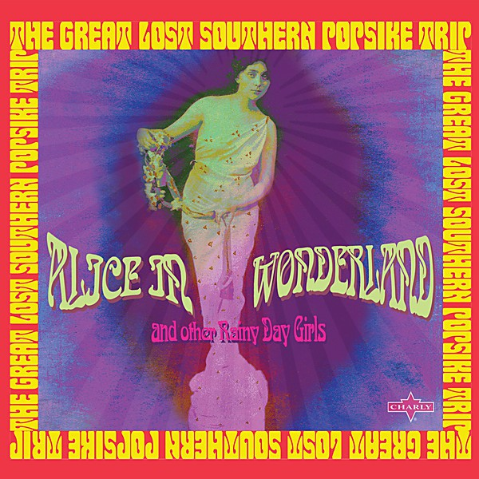

# Unknown Album

By **Ray Stevens**

## Album Data

- **Catalog:** Beets
- **Format:** Digital, Album
- **Album:** Unknown Album
- **Artist:** Ray Stevens
- **Albumartist:** Ray Stevens
- **Genre:** Country
- **MusicBrainz Album Artist ID:** 
- **MusicBrainz Album ID:** 
- **MusicBrainz Release Group ID:** 
- **Year:** 1970
- **Catalog #:** 
- **Label:** 
- **Total Tracks:** 00

## Album Tracks

### Track 01 - Everything Is Beautiful

- **Artist:** Ray Stevens
- **Format:** AAC
- **Genre:** Country Pop
- **Length:** 3:33
- **MusicBrainz Track ID:** 
- **Title:** Everything Is Beautiful
- **Track:** 01
- **Year:** 1970

## See also

- [Vinyl: I Need Your Help Barry Manilow](../../Vinyl/Ray_Stevens/I_Need_Your_Help_Barry_Manilow.md)
- [Vinyl: ](../../Vinyl/Ray_Stevens/Ray_Stevens.md)
