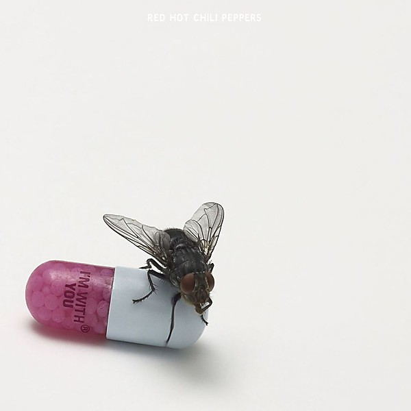

# I’m With You

By **Red Hot Chili Peppers**

## Album Data

- **Catalog:** Beets
- **Format:** Digital, Album
- **Album:** I’m With You
- **Artist:** Red Hot Chili Peppers
- **Albumartist:** Red Hot Chili Peppers
- **Genre:** Alternative Rock
- **MusicBrainz Album Artist ID:** [8bfac288-ccc5-448d-9573-c33ea2aa5c30](https://musicbrainz.org/artist/8bfac288-ccc5-448d-9573-c33ea2aa5c30)
- **MusicBrainz Album ID:** [ae3f018b-5cc5-4f06-a2ff-e9e4690a80d4](https://musicbrainz.org/release/ae3f018b-5cc5-4f06-a2ff-e9e4690a80d4)
- **MusicBrainz Release Group ID:** [c9ffebc3-0e00-4ba7-bef6-980c98d623b6](https://musicbrainz.org/release-group/c9ffebc3-0e00-4ba7-bef6-980c98d623b6)
- **Year:** 2011
- **Catalog #:** UDCD 683
- **Label:** Mobile Fidelity Sound Lab
- **Total Tracks:** 13

## Album Tracks

### Track 01 - Good Time Boys

- **Artist:** Red Hot Chili Peppers
- **Format:** AAC
- **Genre:** Funk Metal
- **Length:** 5:07
- **MusicBrainz Track ID:** [0f7a6289-dc7a-45a0-b279-16bfc68ad290](https://musicbrainz.org/recording/0f7a6289-dc7a-45a0-b279-16bfc68ad290)
- **Title:** Good Time Boys
- **Track:** 01
- **Year:** 1996

### Track 02 - Higher Ground

- **Artist:** Red Hot Chili Peppers
- **Format:** AAC
- **Genre:** Funk Metal
- **Length:** 3:27
- **MusicBrainz Track ID:** [61fbfaa9-cd9f-4501-aaf3-1d008adb3142](https://musicbrainz.org/recording/61fbfaa9-cd9f-4501-aaf3-1d008adb3142)
- **Title:** Higher Ground
- **Track:** 02
- **Year:** 1996

### Track 03 - Subway to Venus

- **Artist:** Red Hot Chili Peppers
- **Format:** AAC
- **Genre:** Funk Metal
- **Length:** 4:32
- **MusicBrainz Track ID:** [e88bc295-93e5-4b9a-a071-01adc0508264](https://musicbrainz.org/recording/e88bc295-93e5-4b9a-a071-01adc0508264)
- **Title:** Subway to Venus
- **Track:** 03
- **Year:** 1996

### Track 04 - Magic Johnson

- **Artist:** Red Hot Chili Peppers
- **Format:** AAC
- **Genre:** Funk Metal
- **Length:** 2:59
- **MusicBrainz Track ID:** [9f10eecb-0d1d-4292-9caa-6ccdf3cac56e](https://musicbrainz.org/recording/9f10eecb-0d1d-4292-9caa-6ccdf3cac56e)
- **Title:** Magic Johnson
- **Track:** 04
- **Year:** 1996

### Track 05 - Nobody Weird Like Me

- **Artist:** Red Hot Chili Peppers
- **Format:** AAC
- **Genre:** Funk Metal
- **Length:** 3:54
- **MusicBrainz Track ID:** [850cfbe5-36cb-4088-8301-524bd5c58f38](https://musicbrainz.org/recording/850cfbe5-36cb-4088-8301-524bd5c58f38)
- **Title:** Nobody Weird Like Me
- **Track:** 05
- **Year:** 1996

### Track 06 - Knock Me Down

- **Artist:** Red Hot Chili Peppers
- **Format:** AAC
- **Genre:** Funk Metal
- **Length:** 3:46
- **MusicBrainz Track ID:** [6932275d-4446-4e84-9176-fd1f19cf2d72](https://musicbrainz.org/recording/6932275d-4446-4e84-9176-fd1f19cf2d72)
- **Title:** Knock Me Down
- **Track:** 06
- **Year:** 1996

### Track 07 - Taste the Pain

- **Artist:** Red Hot Chili Peppers
- **Format:** AAC
- **Genre:** Funk Metal
- **Length:** 4:35
- **MusicBrainz Track ID:** [6380ea3f-2ab2-4721-bc47-acee6383a13d](https://musicbrainz.org/recording/6380ea3f-2ab2-4721-bc47-acee6383a13d)
- **Title:** Taste the Pain
- **Track:** 07
- **Year:** 1996

### Track 08 - Stone Cold Bush

- **Artist:** Red Hot Chili Peppers
- **Format:** AAC
- **Genre:** Funk Metal
- **Length:** 3:10
- **MusicBrainz Track ID:** [3d487e5f-435a-4d88-972e-a203d4c8e5b4](https://musicbrainz.org/recording/3d487e5f-435a-4d88-972e-a203d4c8e5b4)
- **Title:** Stone Cold Bush
- **Track:** 08
- **Year:** 1996

### Track 09 - Fire

- **Artist:** Red Hot Chili Peppers
- **Format:** AAC
- **Genre:** Funk Metal
- **Length:** 2:06
- **MusicBrainz Track ID:** [81f64442-e500-4ced-a232-ae9b7406b5f0](https://musicbrainz.org/recording/81f64442-e500-4ced-a232-ae9b7406b5f0)
- **Title:** Fire
- **Track:** 09
- **Year:** 1996

### Track 10 - Pretty Little Ditty

- **Artist:** Red Hot Chili Peppers
- **Format:** AAC
- **Genre:** Funk Metal
- **Length:** 1:38
- **MusicBrainz Track ID:** [956af554-ddcd-46b9-961a-1b3dfc1c4aa9](https://musicbrainz.org/recording/956af554-ddcd-46b9-961a-1b3dfc1c4aa9)
- **Title:** Pretty Little Ditty
- **Track:** 10
- **Year:** 1996

### Track 11 - Punk Rock Classic

- **Artist:** Red Hot Chili Peppers
- **Format:** AAC
- **Genre:** Funk Metal
- **Length:** 1:50
- **MusicBrainz Track ID:** [a0ac0499-b976-42e4-9506-d52ad02e558c](https://musicbrainz.org/recording/a0ac0499-b976-42e4-9506-d52ad02e558c)
- **Title:** Punk Rock Classic
- **Track:** 11
- **Year:** 1996

### Track 12 - Sexy Mexican Maid

- **Artist:** Red Hot Chili Peppers
- **Format:** AAC
- **Genre:** Funk Metal
- **Length:** 3:26
- **MusicBrainz Track ID:** [af786753-4831-4163-9b63-f8f604d28971](https://musicbrainz.org/recording/af786753-4831-4163-9b63-f8f604d28971)
- **Title:** Sexy Mexican Maid
- **Track:** 12
- **Year:** 1996

### Track 13 - Johnny, Kick a Hole in the Sky

- **Artist:** Red Hot Chili Peppers
- **Format:** AAC
- **Genre:** Funk Metal
- **Length:** 5:17
- **MusicBrainz Track ID:** [e9c77073-37e8-4778-bb40-1fe06f95b084](https://musicbrainz.org/recording/e9c77073-37e8-4778-bb40-1fe06f95b084)
- **Title:** Johnny, Kick a Hole in the Sky
- **Track:** 13
- **Year:** 1996

## See also

- [By the Way](By_the_Way.md)
- [Californication (Bonus Version)](Californication_Bonus_Version.md)
- [Californication](Californication.md)
- [Mother’s Milk](Mother’s_Milk.md)
- [One Hot Minute](One_Hot_Minute.md)
- [Red Hot Chili Peppers](Red_Hot_Chili_Peppers.md)
- [Stadium Arcadium](Stadium_Arcadium_2.md)
- [Stadium Arcadium](Stadium_Arcadium.md)
- [The Getaway](The_Getaway.md)
- [CD: Californication](../../CD/Red_Hot_Chili_Peppers/Californication.md)
- [CD: ](../../CD/Red_Hot_Chili_Peppers/Red_Hot_Chili_Peppers.md)
- [Roon: Blood Sugar Sex Magik (2014 Remaster)](../../Roon/Red_Hot_Chili_Peppers/Blood_Sugar_Sex_Magik_2014_Remaster.md)
- [Roon: Blood Sugar Sex Magik (Deluxe Edition)](../../Roon/Red_Hot_Chili_Peppers/Blood_Sugar_Sex_Magik_Deluxe_Edition.md)
- [Roon: Blood Sugar Sex Magik (U.S. Version)](../../Roon/Red_Hot_Chili_Peppers/Blood_Sugar_Sex_Magik_US_Version.md)
- [Roon: Californication (2014 Remaster)](../../Roon/Red_Hot_Chili_Peppers/Californication_2014_Remaster.md)
- [Roon: Return of the Dream Canteen](../../Roon/Red_Hot_Chili_Peppers/Return_of_the_Dream_Canteen.md)
- [Roon: Stadium Arcadium (2014 Remaster)](../../Roon/Red_Hot_Chili_Peppers/Stadium_Arcadium_2014_Remaster.md)
- [Roon: The Studio Album Collection 1991 - 2011](../../Roon/Red_Hot_Chili_Peppers/The_Studio_Album_Collection_1991_-_2011.md)
- [Roon: Unlimited Love](../../Roon/Red_Hot_Chili_Peppers/Unlimited_Love.md)
- [Vinyl: Freaky Styley](../../Vinyl/Red_Hot_Chili_Peppers/Freaky_Styley.md)
- [Vinyl: Mother's Milk](../../Vinyl/Red_Hot_Chili_Peppers/Mothers_Milk.md)
- [Vinyl: ](../../Vinyl/Red_Hot_Chili_Peppers/Red_Hot_Chili_Peppers.md)
- [Vinyl: Stadium Arcadium](../../Vinyl/Red_Hot_Chili_Peppers/Stadium_Arcadium.md)
