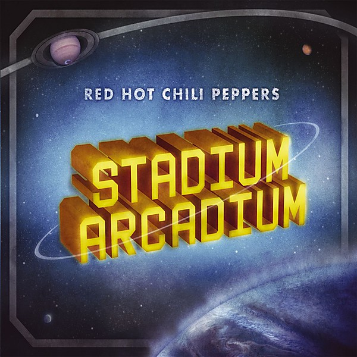

# Stadium Arcadium

By **Red Hot Chili Peppers**

## Album Data

- **Catalog:** Beets
- **Format:** Digital, Album
- **Album:** Stadium Arcadium
- **Artist:** Red Hot Chili Peppers
- **Albumartist:** Red Hot Chili Peppers
- **Genre:** Funk
- **MusicBrainz Album Artist ID:** 
- **MusicBrainz Album ID:** 
- **MusicBrainz Release Group ID:** 
- **Year:** 2006
- **Catalog #:** 
- **Label:** 
- **Total Tracks:** 14

## Album Tracks

### Track 01 - Desecration Smile

- **Artist:** Red Hot Chili Peppers
- **Format:** ALAC
- **Genre:** Funk
- **Length:** 5:01
- **MusicBrainz Track ID:** 
- **Title:** Desecration Smile
- **Track:** 01
- **Year:** 2006

### Track 02 - Tell Me Baby

- **Artist:** Red Hot Chili Peppers
- **Format:** ALAC
- **Genre:** Funk
- **Length:** 4:07
- **MusicBrainz Track ID:** 
- **Title:** Tell Me Baby
- **Track:** 02
- **Year:** 2006

### Track 03 - Hard To Concentrate

- **Artist:** Red Hot Chili Peppers
- **Format:** ALAC
- **Genre:** Funk
- **Length:** 4:01
- **MusicBrainz Track ID:** 
- **Title:** Hard To Concentrate
- **Track:** 03
- **Year:** 2006

### Track 04 - 21st Century

- **Artist:** Red Hot Chili Peppers
- **Format:** ALAC
- **Genre:** Funk
- **Length:** 4:22
- **MusicBrainz Track ID:** 
- **Title:** 21st Century
- **Track:** 04
- **Year:** 2006

### Track 05 - She Looks To Me

- **Artist:** Red Hot Chili Peppers
- **Format:** ALAC
- **Genre:** Funk
- **Length:** 4:06
- **MusicBrainz Track ID:** 
- **Title:** She Looks To Me
- **Track:** 05
- **Year:** 2006

### Track 06 - Readymade

- **Artist:** Red Hot Chili Peppers
- **Format:** ALAC
- **Genre:** Hard Rock
- **Length:** 4:30
- **MusicBrainz Track ID:** 
- **Title:** Readymade
- **Track:** 06
- **Year:** 2006

### Track 07 - If

- **Artist:** Red Hot Chili Peppers
- **Format:** ALAC
- **Genre:** Funk
- **Length:** 2:52
- **MusicBrainz Track ID:** 
- **Title:** If
- **Track:** 07
- **Year:** 2006

### Track 08 - Make You Feel Better

- **Artist:** Red Hot Chili Peppers
- **Format:** ALAC
- **Genre:** Funk
- **Length:** 3:51
- **MusicBrainz Track ID:** 
- **Title:** Make You Feel Better
- **Track:** 08
- **Year:** 2006

### Track 09 - Animal Bar

- **Artist:** Red Hot Chili Peppers
- **Format:** ALAC
- **Genre:** Hard Rock
- **Length:** 5:25
- **MusicBrainz Track ID:** 
- **Title:** Animal Bar
- **Track:** 09
- **Year:** 2006

### Track 10 - So Much I

- **Artist:** Red Hot Chili Peppers
- **Format:** ALAC
- **Genre:** Funk
- **Length:** 3:44
- **MusicBrainz Track ID:** 
- **Title:** So Much I
- **Track:** 10
- **Year:** 2006

### Track 11 - Storm In A Teacup

- **Artist:** Red Hot Chili Peppers
- **Format:** ALAC
- **Genre:** Hard Rock
- **Length:** 3:45
- **MusicBrainz Track ID:** 
- **Title:** Storm In A Teacup
- **Track:** 11
- **Year:** 2006

### Track 12 - We Believe

- **Artist:** Red Hot Chili Peppers
- **Format:** ALAC
- **Genre:** Funk
- **Length:** 3:36
- **MusicBrainz Track ID:** 
- **Title:** We Believe
- **Track:** 12
- **Year:** 2006

### Track 13 - Turn It Again

- **Artist:** Red Hot Chili Peppers
- **Format:** ALAC
- **Genre:** Funk
- **Length:** 6:06
- **MusicBrainz Track ID:** 
- **Title:** Turn It Again
- **Track:** 13
- **Year:** 2006

### Track 14 - Death Of A Martian

- **Artist:** Red Hot Chili Peppers
- **Format:** ALAC
- **Genre:** Funk
- **Length:** 4:24
- **MusicBrainz Track ID:** 
- **Title:** Death Of A Martian
- **Track:** 14
- **Year:** 2006

## See also

- [By the Way](By_the_Way.md)
- [Californication (Bonus Version)](Californication_Bonus_Version.md)
- [Californication](Californication.md)
- [I’m With You](I’m_With_You.md)
- [Mother’s Milk](Mother’s_Milk.md)
- [One Hot Minute](One_Hot_Minute.md)
- [Red Hot Chili Peppers](Red_Hot_Chili_Peppers.md)
- [Stadium Arcadium](Stadium_Arcadium_2.md)
- [The Getaway](The_Getaway.md)
- [CD: Californication](../../CD/Red_Hot_Chili_Peppers/Californication.md)
- [CD: ](../../CD/Red_Hot_Chili_Peppers/Red_Hot_Chili_Peppers.md)
- [Roon: Blood Sugar Sex Magik (2014 Remaster)](../../Roon/Red_Hot_Chili_Peppers/Blood_Sugar_Sex_Magik_2014_Remaster.md)
- [Roon: Blood Sugar Sex Magik (Deluxe Edition)](../../Roon/Red_Hot_Chili_Peppers/Blood_Sugar_Sex_Magik_Deluxe_Edition.md)
- [Roon: Blood Sugar Sex Magik (U.S. Version)](../../Roon/Red_Hot_Chili_Peppers/Blood_Sugar_Sex_Magik_US_Version.md)
- [Roon: Californication (2014 Remaster)](../../Roon/Red_Hot_Chili_Peppers/Californication_2014_Remaster.md)
- [Roon: Return of the Dream Canteen](../../Roon/Red_Hot_Chili_Peppers/Return_of_the_Dream_Canteen.md)
- [Roon: Stadium Arcadium (2014 Remaster)](../../Roon/Red_Hot_Chili_Peppers/Stadium_Arcadium_2014_Remaster.md)
- [Roon: The Studio Album Collection 1991 - 2011](../../Roon/Red_Hot_Chili_Peppers/The_Studio_Album_Collection_1991_-_2011.md)
- [Roon: Unlimited Love](../../Roon/Red_Hot_Chili_Peppers/Unlimited_Love.md)
- [Vinyl: Freaky Styley](../../Vinyl/Red_Hot_Chili_Peppers/Freaky_Styley.md)
- [Vinyl: Mother's Milk](../../Vinyl/Red_Hot_Chili_Peppers/Mothers_Milk.md)
- [Vinyl: ](../../Vinyl/Red_Hot_Chili_Peppers/Red_Hot_Chili_Peppers.md)
- [Vinyl: Stadium Arcadium](../../Vinyl/Red_Hot_Chili_Peppers/Stadium_Arcadium.md)
