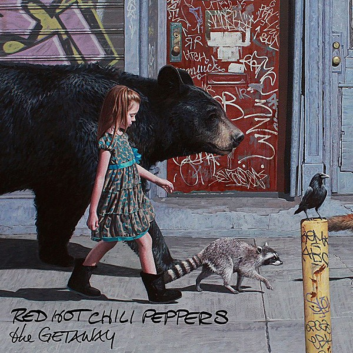

# The Getaway

By **Red Hot Chili Peppers**

## Album Data

- **Catalog:** Beets
- **Format:** Digital, Album
- **Album:** The Getaway
- **Artist:** Red Hot Chili Peppers
- **Albumartist:** Red Hot Chili Peppers
- **Genre:** Funk Metal
- **MusicBrainz Album Artist ID:** [8bfac288-ccc5-448d-9573-c33ea2aa5c30](https://musicbrainz.org/artist/8bfac288-ccc5-448d-9573-c33ea2aa5c30)
- **MusicBrainz Album ID:** [ee811402-e609-4b4a-82a7-68f4dbcf69e0](https://musicbrainz.org/release/ee811402-e609-4b4a-82a7-68f4dbcf69e0)
- **MusicBrainz Release Group ID:** [831f10e3-32e5-4d22-b001-2f3ab1254be0](https://musicbrainz.org/release-group/831f10e3-32e5-4d22-b001-2f3ab1254be0)
- **Year:** 2016
- **Catalog #:** 
- **Label:** Warner Bros. Records
- **Total Tracks:** 13

## Album Tracks

### Track 01 - The Getaway

- **Artist:** Red Hot Chili Peppers
- **Format:** ALAC
- **Genre:** Pop Rock
- **Length:** 4:10
- **MusicBrainz Track ID:** [ea45de37-9999-4f38-8ae3-f6a20fc9f7f5](https://musicbrainz.org/recording/ea45de37-9999-4f38-8ae3-f6a20fc9f7f5)
- **Title:** The Getaway
- **Track:** 01
- **Year:** 2016

### Track 02 - Dark Necessities

- **Artist:** Red Hot Chili Peppers
- **Format:** ALAC
- **Genre:** Emo
- **Length:** 5:02
- **MusicBrainz Track ID:** [90874003-71e7-44e9-8f7f-4ccd9f03d5c0](https://musicbrainz.org/recording/90874003-71e7-44e9-8f7f-4ccd9f03d5c0)
- **Title:** Dark Necessities
- **Track:** 02
- **Year:** 2016

### Track 03 - We Turn Red

- **Artist:** Red Hot Chili Peppers
- **Format:** ALAC
- **Genre:** Pop Rock
- **Length:** 3:20
- **MusicBrainz Track ID:** [fdebad88-464a-4ed8-bd10-8f59e2a00b59](https://musicbrainz.org/recording/fdebad88-464a-4ed8-bd10-8f59e2a00b59)
- **Title:** We Turn Red
- **Track:** 03
- **Year:** 2016

### Track 04 - The Longest Wave

- **Artist:** Red Hot Chili Peppers
- **Format:** ALAC
- **Genre:** Pop Rock
- **Length:** 3:31
- **MusicBrainz Track ID:** [8744632f-38df-471c-8ed9-f7ce58f20243](https://musicbrainz.org/recording/8744632f-38df-471c-8ed9-f7ce58f20243)
- **Title:** The Longest Wave
- **Track:** 04
- **Year:** 2016

### Track 05 - Goodbye Angels

- **Artist:** Red Hot Chili Peppers
- **Format:** ALAC
- **Genre:** Pop Rock
- **Length:** 4:28
- **MusicBrainz Track ID:** [700297da-dc54-494d-8b06-3e2ed70c95ec](https://musicbrainz.org/recording/700297da-dc54-494d-8b06-3e2ed70c95ec)
- **Title:** Goodbye Angels
- **Track:** 05
- **Year:** 2016

### Track 06 - Sick Love

- **Artist:** Red Hot Chili Peppers
- **Format:** ALAC
- **Genre:** Pop Rock
- **Length:** 3:41
- **MusicBrainz Track ID:** [1c62a6e4-a000-4125-9f8b-761ff57bb07c](https://musicbrainz.org/recording/1c62a6e4-a000-4125-9f8b-761ff57bb07c)
- **Title:** Sick Love
- **Track:** 06
- **Year:** 2016

### Track 07 - Go Robot

- **Artist:** Red Hot Chili Peppers
- **Format:** ALAC
- **Genre:** Pop Rock
- **Length:** 4:23
- **MusicBrainz Track ID:** [6f1e4d00-2a2e-403f-9ab1-c9e3d6984eee](https://musicbrainz.org/recording/6f1e4d00-2a2e-403f-9ab1-c9e3d6984eee)
- **Title:** Go Robot
- **Track:** 07
- **Year:** 2016

### Track 08 - Feasting on the Flowers

- **Artist:** Red Hot Chili Peppers
- **Format:** ALAC
- **Genre:** Pop Rock
- **Length:** 3:22
- **MusicBrainz Track ID:** [9741dc59-2a4a-4c80-9fe2-e21629fe452e](https://musicbrainz.org/recording/9741dc59-2a4a-4c80-9fe2-e21629fe452e)
- **Title:** Feasting on the Flowers
- **Track:** 08
- **Year:** 2016

### Track 09 - Detroit

- **Artist:** Red Hot Chili Peppers
- **Format:** ALAC
- **Genre:** Funk Metal
- **Length:** 3:46
- **MusicBrainz Track ID:** [34f91807-5cd7-4e50-b1ca-15d23a08960f](https://musicbrainz.org/recording/34f91807-5cd7-4e50-b1ca-15d23a08960f)
- **Title:** Detroit
- **Track:** 09
- **Year:** 2016

### Track 10 - This Ticonderoga

- **Artist:** Red Hot Chili Peppers
- **Format:** ALAC
- **Genre:** Funk Metal
- **Length:** 3:35
- **MusicBrainz Track ID:** [c49a9a1a-6cde-421d-a9d5-94fcbc66f1c1](https://musicbrainz.org/recording/c49a9a1a-6cde-421d-a9d5-94fcbc66f1c1)
- **Title:** This Ticonderoga
- **Track:** 10
- **Year:** 2016

### Track 11 - Encore

- **Artist:** Red Hot Chili Peppers
- **Format:** ALAC
- **Genre:** Pop Rock
- **Length:** 4:14
- **MusicBrainz Track ID:** [e63ce57b-cc31-42d4-8eca-a42735a48ddc](https://musicbrainz.org/recording/e63ce57b-cc31-42d4-8eca-a42735a48ddc)
- **Title:** Encore
- **Track:** 11
- **Year:** 2016

### Track 12 - The Hunter

- **Artist:** Red Hot Chili Peppers
- **Format:** ALAC
- **Genre:** Pop Rock
- **Length:** 4:00
- **MusicBrainz Track ID:** [51777489-4997-4013-af67-926ed6fa5f3b](https://musicbrainz.org/recording/51777489-4997-4013-af67-926ed6fa5f3b)
- **Title:** The Hunter
- **Track:** 12
- **Year:** 2016

### Track 13 - Dreams of a Samurai

- **Artist:** Red Hot Chili Peppers
- **Format:** ALAC
- **Genre:** Progressive Rock
- **Length:** 6:09
- **MusicBrainz Track ID:** [8bcbd2ac-742a-4f68-86aa-049456b973e5](https://musicbrainz.org/recording/8bcbd2ac-742a-4f68-86aa-049456b973e5)
- **Title:** Dreams of a Samurai
- **Track:** 13
- **Year:** 2016

## See also

- [By the Way](By_the_Way.md)
- [Californication (Bonus Version)](Californication_Bonus_Version.md)
- [Californication](Californication.md)
- [I’m With You](I’m_With_You.md)
- [Mother’s Milk](Mother’s_Milk.md)
- [One Hot Minute](One_Hot_Minute.md)
- [Red Hot Chili Peppers](Red_Hot_Chili_Peppers.md)
- [Stadium Arcadium](Stadium_Arcadium_2.md)
- [Stadium Arcadium](Stadium_Arcadium.md)
- [CD: Californication](../../CD/Red_Hot_Chili_Peppers/Californication.md)
- [CD: ](../../CD/Red_Hot_Chili_Peppers/Red_Hot_Chili_Peppers.md)
- [Roon: Blood Sugar Sex Magik (2014 Remaster)](../../Roon/Red_Hot_Chili_Peppers/Blood_Sugar_Sex_Magik_2014_Remaster.md)
- [Roon: Blood Sugar Sex Magik (Deluxe Edition)](../../Roon/Red_Hot_Chili_Peppers/Blood_Sugar_Sex_Magik_Deluxe_Edition.md)
- [Roon: Blood Sugar Sex Magik (U.S. Version)](../../Roon/Red_Hot_Chili_Peppers/Blood_Sugar_Sex_Magik_US_Version.md)
- [Roon: Californication (2014 Remaster)](../../Roon/Red_Hot_Chili_Peppers/Californication_2014_Remaster.md)
- [Roon: Return of the Dream Canteen](../../Roon/Red_Hot_Chili_Peppers/Return_of_the_Dream_Canteen.md)
- [Roon: Stadium Arcadium (2014 Remaster)](../../Roon/Red_Hot_Chili_Peppers/Stadium_Arcadium_2014_Remaster.md)
- [Roon: The Studio Album Collection 1991 - 2011](../../Roon/Red_Hot_Chili_Peppers/The_Studio_Album_Collection_1991_-_2011.md)
- [Roon: Unlimited Love](../../Roon/Red_Hot_Chili_Peppers/Unlimited_Love.md)
- [Vinyl: Freaky Styley](../../Vinyl/Red_Hot_Chili_Peppers/Freaky_Styley.md)
- [Vinyl: Mother's Milk](../../Vinyl/Red_Hot_Chili_Peppers/Mothers_Milk.md)
- [Vinyl: ](../../Vinyl/Red_Hot_Chili_Peppers/Red_Hot_Chili_Peppers.md)
- [Vinyl: Stadium Arcadium](../../Vinyl/Red_Hot_Chili_Peppers/Stadium_Arcadium.md)
