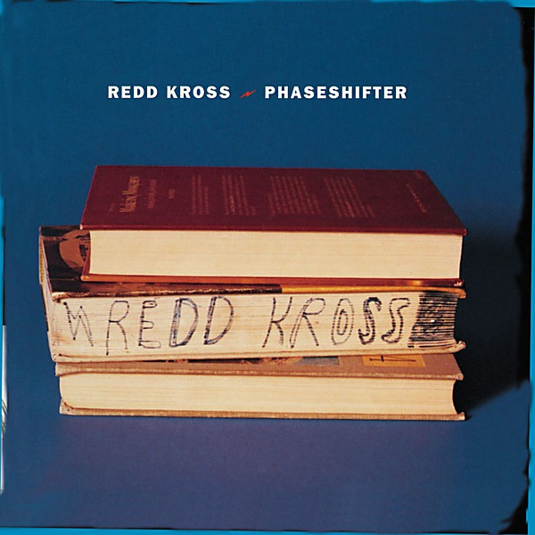

# Phaseshifter

By **Redd Kross**

## Album Data

- **Catalog:** Beets
- **Format:** Digital, Album
- **Album:** Phaseshifter
- **Artist:** Redd Kross
- **Albumartist:** Redd Kross
- **Genre:** Grunge
- **MusicBrainz Album Artist ID:** [d3a4e499-19cf-4676-8aff-4a326b47cdb2](https://musicbrainz.org/artist/d3a4e499-19cf-4676-8aff-4a326b47cdb2)
- **MusicBrainz Album ID:** [7d470aa9-99f3-49b2-ab14-2b603e52879d](https://musicbrainz.org/release/7d470aa9-99f3-49b2-ab14-2b603e52879d)
- **MusicBrainz Release Group ID:** [1fd3f389-d9a9-3fda-90bf-95d99831bffe](https://musicbrainz.org/release-group/1fd3f389-d9a9-3fda-90bf-95d99831bffe)
- **Year:** 1993
- **Catalog #:** 314 524 289-2
- **Label:** Mercury Records
- **Total Tracks:** 14

## Album Tracks

### Track 01 - Pretty Please Me

- **Artist:** Redd Kross
- **Format:** ALAC
- **Genre:** Rock
- **Length:** 4:00
- **MusicBrainz Track ID:** [69a17383-3b18-4204-a45b-14628185cf01](https://musicbrainz.org/recording/69a17383-3b18-4204-a45b-14628185cf01)
- **Title:** Pretty Please Me
- **Track:** 01
- **Year:** 1997

### Track 02 - Stoned

- **Artist:** Redd Kross
- **Format:** ALAC
- **Genre:** Power Pop
- **Length:** 3:51
- **MusicBrainz Track ID:** [3df89fe9-7c6b-4625-bcec-181fb0953a09](https://musicbrainz.org/recording/3df89fe9-7c6b-4625-bcec-181fb0953a09)
- **Title:** Stoned
- **Track:** 02
- **Year:** 1997

### Track 03 - You Lied Again

- **Artist:** Redd Kross
- **Format:** ALAC
- **Genre:** Indie Pop
- **Length:** 2:42
- **MusicBrainz Track ID:** [563431da-bfcc-4481-a616-6f2828598dac](https://musicbrainz.org/recording/563431da-bfcc-4481-a616-6f2828598dac)
- **Title:** You Lied Again
- **Track:** 03
- **Year:** 1997

### Track 04 - Girl God

- **Artist:** Redd Kross
- **Format:** ALAC
- **Genre:** Surf Rock
- **Length:** 3:30
- **MusicBrainz Track ID:** [41a1f02a-2bfc-4757-b6c4-32cdacbb5525](https://musicbrainz.org/recording/41a1f02a-2bfc-4757-b6c4-32cdacbb5525)
- **Title:** Girl God
- **Track:** 04
- **Year:** 1997

### Track 05 - Mess Around

- **Artist:** Redd Kross
- **Format:** ALAC
- **Genre:** Hard Rock
- **Length:** 3:04
- **MusicBrainz Track ID:** [5e0d650b-8cf2-4a70-8e70-e460cf8a6c49](https://musicbrainz.org/recording/5e0d650b-8cf2-4a70-8e70-e460cf8a6c49)
- **Title:** Mess Around
- **Track:** 05
- **Year:** 1997

### Track 06 - One Chord Progression

- **Artist:** Redd Kross
- **Format:** ALAC
- **Genre:** Power Pop
- **Length:** 2:50
- **MusicBrainz Track ID:** [1f0b84be-4824-4812-a5d9-84366ade6e25](https://musicbrainz.org/recording/1f0b84be-4824-4812-a5d9-84366ade6e25)
- **Title:** One Chord Progression
- **Track:** 06
- **Year:** 1997

### Track 07 - Teen Competition

- **Artist:** Redd Kross
- **Format:** ALAC
- **Genre:** Surf Rock
- **Length:** 2:35
- **MusicBrainz Track ID:** [653fa2c6-7e40-4775-bbd4-b758bc540456](https://musicbrainz.org/recording/653fa2c6-7e40-4775-bbd4-b758bc540456)
- **Title:** Teen Competition
- **Track:** 07
- **Year:** 1997

### Track 08 - Follow the Leader

- **Artist:** Redd Kross
- **Format:** ALAC
- **Genre:** Surf Rock
- **Length:** 3:03
- **MusicBrainz Track ID:** [279eca19-48f2-4382-a805-39d7fb991630](https://musicbrainz.org/recording/279eca19-48f2-4382-a805-39d7fb991630)
- **Title:** Follow the Leader
- **Track:** 08
- **Year:** 1997

### Track 09 - Vanity Mirror

- **Artist:** Redd Kross
- **Format:** ALAC
- **Genre:** Surf Rock
- **Length:** 3:02
- **MusicBrainz Track ID:** [ac4663eb-4de4-4da2-a966-f7c5f6243245](https://musicbrainz.org/recording/ac4663eb-4de4-4da2-a966-f7c5f6243245)
- **Title:** Vanity Mirror
- **Track:** 09
- **Year:** 1997

### Track 10 - Secret Life

- **Artist:** Redd Kross
- **Format:** ALAC
- **Genre:** Surf Rock
- **Length:** 3:53
- **MusicBrainz Track ID:** [46e14cf7-2b81-4659-80f4-3d18989a2da0](https://musicbrainz.org/recording/46e14cf7-2b81-4659-80f4-3d18989a2da0)
- **Title:** Secret Life
- **Track:** 10
- **Year:** 1997

### Track 11 - Ugly Town

- **Artist:** Redd Kross
- **Format:** ALAC
- **Genre:** Surf Rock
- **Length:** 3:02
- **MusicBrainz Track ID:** [511d2991-6c52-4605-b73c-e31910e7ad30](https://musicbrainz.org/recording/511d2991-6c52-4605-b73c-e31910e7ad30)
- **Title:** Ugly Town
- **Track:** 11
- **Year:** 1997

### Track 12 - Get Out of Myself

- **Artist:** Redd Kross
- **Format:** ALAC
- **Genre:** Rock
- **Length:** 3:38
- **MusicBrainz Track ID:** [0d6dda9b-adbb-4572-a77e-dbbdd6ee9516](https://musicbrainz.org/recording/0d6dda9b-adbb-4572-a77e-dbbdd6ee9516)
- **Title:** Get Out of Myself
- **Track:** 12
- **Year:** 1997

### Track 13 - Kiss the Goat

- **Artist:** Redd Kross
- **Format:** ALAC
- **Genre:** Surf Rock
- **Length:** 4:52
- **MusicBrainz Track ID:** [35cf12ec-598e-4eff-a617-ea4bcb48b722](https://musicbrainz.org/recording/35cf12ec-598e-4eff-a617-ea4bcb48b722)
- **Title:** Kiss the Goat
- **Track:** 13
- **Year:** 1997

### Track 14 - Sick Love

- **Artist:** Redd Kross
- **Format:** ALAC
- **Genre:** Surf Rock
- **Length:** 3:28
- **MusicBrainz Track ID:** [b6315527-10cb-4f91-90eb-920e61810f4d](https://musicbrainz.org/recording/b6315527-10cb-4f91-90eb-920e61810f4d)
- **Title:** Sick Love
- **Track:** 14
- **Year:** 1997

## See also

- [Show World](Show_World.md)
- [Third Eye](Third_Eye.md)
