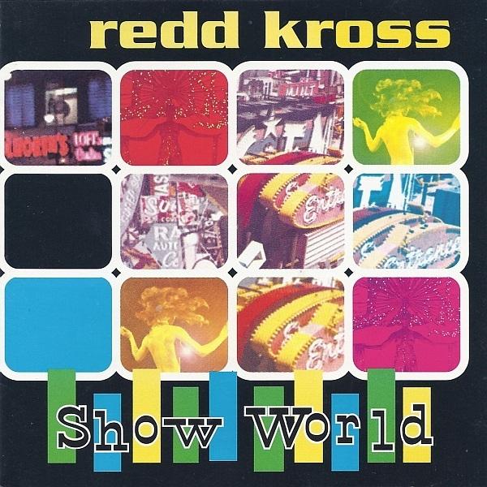

# Show World

By **Redd Kross**

## Album Data

- **Catalog:** Beets
- **Format:** Digital, Album
- **Album:** Show World
- **Artist:** Redd Kross
- **Albumartist:** Redd Kross
- **Genre:** Surf Rock
- **MusicBrainz Album Artist ID:** [d3a4e499-19cf-4676-8aff-4a326b47cdb2](https://musicbrainz.org/artist/d3a4e499-19cf-4676-8aff-4a326b47cdb2)
- **MusicBrainz Album ID:** [90b0d4d5-af91-45a0-ac2c-d2a1a9e88909](https://musicbrainz.org/release/90b0d4d5-af91-45a0-ac2c-d2a1a9e88909)
- **MusicBrainz Release Group ID:** [eddc1ecd-28cc-312f-a0fe-7919b0338232](https://musicbrainz.org/release-group/eddc1ecd-28cc-312f-a0fe-7919b0338232)
- **Year:** 1997
- **Catalog #:** 82148-2
- **Label:** Atlantic
- **Total Tracks:** 11

## Album Tracks

### Track 01 - The Faith Healer

- **Artist:** Redd Kross
- **Format:** ALAC
- **Genre:** Power Pop
- **Length:** 3:52
- **MusicBrainz Track ID:** [a8d05a63-fae8-410e-8a3f-220e6ab03665](https://musicbrainz.org/recording/a8d05a63-fae8-410e-8a3f-220e6ab03665)
- **Title:** The Faith Healer
- **Track:** 01
- **Year:** 1990

### Track 02 - Annie's Gone

- **Artist:** Redd Kross
- **Format:** ALAC
- **Genre:** Power Pop
- **Length:** 3:36
- **MusicBrainz Track ID:** [cf93f2be-e75d-427f-90bd-afbd7e37cd6b](https://musicbrainz.org/recording/cf93f2be-e75d-427f-90bd-afbd7e37cd6b)
- **Title:** Annie's Gone
- **Track:** 02
- **Year:** 1990

### Track 03 - I Don't Know How to Be Your Friend

- **Artist:** Redd Kross
- **Format:** ALAC
- **Genre:** Rock
- **Length:** 3:55
- **MusicBrainz Track ID:** [b97f32e6-d7da-4337-b71e-8b1acd4c22d1](https://musicbrainz.org/recording/b97f32e6-d7da-4337-b71e-8b1acd4c22d1)
- **Title:** I Don't Know How to Be Your Friend
- **Track:** 03
- **Year:** 1990

### Track 04 - Shonen Knife

- **Artist:** Redd Kross
- **Format:** ALAC
- **Genre:** Rock
- **Length:** 3:22
- **MusicBrainz Track ID:** [abc434c4-871e-466d-8632-18d41cf014ec](https://musicbrainz.org/recording/abc434c4-871e-466d-8632-18d41cf014ec)
- **Title:** Shonen Knife
- **Track:** 04
- **Year:** 1990

### Track 05 - Bubblegum Factory

- **Artist:** Redd Kross
- **Format:** ALAC
- **Genre:** Power Pop
- **Length:** 2:50
- **MusicBrainz Track ID:** [358c118c-76b9-474c-b925-88d8a2c41012](https://musicbrainz.org/recording/358c118c-76b9-474c-b925-88d8a2c41012)
- **Title:** Bubblegum Factory
- **Track:** 05
- **Year:** 1990

### Track 06 - Where I Am Today

- **Artist:** Redd Kross
- **Format:** ALAC
- **Genre:** Power Pop
- **Length:** 5:03
- **MusicBrainz Track ID:** [59451481-0122-485d-9bee-17d42b22d52d](https://musicbrainz.org/recording/59451481-0122-485d-9bee-17d42b22d52d)
- **Title:** Where I Am Today
- **Track:** 06
- **Year:** 1990

### Track 07 - Zira (Call Out My Name)

- **Artist:** Redd Kross
- **Format:** ALAC
- **Genre:** Power Pop
- **Length:** 4:09
- **MusicBrainz Track ID:** [6ebd6c1b-951b-47b7-bb6e-bf2f753474f1](https://musicbrainz.org/recording/6ebd6c1b-951b-47b7-bb6e-bf2f753474f1)
- **Title:** Zira (Call Out My Name)
- **Track:** 07
- **Year:** 1990

### Track 08 - Love Is Not Love

- **Artist:** Redd Kross
- **Format:** ALAC
- **Genre:** Power Pop
- **Length:** 4:32
- **MusicBrainz Track ID:** [a7743ca0-727c-4397-90c1-4b377f5f22ab](https://musicbrainz.org/recording/a7743ca0-727c-4397-90c1-4b377f5f22ab)
- **Title:** Love Is Not Love
- **Track:** 08
- **Year:** 1990

### Track 09 - 1976

- **Artist:** Redd Kross
- **Format:** ALAC
- **Genre:** Power Pop
- **Length:** 3:44
- **MusicBrainz Track ID:** [141f42f3-c3b6-403d-8c3a-e74fbbf9156d](https://musicbrainz.org/recording/141f42f3-c3b6-403d-8c3a-e74fbbf9156d)
- **Title:** 1976
- **Track:** 09
- **Year:** 1990

### Track 10 - Debbie & Kim

- **Artist:** Redd Kross
- **Format:** ALAC
- **Genre:** Power Pop
- **Length:** 4:01
- **MusicBrainz Track ID:** [8e792aad-8a83-4449-b58f-7936c1a0ac4d](https://musicbrainz.org/recording/8e792aad-8a83-4449-b58f-7936c1a0ac4d)
- **Title:** Debbie & Kim
- **Track:** 10
- **Year:** 1990

### Track 11 - Elephant Flares

- **Artist:** Redd Kross
- **Format:** ALAC
- **Genre:** Power Pop
- **Length:** 4:03
- **MusicBrainz Track ID:** [de6b3351-b512-4cec-b618-18eb70c2fa60](https://musicbrainz.org/recording/de6b3351-b512-4cec-b618-18eb70c2fa60)
- **Title:** Elephant Flares
- **Track:** 11
- **Year:** 1990

## See also

- [Phaseshifter](Phaseshifter.md)
- [Third Eye](Third_Eye.md)
