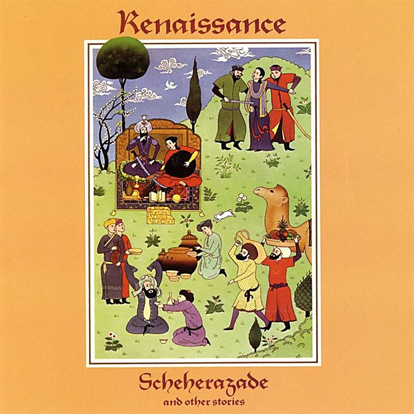

# Scheherazade and Other Stories

By **Renaissance**

## Album Data

- **Catalog:** Beets
- **Format:** Digital, Album
- **Album:** Scheherazade and Other Stories
- **Artist:** Renaissance
- **Albumartist:** Renaissance
- **Genre:** Progressive Rock
- **MusicBrainz Album Artist ID:** 
- **MusicBrainz Album ID:** 
- **MusicBrainz Release Group ID:** 
- **Year:** 1979
- **Catalog #:** 
- **Label:** Renaissance
- **Total Tracks:** 11

## Album Tracks

### Track 01 - Symphony of Light

- **Artist:** Renaissance
- **Format:** ALAC
- **Genre:** Progressive Rock
- **Length:** 12:08
- **MusicBrainz Track ID:** [https](https://musicbrainz.org/recording/https)
- **Title:** Symphony of Light
- **Track:** 01
- **Year:** 2014

### Track 02 - Waterfall

- **Artist:** Renaissance
- **Format:** ALAC
- **Genre:** Progressive Rock
- **Length:** 4:43
- **MusicBrainz Track ID:** [https](https://musicbrainz.org/recording/https)
- **Title:** Waterfall
- **Track:** 02
- **Year:** 2014

### Track 03 - Grandine il Vento

- **Artist:** Renaissance
- **Format:** ALAC
- **Genre:** Progressive Rock
- **Length:** 6:29
- **MusicBrainz Track ID:** [https](https://musicbrainz.org/recording/https)
- **Title:** Grandine il Vento
- **Track:** 03
- **Year:** 2014

### Track 04 - Porcelain

- **Artist:** Renaissance
- **Format:** ALAC
- **Genre:** Progressive Rock
- **Length:** 6:40
- **MusicBrainz Track ID:** [https](https://musicbrainz.org/recording/https)
- **Title:** Porcelain
- **Track:** 04
- **Year:** 2014

### Track 06 - Air of Drama

- **Artist:** Renaissance
- **Format:** ALAC
- **Genre:** Progressive Rock
- **Length:** 5:20
- **MusicBrainz Track ID:** [https](https://musicbrainz.org/recording/https)
- **Title:** Air of Drama
- **Track:** 06
- **Year:** 2014

### Track 08 - The Mystic and the Muse

- **Artist:** Renaissance
- **Format:** ALAC
- **Genre:** Progressive Rock
- **Length:** 7:50
- **MusicBrainz Track ID:** [https](https://musicbrainz.org/recording/https)
- **Title:** The Mystic and the Muse
- **Track:** 08
- **Year:** 2014

### Track 09 - Tonight

- **Artist:** Renaissance
- **Format:** ALAC
- **Genre:** Progressive Rock
- **Length:** 4:24
- **MusicBrainz Track ID:** [https](https://musicbrainz.org/recording/https)
- **Title:** Tonight
- **Track:** 09
- **Year:** 2014

### Track 10 - Immortal Beloved

- **Artist:** Renaissance
- **Format:** ALAC
- **Genre:** Progressive Rock
- **Length:** 5:38
- **MusicBrainz Track ID:** [https](https://musicbrainz.org/recording/https)
- **Title:** Immortal Beloved
- **Track:** 10
- **Year:** 2014

### Track 11 - Renaissance Man

- **Artist:** Renaissance
- **Format:** ALAC
- **Genre:** Progressive Rock
- **Length:** 3:27
- **MusicBrainz Track ID:** [https](https://musicbrainz.org/recording/https)
- **Title:** Renaissance Man
- **Track:** 11
- **Year:** 2014

### Track 05 - Cry to the World

- **Artist:** Renaissance feat. Ian Anderson
- **Format:** ALAC
- **Genre:** Progressive Rock
- **Length:** 5:44
- **MusicBrainz Track ID:** [https](https://musicbrainz.org/recording/https)
- **Title:** Cry to the World
- **Track:** 05
- **Year:** 2014

### Track 07 - Blood Silver Like Moonlight

- **Artist:** Renaissance feat. John Wetton
- **Format:** ALAC
- **Genre:** Progressive Rock
- **Length:** 5:15
- **MusicBrainz Track ID:** [https](https://musicbrainz.org/recording/https)
- **Title:** Blood Silver Like Moonlight
- **Track:** 07
- **Year:** 2014

## See also

- [Symphony of Light](Symphony_of_Light.md)
- [Tales of 1001 Nights](Tales_of_1001_Nights.md)
- [Roon: Ashes Are Burning](../../Roon/Renaissance/Ashes_Are_Burning.md)
- [Roon: Live at Carnegie Hall (Live at Carnegie Hall)](../../Roon/Renaissance/Live_at_Carnegie_Hall_Live_at_Carnegie_Hall.md)
- [Roon: Live at the BBC - Sight & Sound](../../Roon/Renaissance/Live_at_the_BBC_-_Sight_and_Sound.md)
- [Roon: Novella](../../Roon/Renaissance/Novella.md)
- [Roon: Renaissance](../../Roon/Renaissance/Renaissance.md)
- [Roon: Scheherazade and Other Stories](../../Roon/Renaissance/Scheherazade_and_Other_Stories.md)
- [Roon: Turn of the Cards](../../Roon/Renaissance/Turn_of_the_Cards.md)
- [Vinyl: ](../../Vinyl/Renaissance/Renaissance.md)
- [Vinyl: Scheherazade And Other Stories](../../Vinyl/Renaissance/Scheherazade_And_Other_Stories.md)
