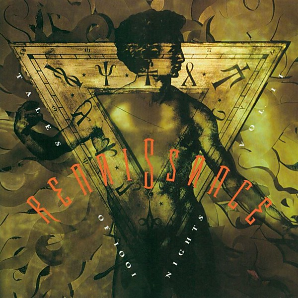

# Tales of 1001 Nights

By **Renaissance**

## Album Data

- **Catalog:** Beets
- **Format:** Digital, Album
- **Album:** Tales of 1001 Nights
- **Artist:** Renaissance
- **Albumartist:** Renaissance
- **Genre:** Progressive Rock
- **MusicBrainz Album Artist ID:** 
- **MusicBrainz Album ID:** 
- **MusicBrainz Release Group ID:** 
- **Year:** 0000
- **Catalog #:** 
- **Label:** 
- **Total Tracks:** 00

## Album Tracks

### Track 01 - Prologue

- **Artist:** Renaissance
- **Format:** AAC
- **Genre:** Progressive Rock
- **Length:** 7:32
- **MusicBrainz Track ID:** 
- **Title:** Prologue
- **Track:** 01
- **Year:** 0000

### Track 05 - I Think Of You

- **Artist:** Renaissance
- **Format:** AAC
- **Genre:** Progressive Rock
- **Length:** 3:06
- **MusicBrainz Track ID:** 
- **Title:** I Think Of You
- **Track:** 05
- **Year:** 0000

### Track 07 - Mother Russia

- **Artist:** Renaissance
- **Format:** AAC
- **Genre:** Progressive Rock
- **Length:** 9:20
- **MusicBrainz Track ID:** 
- **Title:** Mother Russia
- **Track:** 07
- **Year:** 0000

