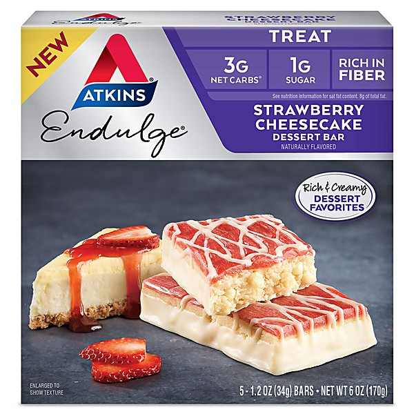

# Flashback

By **Rhythm Dukes**

## Album Data

- **Catalog:** Beets
- **Format:** Digital, Album
- **Album:** Flashback
- **Artist:** Rhythm Dukes
- **Albumartist:** Rhythm Dukes
- **Genre:** Rock
- **MusicBrainz Album Artist ID:** 
- **MusicBrainz Album ID:** 
- **MusicBrainz Release Group ID:** 
- **Year:** 1970
- **Catalog #:** 
- **Label:** 
- **Total Tracks:** 10

## Album Tracks

### Track 01 - Love Your Daddy All Night

- **Artist:** Rhythm Dukes
- **Format:** ALAC
- **Genre:** Rock
- **Length:** 6:30
- **MusicBrainz Track ID:** 
- **Title:** Love Your Daddy All Night
- **Track:** 01
- **Year:** 1970

### Track 02 - Kansas City

- **Artist:** Rhythm Dukes
- **Format:** ALAC
- **Genre:** Rock
- **Length:** 5:44
- **MusicBrainz Track ID:** 
- **Title:** Kansas City
- **Track:** 02
- **Year:** 1970

### Track 03 - Perfect

- **Artist:** Rhythm Dukes
- **Format:** ALAC
- **Genre:** Rock
- **Length:** 6:37
- **MusicBrainz Track ID:** 
- **Title:** Perfect
- **Track:** 03
- **Year:** 1970

### Track 04 - She's A Woman

- **Artist:** Rhythm Dukes
- **Format:** ALAC
- **Genre:** Rock
- **Length:** 5:08
- **MusicBrainz Track ID:** 
- **Title:** She's A Woman
- **Track:** 04
- **Year:** 1970

### Track 05 - I Don't Know If I Was Right

- **Artist:** Rhythm Dukes
- **Format:** ALAC
- **Genre:** Rock
- **Length:** 3:24
- **MusicBrainz Track ID:** 
- **Title:** I Don't Know If I Was Right
- **Track:** 05
- **Year:** 1970

### Track 06 - Hey, Children

- **Artist:** Rhythm Dukes
- **Format:** ALAC
- **Genre:** Rock
- **Length:** 7:02
- **MusicBrainz Track ID:** 
- **Title:** Hey, Children
- **Track:** 06
- **Year:** 1970

### Track 07 - Children Part II

- **Artist:** Rhythm Dukes
- **Format:** ALAC
- **Genre:** Rock
- **Length:** 5:05
- **MusicBrainz Track ID:** 
- **Title:** Children Part II
- **Track:** 07
- **Year:** 1970

### Track 08 - For Joy

- **Artist:** Rhythm Dukes
- **Format:** ALAC
- **Genre:** Rock
- **Length:** 14:23
- **MusicBrainz Track ID:** 
- **Title:** For Joy
- **Track:** 08
- **Year:** 1970

### Track 09 - I'd Like To Get To Know You

- **Artist:** Rhythm Dukes
- **Format:** ALAC
- **Genre:** Rock
- **Length:** 9:09
- **MusicBrainz Track ID:** 
- **Title:** I'd Like To Get To Know You
- **Track:** 09
- **Year:** 1970

### Track 10 - Seven Four

- **Artist:** Rhythm Dukes
- **Format:** ALAC
- **Genre:** Rock
- **Length:** 5:01
- **MusicBrainz Track ID:** 
- **Title:** Seven Four
- **Track:** 10
- **Year:** 1970

