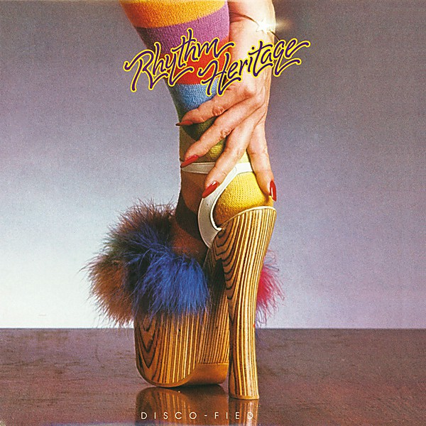

# Disco-Fied

By **Rhythm Heritage**

## Album Data

- **Catalog:** Beets
- **Format:** Digital, Album
- **Album:** Disco-Fied
- **Artist:** Rhythm Heritage
- **Albumartist:** Rhythm Heritage
- **Genre:** Funk
- **MusicBrainz Album Artist ID:** 
- **MusicBrainz Album ID:** 
- **MusicBrainz Release Group ID:** 
- **Year:** 1976
- **Catalog #:** 
- **Label:** 
- **Total Tracks:** 00

## Album Tracks

### Track 01 - Theme From S.W.A.T.

- **Artist:** Rhythm Heritage
- **Format:** MP3
- **Genre:** Uk Garage
- **Length:** 4:07
- **MusicBrainz Track ID:** 
- **Title:** Theme From S.W.A.T.
- **Track:** 01
- **Year:** 1976

