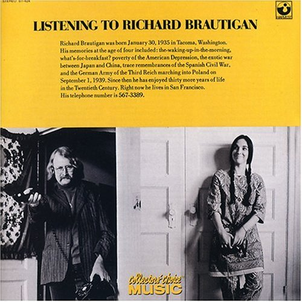

# Listening To Richard Brautigan

By **Richard Brautigan**

## Album Data

- **Catalog:** Beets
- **Format:** Digital, Album
- **Album:** Listening To Richard Brautigan
- **Artist:** Richard Brautigan
- **Albumartist:** Richard Brautigan
- **Genre:** Unknown
- **MusicBrainz Album Artist ID:** [dea7a803-8bb2-4651-a666-011f3ced6ad8](https://musicbrainz.org/artist/dea7a803-8bb2-4651-a666-011f3ced6ad8)
- **MusicBrainz Album ID:** [f940489c-a862-478b-8d1b-e5fcebf45899](https://musicbrainz.org/release/f940489c-a862-478b-8d1b-e5fcebf45899)
- **MusicBrainz Release Group ID:** [08347bb7-d1b2-3985-9268-d5c1813203d1](https://musicbrainz.org/release-group/08347bb7-d1b2-3985-9268-d5c1813203d1)
- **Year:** 2008
- **Catalog #:** CCM-540-2
- **Label:** Collectors’ Choice Music
- **Total Tracks:** 12

## Album Tracks

### Track 01 - The Telephone Door to Richard Brautigan

- **Artist:** Richard Brautigan
- **Format:** ALAC
- **Genre:** Unknown
- **Length:** 0:56
- **MusicBrainz Track ID:** [ac6a3b93-c822-4a31-8604-b8526547e0a5](https://musicbrainz.org/recording/ac6a3b93-c822-4a31-8604-b8526547e0a5)
- **Title:** The Telephone Door to Richard Brautigan
- **Track:** 01
- **Year:** 2008

### Track 02 - Trout Fishing In America

- **Artist:** Richard Brautigan
- **Format:** ALAC
- **Genre:** Unknown
- **Length:** 7:19
- **MusicBrainz Track ID:** [780a22fb-3fe4-4458-b775-d4a22f759411](https://musicbrainz.org/recording/780a22fb-3fe4-4458-b775-d4a22f759411)
- **Title:** Trout Fishing In America
- **Track:** 02
- **Year:** 2008

### Track 03 - Love Poem

- **Artist:** Richard Brautigan
- **Format:** ALAC
- **Genre:** Unknown
- **Length:** 3:45
- **MusicBrainz Track ID:** [f045740a-605b-4b14-907e-12ee50c74221](https://musicbrainz.org/recording/f045740a-605b-4b14-907e-12ee50c74221)
- **Title:** Love Poem
- **Track:** 03
- **Year:** 2008

### Track 04 - A Confederate General From Big Sur

- **Artist:** Richard Brautigan
- **Format:** ALAC
- **Genre:** Unknown
- **Length:** 4:16
- **MusicBrainz Track ID:** [81c2389d-c888-4c03-aa06-35d2285a8115](https://musicbrainz.org/recording/81c2389d-c888-4c03-aa06-35d2285a8115)
- **Title:** A Confederate General From Big Sur
- **Track:** 04
- **Year:** 2008

### Track 05 - Here Are the Sounds of My Life in San Francisco

- **Artist:** Richard Brautigan
- **Format:** ALAC
- **Genre:** Unknown
- **Length:** 3:30
- **MusicBrainz Track ID:** [83bd9d8b-c216-4ef8-8df9-5db551388c66](https://musicbrainz.org/recording/83bd9d8b-c216-4ef8-8df9-5db551388c66)
- **Title:** Here Are the Sounds of My Life in San Francisco
- **Track:** 05
- **Year:** 2008

### Track 06 - The Pill Versus The Springhill Mine Disaster

- **Artist:** Richard Brautigan
- **Format:** ALAC
- **Genre:** Unknown
- **Length:** 6:30
- **MusicBrainz Track ID:** [c3f286ef-4cca-4c33-8595-4f9b3174ce61](https://musicbrainz.org/recording/c3f286ef-4cca-4c33-8595-4f9b3174ce61)
- **Title:** The Pill Versus The Springhill Mine Disaster
- **Track:** 06
- **Year:** 2008

### Track 07 - Revenge of the Lawn

- **Artist:** Richard Brautigan
- **Format:** ALAC
- **Genre:** Unknown
- **Length:** 10:00
- **MusicBrainz Track ID:** [8e16da92-a4df-4c2b-b42f-7638b48dd482](https://musicbrainz.org/recording/8e16da92-a4df-4c2b-b42f-7638b48dd482)
- **Title:** Revenge of the Lawn
- **Track:** 07
- **Year:** 2008

### Track 08 - The Telephone Door That Leads Eventually to Some Love Poems

- **Artist:** Richard Brautigan
- **Format:** ALAC
- **Genre:** Unknown
- **Length:** 7:36
- **MusicBrainz Track ID:** [e3df540e-064d-4850-a4e1-b250b74cf960](https://musicbrainz.org/recording/e3df540e-064d-4850-a4e1-b250b74cf960)
- **Title:** The Telephone Door That Leads Eventually to Some Love Poems
- **Track:** 08
- **Year:** 2008

### Track 09 - In Watermelon Sugar

- **Artist:** Richard Brautigan
- **Format:** ALAC
- **Genre:** Unknown
- **Length:** 2:25
- **MusicBrainz Track ID:** [c7cb0d37-dc1a-4529-9119-84bbe4e18a16](https://musicbrainz.org/recording/c7cb0d37-dc1a-4529-9119-84bbe4e18a16)
- **Title:** In Watermelon Sugar
- **Track:** 09
- **Year:** 2008

### Track 10 - Here Are Some More Sounds of My Life

- **Artist:** Richard Brautigan
- **Format:** ALAC
- **Genre:** Unknown
- **Length:** 1:55
- **MusicBrainz Track ID:** [f34f08ed-365c-40c8-98c5-2a1fa6fb1bfe](https://musicbrainz.org/recording/f34f08ed-365c-40c8-98c5-2a1fa6fb1bfe)
- **Title:** Here Are Some More Sounds of My Life
- **Track:** 10
- **Year:** 2008

### Track 11 - Short Stories About California

- **Artist:** Richard Brautigan
- **Format:** ALAC
- **Genre:** Unknown
- **Length:** 6:08
- **MusicBrainz Track ID:** [d943a092-b72e-4efd-b258-bb484ba3bdf1](https://musicbrainz.org/recording/d943a092-b72e-4efd-b258-bb484ba3bdf1)
- **Title:** Short Stories About California
- **Track:** 11
- **Year:** 2008

### Track 12 - Boo, Forever

- **Artist:** Richard Brautigan
- **Format:** ALAC
- **Genre:** Unknown
- **Length:** 0:45
- **MusicBrainz Track ID:** [9a184013-9d65-4394-9c20-940b55129f6d](https://musicbrainz.org/recording/9a184013-9d65-4394-9c20-940b55129f6d)
- **Title:** Boo, Forever
- **Track:** 12
- **Year:** 2008

## See also

