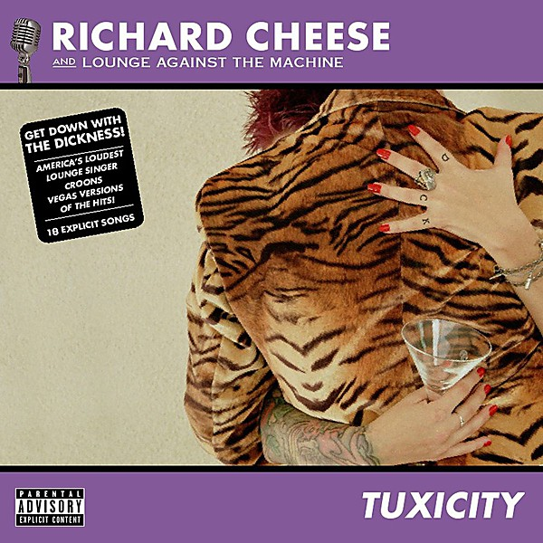

# Tuxicity

By **Richard Cheese**

## Album Data

- **Catalog:** Beets
- **Format:** Digital, Album
- **Album:** Tuxicity
- **Artist:** Richard Cheese
- **Albumartist:** Richard Cheese
- **Genre:** Swing
- **MusicBrainz Album Artist ID:** 
- **MusicBrainz Album ID:** 
- **MusicBrainz Release Group ID:** 
- **Year:** 2002
- **Catalog #:** 
- **Label:** 
- **Total Tracks:** 18

## Album Tracks

### Track 01 - She Hates Me

- **Artist:** Richard Cheese
- **Format:** ALAC
- **Genre:** Swing
- **Length:** 1:45
- **MusicBrainz Track ID:** 
- **Title:** She Hates Me
- **Track:** 01
- **Year:** 2002

### Track 02 - Fell In Love With A Girl

- **Artist:** Richard Cheese
- **Format:** ALAC
- **Genre:** Jazz
- **Length:** 1:33
- **MusicBrainz Track ID:** 
- **Title:** Fell In Love With A Girl
- **Track:** 02
- **Year:** 2002

### Track 03 - Baby Got Back

- **Artist:** Richard Cheese
- **Format:** ALAC
- **Genre:** Humor
- **Length:** 2:49
- **MusicBrainz Track ID:** 
- **Title:** Baby Got Back
- **Track:** 03
- **Year:** 2002

### Track 04 - Down With The Sickness (From "Dawn Of The Dead")

- **Artist:** Richard Cheese
- **Format:** ALAC
- **Genre:** Swing
- **Length:** 2:21
- **MusicBrainz Track ID:** 
- **Title:** Down With The Sickness (From "Dawn Of The Dead")
- **Track:** 04
- **Year:** 2002

### Track 05 - Hate To Say I Told You So

- **Artist:** Richard Cheese
- **Format:** ALAC
- **Genre:** Swing
- **Length:** 1:31
- **MusicBrainz Track ID:** 
- **Title:** Hate To Say I Told You So
- **Track:** 05
- **Year:** 2002

### Track 06 - Insane In The Brain

- **Artist:** Richard Cheese
- **Format:** ALAC
- **Genre:** Swing
- **Length:** 3:19
- **MusicBrainz Track ID:** 
- **Title:** Insane In The Brain
- **Track:** 06
- **Year:** 2002

### Track 07 - Relax

- **Artist:** Richard Cheese
- **Format:** ALAC
- **Genre:** Jazz
- **Length:** 1:57
- **MusicBrainz Track ID:** 
- **Title:** Relax
- **Track:** 07
- **Year:** 2002

### Track 08 - Shake Ya A*s

- **Artist:** Richard Cheese
- **Format:** ALAC
- **Genre:** Swing
- **Length:** 1:50
- **MusicBrainz Track ID:** 
- **Title:** Shake Ya A*s
- **Track:** 08
- **Year:** 2002

### Track 09 - Hot For Teacher

- **Artist:** Richard Cheese
- **Format:** ALAC
- **Genre:** Swing
- **Length:** 2:40
- **MusicBrainz Track ID:** 
- **Title:** Hot For Teacher
- **Track:** 09
- **Year:** 2002

### Track 10 - One Step Closer

- **Artist:** Richard Cheese
- **Format:** ALAC
- **Genre:** Swing
- **Length:** 1:38
- **MusicBrainz Track ID:** 
- **Title:** One Step Closer
- **Track:** 10
- **Year:** 2002

### Track 11 - Live In The Louge - NYC

- **Artist:** Richard Cheese
- **Format:** ALAC
- **Genre:** Swing
- **Length:** 1:11
- **MusicBrainz Track ID:** 
- **Title:** Live In The Louge - NYC
- **Track:** 11
- **Year:** 2002

### Track 12 - Smoke Two Joints

- **Artist:** Richard Cheese
- **Format:** ALAC
- **Genre:** Jazz
- **Length:** 1:32
- **MusicBrainz Track ID:** 
- **Title:** Smoke Two Joints
- **Track:** 12
- **Year:** 2002

### Track 13 - Chop Suey

- **Artist:** Richard Cheese
- **Format:** ALAC
- **Genre:** Swing
- **Length:** 2:27
- **MusicBrainz Track ID:** 
- **Title:** Chop Suey
- **Track:** 13
- **Year:** 2002

### Track 14 - Loser

- **Artist:** Richard Cheese
- **Format:** ALAC
- **Genre:** Swing
- **Length:** 2:27
- **MusicBrainz Track ID:** 
- **Title:** Loser
- **Track:** 14
- **Year:** 2002

### Track 15 - More Human Than Human

- **Artist:** Richard Cheese
- **Format:** ALAC
- **Genre:** Jazz
- **Length:** 3:02
- **MusicBrainz Track ID:** 
- **Title:** More Human Than Human
- **Track:** 15
- **Year:** 2002

### Track 16 - Used To Love Her

- **Artist:** Richard Cheese
- **Format:** ALAC
- **Genre:** Swing
- **Length:** 1:24
- **MusicBrainz Track ID:** 
- **Title:** Used To Love Her
- **Track:** 16
- **Year:** 2002

### Track 17 - (You Drive Me) Crazy

- **Artist:** Richard Cheese
- **Format:** ALAC
- **Genre:** Comedy
- **Length:** 1:52
- **MusicBrainz Track ID:** 
- **Title:** (You Drive Me) Crazy
- **Track:** 17
- **Year:** 2002

### Track 18 - Buddy Holly

- **Artist:** Richard Cheese
- **Format:** ALAC
- **Genre:** Jazz
- **Length:** 2:43
- **MusicBrainz Track ID:** 
- **Title:** Buddy Holly
- **Track:** 18
- **Year:** 2002

## See also

- [Lounge Against The Machine](Lounge_Against_The_Machine.md)
