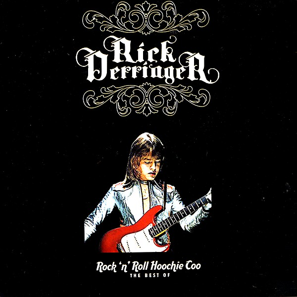

# The Best of Rock 'n' Roll Hoochie Coo (Re-Recorded Versions)

By **Rick Derringer**

## Album Data

- **Catalog:** Beets
- **Format:** Digital, Album
- **Album:** The Best of Rock 'n' Roll Hoochie Coo (Re-Recorded Versions)
- **Artist:** Rick Derringer
- **Albumartist:** Rick Derringer
- **Genre:** Hard Rock
- **MusicBrainz Album Artist ID:** 
- **MusicBrainz Album ID:** 
- **MusicBrainz Release Group ID:** 
- **Year:** 2006
- **Catalog #:** 
- **Label:** 
- **Total Tracks:** 12

## Album Tracks

### Track 01 - Rock and Roll, Hoochie Koo (Re-Recorded)

- **Artist:** Rick Derringer
- **Format:** AAC
- **Genre:** Hard Rock
- **Length:** 3:43
- **MusicBrainz Track ID:** 
- **Title:** Rock and Roll, Hoochie Koo (Re-Recorded)
- **Track:** 01
- **Year:** 2006

