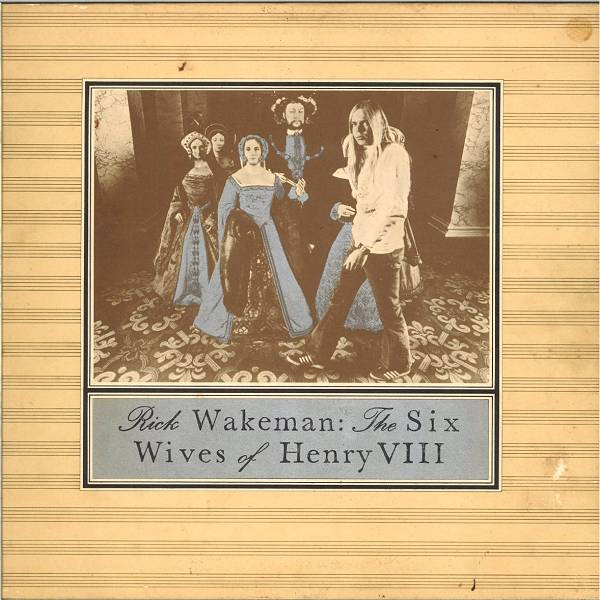

# The Six Wives Of Henry VIII

By **Rick Wakeman**

## Album Data

- **Catalog:** Beets
- **Format:** Digital, Album
- **Album:** The Six Wives Of Henry VIII
- **Artist:** Rick Wakeman
- **Albumartist:** Rick Wakeman
- **Genre:** Progressive Rock
- **MusicBrainz Album Artist ID:** 
- **MusicBrainz Album ID:** 
- **MusicBrainz Release Group ID:** 
- **Year:** 1973
- **Catalog #:** 
- **Label:** 
- **Total Tracks:** 03

## Album Tracks

### Track 01 - LPCDM 96/24 Stereo Mix

- **Artist:** Rick Wakeman
- **Format:** AAC
- **Genre:** Progressive Rock
- **Length:** 36:49
- **MusicBrainz Track ID:** 
- **Title:** LPCDM 96/24 Stereo Mix
- **Track:** 01
- **Year:** 2014

### Track 02 - DTX 96/24 Quad Mix

- **Artist:** Rick Wakeman
- **Format:** AAC
- **Genre:** Progressive Rock
- **Length:** 36:49
- **MusicBrainz Track ID:** 
- **Title:** DTX 96/24 Quad Mix
- **Track:** 02
- **Year:** 2014

### Track 03 - Catherine Howard (BBC TV 1973)

- **Artist:** Rick Wakeman
- **Format:** AAC
- **Genre:** Progressive Rock
- **Length:** 5:33
- **MusicBrainz Track ID:** 
- **Title:** Catherine Howard (BBC TV 1973)
- **Track:** 03
- **Year:** 2014

## See also

- [The Six Wives Of Henry VIII (DVD audio)](The_Six_Wives_Of_Henry_VIII_DVD_audio.md)
- [Roon: The Six Wives Of Henry VIII](../../Roon/Rick_Wakeman/The_Six_Wives_Of_Henry_VIII.md)
