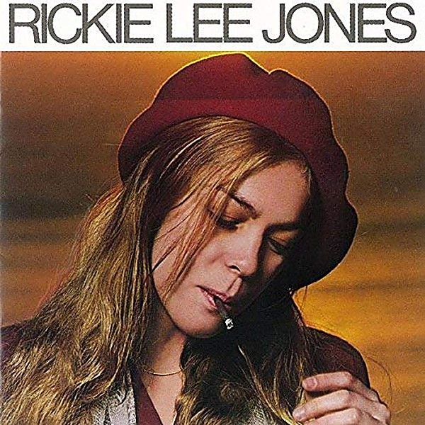

# Rickie Lee Jones

By **Rickie Lee Jones**

## Album Data

- **Catalog:** Beets
- **Format:** Digital, Album
- **Album:** Rickie Lee Jones
- **Artist:** Rickie Lee Jones
- **Albumartist:** Rickie Lee Jones
- **Genre:** Folk Rock
- **MusicBrainz Album Artist ID:** [9cd9232e-7a3e-4eb9-8043-ee05c1e396ec](https://musicbrainz.org/artist/9cd9232e-7a3e-4eb9-8043-ee05c1e396ec)
- **MusicBrainz Album ID:** [1c7ecfa5-8ada-388c-aa4d-bee6e207933d](https://musicbrainz.org/release/1c7ecfa5-8ada-388c-aa4d-bee6e207933d)
- **MusicBrainz Release Group ID:** [389cec5a-2b88-3090-8e62-84a4580d6f44](https://musicbrainz.org/release-group/389cec5a-2b88-3090-8e62-84a4580d6f44)
- **Year:** 1979
- **Catalog #:** 3296-2
- **Label:** Warner Bros. Records
- **Total Tracks:** 11

## Album Tracks

### Track 01 - Chuck E.’s in Love

- **Artist:** Rickie Lee Jones
- **Format:** ALAC
- **Genre:** Folk Rock
- **Length:** 3:31
- **MusicBrainz Track ID:** [8bb55c38-b4d6-49e7-b528-d56480ca7fb1](https://musicbrainz.org/recording/8bb55c38-b4d6-49e7-b528-d56480ca7fb1)
- **Title:** Chuck E.’s in Love
- **Track:** 01
- **Year:** 1979

### Track 02 - On Saturday Afternoons in 1963

- **Artist:** Rickie Lee Jones
- **Format:** ALAC
- **Genre:** Rock
- **Length:** 2:35
- **MusicBrainz Track ID:** [daf2dde7-3592-4ce7-b9c6-a0c76a8ad10b](https://musicbrainz.org/recording/daf2dde7-3592-4ce7-b9c6-a0c76a8ad10b)
- **Title:** On Saturday Afternoons in 1963
- **Track:** 02
- **Year:** 1979

### Track 03 - Night Train

- **Artist:** Rickie Lee Jones
- **Format:** ALAC
- **Genre:** Soul
- **Length:** 3:18
- **MusicBrainz Track ID:** [fed869b6-9826-4023-9f5d-878ef290e81d](https://musicbrainz.org/recording/fed869b6-9826-4023-9f5d-878ef290e81d)
- **Title:** Night Train
- **Track:** 03
- **Year:** 1979

### Track 04 - Young Blood

- **Artist:** Rickie Lee Jones
- **Format:** ALAC
- **Genre:** Soul
- **Length:** 4:07
- **MusicBrainz Track ID:** [b2a80266-4add-44bc-a04e-af3c12246622](https://musicbrainz.org/recording/b2a80266-4add-44bc-a04e-af3c12246622)
- **Title:** Young Blood
- **Track:** 04
- **Year:** 1979

### Track 05 - Easy Money

- **Artist:** Rickie Lee Jones
- **Format:** ALAC
- **Genre:** Soft Rock
- **Length:** 3:20
- **MusicBrainz Track ID:** [6bcec6cb-810f-48d2-82e8-fe117b818a8d](https://musicbrainz.org/recording/6bcec6cb-810f-48d2-82e8-fe117b818a8d)
- **Title:** Easy Money
- **Track:** 05
- **Year:** 1979

### Track 06 - The Last Chance Texaco

- **Artist:** Rickie Lee Jones
- **Format:** ALAC
- **Genre:** Soft Rock
- **Length:** 4:08
- **MusicBrainz Track ID:** [dad2feb5-1054-489a-8b58-a1436ed102f9](https://musicbrainz.org/recording/dad2feb5-1054-489a-8b58-a1436ed102f9)
- **Title:** The Last Chance Texaco
- **Track:** 06
- **Year:** 1979

### Track 07 - Danny’s All‐Star Joint

- **Artist:** Rickie Lee Jones
- **Format:** ALAC
- **Genre:** Folk Rock
- **Length:** 4:06
- **MusicBrainz Track ID:** [14641038-019a-469e-8545-7ca58a024672](https://musicbrainz.org/recording/14641038-019a-469e-8545-7ca58a024672)
- **Title:** Danny’s All‐Star Joint
- **Track:** 07
- **Year:** 1979

### Track 08 - Coolsville

- **Artist:** Rickie Lee Jones
- **Format:** ALAC
- **Genre:** Soul
- **Length:** 3:52
- **MusicBrainz Track ID:** [93d2ea6d-9952-4fef-8a21-36fb35a8ec38](https://musicbrainz.org/recording/93d2ea6d-9952-4fef-8a21-36fb35a8ec38)
- **Title:** Coolsville
- **Track:** 08
- **Year:** 1979

### Track 09 - Weasel and the White Boys Cool

- **Artist:** Rickie Lee Jones
- **Format:** ALAC
- **Genre:** Soul
- **Length:** 6:03
- **MusicBrainz Track ID:** [5aca2be9-1434-4d06-9492-4a2fe17513b7](https://musicbrainz.org/recording/5aca2be9-1434-4d06-9492-4a2fe17513b7)
- **Title:** Weasel and the White Boys Cool
- **Track:** 09
- **Year:** 1979

### Track 10 - Company

- **Artist:** Rickie Lee Jones
- **Format:** ALAC
- **Genre:** Soul
- **Length:** 4:54
- **MusicBrainz Track ID:** [a7e013de-17a5-4e10-93d1-9a71c24046f6](https://musicbrainz.org/recording/a7e013de-17a5-4e10-93d1-9a71c24046f6)
- **Title:** Company
- **Track:** 10
- **Year:** 1979

### Track 11 - After Hours (Twelve Bars Past Goodnight)

- **Artist:** Rickie Lee Jones
- **Format:** ALAC
- **Genre:** Folk Rock
- **Length:** 2:13
- **MusicBrainz Track ID:** [ba815da6-4682-4c79-84a2-5487293a41da](https://musicbrainz.org/recording/ba815da6-4682-4c79-84a2-5487293a41da)
- **Title:** After Hours (Twelve Bars Past Goodnight)
- **Track:** 11
- **Year:** 1979

## See also

- [Roon: Rickie Lee Jones](../../Roon/Rickie_Lee_Jones/Rickie_Lee_Jones.md)
- [Vinyl: Girl At Her Volcano](../../Vinyl/Rickie_Lee_Jones/Girl_At_Her_Volcano.md)
- [Vinyl: ](../../Vinyl/Rickie_Lee_Jones/Rickie_Lee_Jones_index.md)
- [Vinyl: Rickie Lee Jones](../../Vinyl/Rickie_Lee_Jones/Rickie_Lee_Jones.md)
