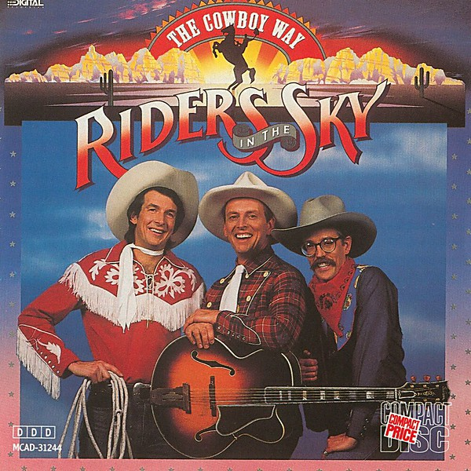

# The Cowboy Way

By **Riders in the Sky**

## Album Data

- **Catalog:** Beets
- **Format:** Digital, Album
- **Album:** The Cowboy Way
- **Artist:** Riders In The Sky
- **Albumartist:** Riders in the Sky
- **Genre:** Americana
- **MusicBrainz Album Artist ID:** [10df2d8c-763d-4a61-b712-8a4dd88fc80a](https://musicbrainz.org/artist/10df2d8c-763d-4a61-b712-8a4dd88fc80a)
- **MusicBrainz Album ID:** [179817aa-53fb-4ac8-bcbc-537df1b29a0a](https://musicbrainz.org/release/179817aa-53fb-4ac8-bcbc-537df1b29a0a)
- **MusicBrainz Release Group ID:** [e27b6a77-b2d5-3ddd-b7ad-240f5fdae08f](https://musicbrainz.org/release-group/e27b6a77-b2d5-3ddd-b7ad-240f5fdae08f)
- **Year:** 1987
- **Catalog #:** MCAD-31244
- **Label:** MCA Records
- **Total Tracks:** 15

## Album Tracks

### Track 01 - Texas Plains

- **Artist:** Riders in the Sky
- **Format:** ALAC
- **Genre:** Americana
- **Length:** 2:36
- **MusicBrainz Track ID:** [01e61f2b-3f6e-418b-b9cd-2f3b36dfdb66](https://musicbrainz.org/recording/01e61f2b-3f6e-418b-b9cd-2f3b36dfdb66)
- **Title:** Texas Plains
- **Track:** 01
- **Year:** 1987

### Track 02 - Back in the Saddle Again

- **Artist:** Riders in the Sky
- **Format:** ALAC
- **Genre:** Classic Country
- **Length:** 4:25
- **MusicBrainz Track ID:** [02540fb3-25eb-4bfa-a628-78c0caa50f89](https://musicbrainz.org/recording/02540fb3-25eb-4bfa-a628-78c0caa50f89)
- **Title:** Back in the Saddle Again
- **Track:** 02
- **Year:** 1987

### Track 03 - Riders in the Sky

- **Artist:** Riders in the Sky
- **Format:** ALAC
- **Genre:** Americana
- **Length:** 3:09
- **MusicBrainz Track ID:** [e2321779-397f-4979-8e47-53504f856a58](https://musicbrainz.org/recording/e2321779-397f-4979-8e47-53504f856a58)
- **Title:** Riders in the Sky
- **Track:** 03
- **Year:** 1987

### Track 04 - Carry Me Back to the Lone Prairie

- **Artist:** Riders in the Sky
- **Format:** ALAC
- **Genre:** Americana
- **Length:** 2:43
- **MusicBrainz Track ID:** [3899cc86-7179-4d85-a1fd-afba28d53380](https://musicbrainz.org/recording/3899cc86-7179-4d85-a1fd-afba28d53380)
- **Title:** Carry Me Back to the Lone Prairie
- **Track:** 04
- **Year:** 1987

### Track 05 - Mr. Sincere (State Fair Burnout)

- **Artist:** Riders in the Sky
- **Format:** ALAC
- **Genre:** Americana
- **Length:** 1:28
- **MusicBrainz Track ID:** [c362aa3c-1fd4-48bb-864b-b6840528beb1](https://musicbrainz.org/recording/c362aa3c-1fd4-48bb-864b-b6840528beb1)
- **Title:** Mr. Sincere (State Fair Burnout)
- **Track:** 05
- **Year:** 1987

### Track 06 - Concerto for Violin and Longhorns

- **Artist:** Riders in the Sky
- **Format:** ALAC
- **Genre:** Americana
- **Length:** 2:41
- **MusicBrainz Track ID:** [069902b3-d9dc-4553-ac05-ae614a6b4a1d](https://musicbrainz.org/recording/069902b3-d9dc-4553-ac05-ae614a6b4a1d)
- **Title:** Concerto for Violin and Longhorns
- **Track:** 06
- **Year:** 1987

### Track 07 - Lonely Yukon Stars

- **Artist:** Riders in the Sky
- **Format:** ALAC
- **Genre:** Country
- **Length:** 3:23
- **MusicBrainz Track ID:** [5019840d-af6c-4593-a7d1-a369ea772f45](https://musicbrainz.org/recording/5019840d-af6c-4593-a7d1-a369ea772f45)
- **Title:** Lonely Yukon Stars
- **Track:** 07
- **Year:** 1987

### Track 08 - The Salting of the Slug

- **Artist:** Riders in the Sky
- **Format:** ALAC
- **Genre:** Americana
- **Length:** 4:33
- **MusicBrainz Track ID:** [a10759cc-f1d3-44f2-a53a-d762a2903feb](https://musicbrainz.org/recording/a10759cc-f1d3-44f2-a53a-d762a2903feb)
- **Title:** The Salting of the Slug
- **Track:** 08
- **Year:** 1987

### Track 09 - When Pay Day Rolls Around

- **Artist:** Riders in the Sky
- **Format:** ALAC
- **Genre:** Americana
- **Length:** 1:44
- **MusicBrainz Track ID:** [0ff504d4-a416-4d95-96bf-9fb16e3437bd](https://musicbrainz.org/recording/0ff504d4-a416-4d95-96bf-9fb16e3437bd)
- **Title:** When Pay Day Rolls Around
- **Track:** 09
- **Year:** 1987

### Track 10 - My Oklahoma

- **Artist:** Riders in the Sky
- **Format:** ALAC
- **Genre:** Americana
- **Length:** 2:51
- **MusicBrainz Track ID:** [1c733da6-4143-4ce2-84bd-3dfea5bc4887](https://musicbrainz.org/recording/1c733da6-4143-4ce2-84bd-3dfea5bc4887)
- **Title:** My Oklahoma
- **Track:** 10
- **Year:** 1987

### Track 11 - Reincarnation

- **Artist:** Riders in the Sky
- **Format:** ALAC
- **Genre:** Americana
- **Length:** 3:45
- **MusicBrainz Track ID:** [b4e17db9-9326-4c2e-b87b-a8f9e714e03e](https://musicbrainz.org/recording/b4e17db9-9326-4c2e-b87b-a8f9e714e03e)
- **Title:** Reincarnation
- **Track:** 11
- **Year:** 1987

### Track 12 - Miss Molly

- **Artist:** Riders in the Sky
- **Format:** ALAC
- **Genre:** Americana
- **Length:** 3:40
- **MusicBrainz Track ID:** [d130d707-2a86-4128-8875-5ad0bde242e6](https://musicbrainz.org/recording/d130d707-2a86-4128-8875-5ad0bde242e6)
- **Title:** Miss Molly
- **Track:** 12
- **Year:** 1987

### Track 13 - Ridin' Down the Canyon (When the Sun Goes Down)

- **Artist:** Riders in the Sky
- **Format:** ALAC
- **Genre:** Americana
- **Length:** 4:23
- **MusicBrainz Track ID:** [17a6a10c-19ec-4cb6-aa26-1d66ab0a93b0](https://musicbrainz.org/recording/17a6a10c-19ec-4cb6-aa26-1d66ab0a93b0)
- **Title:** Ridin' Down the Canyon (When the Sun Goes Down)
- **Track:** 13
- **Year:** 1987

### Track 14 - That's How the Yodel Was Born

- **Artist:** Riders in the Sky
- **Format:** ALAC
- **Genre:** Country
- **Length:** 2:40
- **MusicBrainz Track ID:** [51ef7e28-7297-4755-a457-804b51a95a99](https://musicbrainz.org/recording/51ef7e28-7297-4755-a457-804b51a95a99)
- **Title:** That's How the Yodel Was Born
- **Track:** 14
- **Year:** 1987

### Track 15 - Happy Trails

- **Artist:** Riders in the Sky
- **Format:** ALAC
- **Genre:** Americana
- **Length:** 1:38
- **MusicBrainz Track ID:** [08bc5d9c-9c6a-4b41-ab21-e13f1692d55c](https://musicbrainz.org/recording/08bc5d9c-9c6a-4b41-ab21-e13f1692d55c)
- **Title:** Happy Trails
- **Track:** 15
- **Year:** 1987

