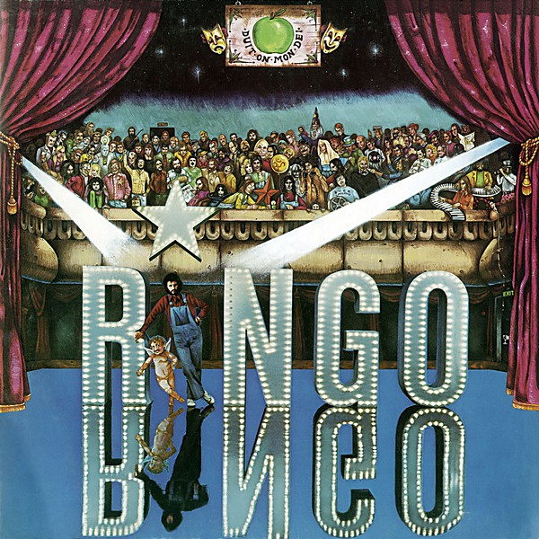

# Ringo

By **Ringo Starr**

## Album Data

- **Catalog:** Beets
- **Format:** Digital, Album
- **Album:** Ringo
- **Artist:** Ringo Starr
- **Albumartist:** Ringo Starr
- **Genre:** Rock
- **MusicBrainz Album Artist ID:** [300c4c73-33ac-4255-9d57-4e32627f5e13](https://musicbrainz.org/artist/300c4c73-33ac-4255-9d57-4e32627f5e13)
- **MusicBrainz Album ID:** [fdbcaef1-b089-3bd8-a461-591c3af5d870](https://musicbrainz.org/release/fdbcaef1-b089-3bd8-a461-591c3af5d870)
- **MusicBrainz Release Group ID:** [92e9a813-265a-3ddb-a5ad-5daac76af8b1](https://musicbrainz.org/release-group/92e9a813-265a-3ddb-a5ad-5daac76af8b1)
- **Year:** 1994
- **Catalog #:** 01005-82097-2
- **Label:** Private Music
- **Total Tracks:** 10

## Album Tracks

### Track 01 - Weight of the World

- **Artist:** Ringo Starr
- **Format:** ALAC
- **Genre:** Soft Rock
- **Length:** 3:53
- **MusicBrainz Track ID:** [7c55ade1-a1c6-42bb-b630-685bb27edee4](https://musicbrainz.org/recording/7c55ade1-a1c6-42bb-b630-685bb27edee4)
- **Title:** Weight of the World
- **Track:** 01
- **Year:** 1992

### Track 02 - Don't Know a Thing About Love

- **Artist:** Ringo Starr
- **Format:** ALAC
- **Genre:** Soft Rock
- **Length:** 3:49
- **MusicBrainz Track ID:** [b997adc8-35be-47b4-bb04-087dce06a01a](https://musicbrainz.org/recording/b997adc8-35be-47b4-bb04-087dce06a01a)
- **Title:** Don't Know a Thing About Love
- **Track:** 02
- **Year:** 1992

### Track 03 - Don't Go Where the Road Don't Go

- **Artist:** Ringo Starr
- **Format:** ALAC
- **Genre:** Soft Rock
- **Length:** 3:21
- **MusicBrainz Track ID:** [1e062200-fce2-4e73-9f24-2833141f2068](https://musicbrainz.org/recording/1e062200-fce2-4e73-9f24-2833141f2068)
- **Title:** Don't Go Where the Road Don't Go
- **Track:** 03
- **Year:** 1992

### Track 04 - Golden Blunders

- **Artist:** Ringo Starr
- **Format:** ALAC
- **Genre:** Soft Rock
- **Length:** 4:06
- **MusicBrainz Track ID:** [85174920-f4c0-46be-b289-453ecd4ace6a](https://musicbrainz.org/recording/85174920-f4c0-46be-b289-453ecd4ace6a)
- **Title:** Golden Blunders
- **Track:** 04
- **Year:** 1992

### Track 05 - All in the Name of Love

- **Artist:** Ringo Starr
- **Format:** ALAC
- **Genre:** Soft Rock
- **Length:** 3:42
- **MusicBrainz Track ID:** [15c1d9f2-aef9-4c45-b7c0-99c73453d457](https://musicbrainz.org/recording/15c1d9f2-aef9-4c45-b7c0-99c73453d457)
- **Title:** All in the Name of Love
- **Track:** 05
- **Year:** 1992

### Track 06 - After All These Years

- **Artist:** Ringo Starr
- **Format:** ALAC
- **Genre:** Soft Rock
- **Length:** 3:10
- **MusicBrainz Track ID:** [4f9c03e1-ad9e-4156-b164-c5f050c35b3d](https://musicbrainz.org/recording/4f9c03e1-ad9e-4156-b164-c5f050c35b3d)
- **Title:** After All These Years
- **Track:** 06
- **Year:** 1992

### Track 07 - I Don't Believe You

- **Artist:** Ringo Starr
- **Format:** ALAC
- **Genre:** Soft Rock
- **Length:** 2:48
- **MusicBrainz Track ID:** [1b71d67b-fd88-4c20-b1e6-0e30341cba82](https://musicbrainz.org/recording/1b71d67b-fd88-4c20-b1e6-0e30341cba82)
- **Title:** I Don't Believe You
- **Track:** 07
- **Year:** 1992

### Track 08 - Runaways

- **Artist:** Ringo Starr
- **Format:** ALAC
- **Genre:** Pop Rock
- **Length:** 4:51
- **MusicBrainz Track ID:** [12ca473b-7561-4af3-ae93-4bbed01752df](https://musicbrainz.org/recording/12ca473b-7561-4af3-ae93-4bbed01752df)
- **Title:** Runaways
- **Track:** 08
- **Year:** 1992

### Track 09 - In a Heartbeat

- **Artist:** Ringo Starr
- **Format:** ALAC
- **Genre:** Pop Rock
- **Length:** 4:30
- **MusicBrainz Track ID:** [40e0fd49-226a-41ec-a502-6827d87d7967](https://musicbrainz.org/recording/40e0fd49-226a-41ec-a502-6827d87d7967)
- **Title:** In a Heartbeat
- **Track:** 09
- **Year:** 1992

### Track 10 - What Goes Around

- **Artist:** Ringo Starr
- **Format:** ALAC
- **Genre:** Soft Rock
- **Length:** 5:50
- **MusicBrainz Track ID:** [717eb7d4-6279-4069-8e2c-1a03dbdbab2c](https://musicbrainz.org/recording/717eb7d4-6279-4069-8e2c-1a03dbdbab2c)
- **Title:** What Goes Around
- **Track:** 10
- **Year:** 1992

## See also

- [Ringo [Bonus Tracks]](Ringo_[Bonus_Tracks].md)
- [Time Takes Time](Time_Takes_Time.md)
- [Roon: Ringo](../../Roon/Ringo_Starr/Ringo.md)
- [Roon: Time Takes Time](../../Roon/Ringo_Starr/Time_Takes_Time.md)
- [Vinyl: Photograph](../../Vinyl/Ringo_Starr/Photograph.md)
- [Vinyl: ](../../Vinyl/Ringo_Starr/Ringo_Starr.md)
