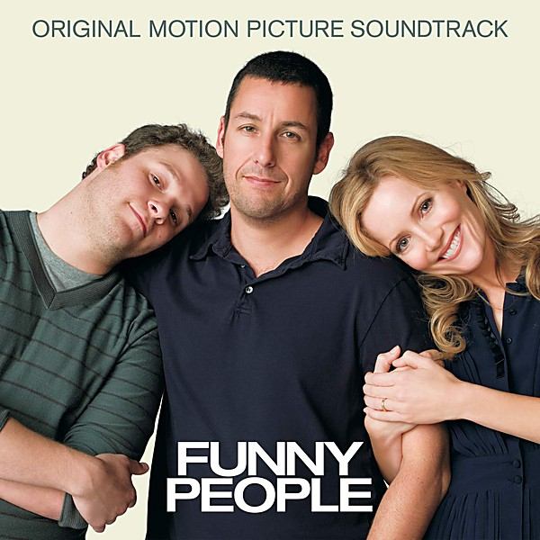

# Ringo [Bonus Tracks]

By **Ringo Starr**

## Album Data

- **Catalog:** Beets
- **Format:** Digital, Album
- **Album:** Ringo [Bonus Tracks]
- **Artist:** Ringo Starr
- **Albumartist:** Ringo Starr
- **Genre:** Rock
- **MusicBrainz Album Artist ID:** 
- **MusicBrainz Album ID:** 
- **MusicBrainz Release Group ID:** 
- **Year:** 1973
- **Catalog #:** GZS-1066
- **Label:** DCC Compact Classics
- **Total Tracks:** 13

## Album Tracks

### Track 01 - I’m the Greatest

- **Artist:** Ringo Starr
- **Format:** MP3
- **Genre:** Rock
- **Length:** 3:30
- **MusicBrainz Track ID:** [7bf95a85-cff9-41a0-9d1a-91cd057efa38](https://musicbrainz.org/recording/7bf95a85-cff9-41a0-9d1a-91cd057efa38)
- **Title:** I’m the Greatest
- **Track:** 01
- **Year:** 1994

### Track 02 - Have You Seen My Baby (Hold On)

- **Artist:** Ringo Starr
- **Format:** MP3
- **Genre:** Pop
- **Length:** 3:48
- **MusicBrainz Track ID:** [78e560a4-a53b-42a1-9bfb-2aa0ff3fe71c](https://musicbrainz.org/recording/78e560a4-a53b-42a1-9bfb-2aa0ff3fe71c)
- **Title:** Have You Seen My Baby (Hold On)
- **Track:** 02
- **Year:** 1994

### Track 03 - Photograph

- **Artist:** Ringo Starr
- **Format:** MP3
- **Genre:** Rock
- **Length:** 4:01
- **MusicBrainz Track ID:** [370ebb14-e79b-4aa4-b40e-b5fdf5ad5d1d](https://musicbrainz.org/recording/370ebb14-e79b-4aa4-b40e-b5fdf5ad5d1d)
- **Title:** Photograph
- **Track:** 03
- **Year:** 1994

### Track 04 - Sunshine Life for Me (Sail Away Raymond)

- **Artist:** Ringo Starr
- **Format:** MP3
- **Genre:** Pop
- **Length:** 2:49
- **MusicBrainz Track ID:** [7395092a-e6d1-4164-b574-c227f2822bc9](https://musicbrainz.org/recording/7395092a-e6d1-4164-b574-c227f2822bc9)
- **Title:** Sunshine Life for Me (Sail Away Raymond)
- **Track:** 04
- **Year:** 1994

### Track 05 - You’re Sixteen (You’re Beautiful and You’re Mine)

- **Artist:** Ringo Starr
- **Format:** MP3
- **Genre:** Rock
- **Length:** 2:52
- **MusicBrainz Track ID:** [0ad67f25-fedd-4677-8734-e459d9f95add](https://musicbrainz.org/recording/0ad67f25-fedd-4677-8734-e459d9f95add)
- **Title:** You’re Sixteen (You’re Beautiful and You’re Mine)
- **Track:** 05
- **Year:** 1994

### Track 06 - Oh My My

- **Artist:** Ringo Starr
- **Format:** MP3
- **Genre:** Soft Rock
- **Length:** 4:20
- **MusicBrainz Track ID:** [c6658afb-80fd-4ab0-8a98-5a81ca64cc3d](https://musicbrainz.org/recording/c6658afb-80fd-4ab0-8a98-5a81ca64cc3d)
- **Title:** Oh My My
- **Track:** 06
- **Year:** 1994

### Track 07 - Step Lightly

- **Artist:** Ringo Starr
- **Format:** MP3
- **Genre:** Soft Rock
- **Length:** 3:19
- **MusicBrainz Track ID:** [4aae974c-9574-4279-ad6e-abaababc50ba](https://musicbrainz.org/recording/4aae974c-9574-4279-ad6e-abaababc50ba)
- **Title:** Step Lightly
- **Track:** 07
- **Year:** 1994

### Track 08 - Six O’Clock

- **Artist:** Ringo Starr
- **Format:** MP3
- **Genre:** Rock
- **Length:** 4:09
- **MusicBrainz Track ID:** [64e52927-407f-474b-9a65-0ae32275b337](https://musicbrainz.org/recording/64e52927-407f-474b-9a65-0ae32275b337)
- **Title:** Six O’Clock
- **Track:** 08
- **Year:** 1994

### Track 09 - Devil Woman

- **Artist:** Ringo Starr
- **Format:** MP3
- **Genre:** Rock
- **Length:** 4:05
- **MusicBrainz Track ID:** [93e99bd8-6d8e-4c25-8c1a-727ece81cbf5](https://musicbrainz.org/recording/93e99bd8-6d8e-4c25-8c1a-727ece81cbf5)
- **Title:** Devil Woman
- **Track:** 09
- **Year:** 1994

### Track 10 - You and Me (Babe)

- **Artist:** Ringo Starr
- **Format:** MP3
- **Genre:** Rock
- **Length:** 5:16
- **MusicBrainz Track ID:** [98fe8c82-b11e-4e8f-980b-6ddcb04c7749](https://musicbrainz.org/recording/98fe8c82-b11e-4e8f-980b-6ddcb04c7749)
- **Title:** You and Me (Babe)
- **Track:** 10
- **Year:** 1994

### Track 11 - It Don’t Come Easy

- **Artist:** Ringo Starr
- **Format:** MP3
- **Genre:** Rock
- **Length:** 3:06
- **MusicBrainz Track ID:** [11d2a611-1032-4b7e-a3ad-0ae5fcfdb6b2](https://musicbrainz.org/recording/11d2a611-1032-4b7e-a3ad-0ae5fcfdb6b2)
- **Title:** It Don’t Come Easy
- **Track:** 11
- **Year:** 1994

### Track 12 - Early 1970

- **Artist:** Ringo Starr
- **Format:** MP3
- **Genre:** Pop Rock
- **Length:** 2:24
- **MusicBrainz Track ID:** [6b11798a-6dbb-42f0-b8b1-0ed8f2d15906](https://musicbrainz.org/recording/6b11798a-6dbb-42f0-b8b1-0ed8f2d15906)
- **Title:** Early 1970
- **Track:** 12
- **Year:** 1994

### Track 13 - Down and Out

- **Artist:** Ringo Starr
- **Format:** MP3
- **Genre:** Pop
- **Length:** 3:04
- **MusicBrainz Track ID:** [b6d3b162-9f2e-4975-9d47-935f1cf26ed8](https://musicbrainz.org/recording/b6d3b162-9f2e-4975-9d47-935f1cf26ed8)
- **Title:** Down and Out
- **Track:** 13
- **Year:** 1994

## See also

- [Ringo](Ringo.md)
- [Time Takes Time](Time_Takes_Time.md)
- [Roon: Ringo](../../Roon/Ringo_Starr/Ringo.md)
- [Roon: Time Takes Time](../../Roon/Ringo_Starr/Time_Takes_Time.md)
- [Vinyl: Photograph](../../Vinyl/Ringo_Starr/Photograph.md)
- [Vinyl: ](../../Vinyl/Ringo_Starr/Ringo_Starr.md)
