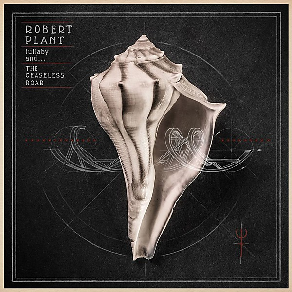

# Lullaby and... The Ceaseless Roar

By **Robert Plant**

## Album Data

- **Catalog:** Beets
- **Format:** Digital, Album
- **Album:** Lullaby and... The Ceaseless Roar
- **Artist:** Robert Plant
- **Albumartist:** Robert Plant
- **Genre:** Rockabilly
- **MusicBrainz Album Artist ID:** [bd53f9a7-8be9-46b0-bf7d-1deea3cb57bc](https://musicbrainz.org/artist/bd53f9a7-8be9-46b0-bf7d-1deea3cb57bc)
- **MusicBrainz Album ID:** [d2894822-f07d-40c9-9710-321627a1b918](https://musicbrainz.org/release/d2894822-f07d-40c9-9710-321627a1b918)
- **MusicBrainz Release Group ID:** [2e6efc55-8550-40e3-a61a-6aeff39af26a](https://musicbrainz.org/release-group/2e6efc55-8550-40e3-a61a-6aeff39af26a)
- **Year:** 2014
- **Catalog #:** 
- **Label:** Trolcharm
- **Total Tracks:** 11

## Album Tracks

### Track 01 - Little Maggie

- **Artist:** Robert Plant
- **Format:** ALAC
- **Genre:** Rockabilly
- **Length:** 5:06
- **MusicBrainz Track ID:** [b7acd9d7-ba52-4f38-99d2-e5511f1a04d6](https://musicbrainz.org/recording/b7acd9d7-ba52-4f38-99d2-e5511f1a04d6)
- **Title:** Little Maggie
- **Track:** 01
- **Year:** 2014

### Track 02 - Rainbow

- **Artist:** Robert Plant
- **Format:** ALAC
- **Genre:** Progressive Rock
- **Length:** 4:17
- **MusicBrainz Track ID:** [13d59167-4acf-4d64-9ace-d266c0bf32e4](https://musicbrainz.org/recording/13d59167-4acf-4d64-9ace-d266c0bf32e4)
- **Title:** Rainbow
- **Track:** 02
- **Year:** 2014

### Track 03 - Pocketful of Golden

- **Artist:** Robert Plant
- **Format:** ALAC
- **Genre:** Hard Rock
- **Length:** 4:12
- **MusicBrainz Track ID:** [5f70524f-c5da-4a69-ba86-bf5237f284e2](https://musicbrainz.org/recording/5f70524f-c5da-4a69-ba86-bf5237f284e2)
- **Title:** Pocketful of Golden
- **Track:** 03
- **Year:** 2014

### Track 04 - Embrace Another Fall

- **Artist:** Robert Plant
- **Format:** ALAC
- **Genre:** Progressive Rock
- **Length:** 5:52
- **MusicBrainz Track ID:** [3579af19-e445-4b0b-8739-fc2e99c096fc](https://musicbrainz.org/recording/3579af19-e445-4b0b-8739-fc2e99c096fc)
- **Title:** Embrace Another Fall
- **Track:** 04
- **Year:** 2014

### Track 05 - Turn It Up

- **Artist:** Robert Plant
- **Format:** ALAC
- **Genre:** Hard Rock
- **Length:** 4:05
- **MusicBrainz Track ID:** [a6997a37-374e-4699-b98a-7c33ee212012](https://musicbrainz.org/recording/a6997a37-374e-4699-b98a-7c33ee212012)
- **Title:** Turn It Up
- **Track:** 05
- **Year:** 2014

### Track 06 - A Stolen Kiss

- **Artist:** Robert Plant
- **Format:** ALAC
- **Genre:** Hard Rock
- **Length:** 5:15
- **MusicBrainz Track ID:** [ba10bf05-7958-4630-86f0-d2402cb4ff78](https://musicbrainz.org/recording/ba10bf05-7958-4630-86f0-d2402cb4ff78)
- **Title:** A Stolen Kiss
- **Track:** 06
- **Year:** 2014

### Track 07 - Somebody There

- **Artist:** Robert Plant
- **Format:** ALAC
- **Genre:** Hard Rock
- **Length:** 4:32
- **MusicBrainz Track ID:** [809847c3-6e00-493b-af60-72af07ff9b4e](https://musicbrainz.org/recording/809847c3-6e00-493b-af60-72af07ff9b4e)
- **Title:** Somebody There
- **Track:** 07
- **Year:** 2014

### Track 08 - Poor Howard

- **Artist:** Robert Plant
- **Format:** ALAC
- **Genre:** Rockabilly
- **Length:** 4:13
- **MusicBrainz Track ID:** [d18e9401-c178-4ace-8610-9e7cfa0ada1a](https://musicbrainz.org/recording/d18e9401-c178-4ace-8610-9e7cfa0ada1a)
- **Title:** Poor Howard
- **Track:** 08
- **Year:** 2014

### Track 09 - House of Love

- **Artist:** Robert Plant
- **Format:** ALAC
- **Genre:** Hard Rock
- **Length:** 5:06
- **MusicBrainz Track ID:** [d7000789-5121-4cea-b60a-912967175935](https://musicbrainz.org/recording/d7000789-5121-4cea-b60a-912967175935)
- **Title:** House of Love
- **Track:** 09
- **Year:** 2014

### Track 10 - Up on the Hollow Hill (Understanding Arthur)

- **Artist:** Robert Plant
- **Format:** ALAC
- **Genre:** Hard Rock
- **Length:** 4:35
- **MusicBrainz Track ID:** [5dc8c72a-25c2-470f-b38f-ce06ef4d59e6](https://musicbrainz.org/recording/5dc8c72a-25c2-470f-b38f-ce06ef4d59e6)
- **Title:** Up on the Hollow Hill (Understanding Arthur)
- **Track:** 10
- **Year:** 2014

### Track 11 - Arbaden (Maggie's Babby)

- **Artist:** Robert Plant
- **Format:** ALAC
- **Genre:** Hard Rock
- **Length:** 2:46
- **MusicBrainz Track ID:** [a3df99e4-0814-44ac-81c8-46777769d3f2](https://musicbrainz.org/recording/a3df99e4-0814-44ac-81c8-46777769d3f2)
- **Title:** Arbaden (Maggie's Babby)
- **Track:** 11
- **Year:** 2014

## See also

- [Roon: Raise The Roof](../../Roon/Robert_Plant/Raise_The_Roof.md)
- [Vinyl: In The Mood](../../Vinyl/Robert_Plant/In_The_Mood.md)
- [Vinyl: ](../../Vinyl/Robert_Plant/Robert_Plant.md)
