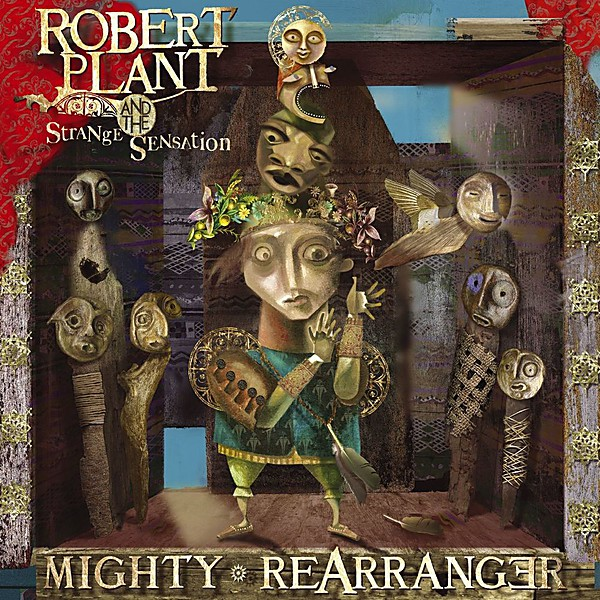

# Mighty Rearranger

By **Robert Plant and the Strange Sensation**

## Album Data

- **Catalog:** Beets
- **Format:** Digital, Album
- **Album:** Mighty Rearranger
- **Artist:** Robert Plant And The Strange Sensation
- **Albumartist:** Robert Plant and the Strange Sensation
- **Genre:** Uk Garage
- **MusicBrainz Album Artist ID:** [a527e4cb-64be-4960-8ef5-edb02ff7d48e](https://musicbrainz.org/artist/a527e4cb-64be-4960-8ef5-edb02ff7d48e)
- **MusicBrainz Album ID:** [bdeb5fab-e953-4eae-9e24-ceb8cccca1c4](https://musicbrainz.org/release/bdeb5fab-e953-4eae-9e24-ceb8cccca1c4)
- **MusicBrainz Release Group ID:** [47230d04-525e-3146-a240-38405067ff4f](https://musicbrainz.org/release-group/47230d04-525e-3146-a240-38405067ff4f)
- **Year:** 2005
- **Catalog #:** CDSAN90
- **Label:** Sanctuary Records
- **Total Tracks:** 12

## Album Tracks

### Track 01 - Another Tribe

- **Artist:** Robert Plant and the Strange Sensation
- **Format:** ALAC
- **Genre:** Worldbeat
- **Length:** 3:16
- **MusicBrainz Track ID:** [31fccc36-60f8-413f-85f7-7128d8dbbd2a](https://musicbrainz.org/recording/31fccc36-60f8-413f-85f7-7128d8dbbd2a)
- **Title:** Another Tribe
- **Track:** 01
- **Year:** 2005

### Track 02 - Shine It All Around

- **Artist:** Robert Plant and the Strange Sensation
- **Format:** ALAC
- **Genre:** Hard Rock
- **Length:** 4:03
- **MusicBrainz Track ID:** [18d849c2-cdc5-4083-a8f8-b341b5ff62b2](https://musicbrainz.org/recording/18d849c2-cdc5-4083-a8f8-b341b5ff62b2)
- **Title:** Shine It All Around
- **Track:** 02
- **Year:** 2005

### Track 03 - Freedom Fries

- **Artist:** Robert Plant and the Strange Sensation
- **Format:** ALAC
- **Genre:** Worldbeat
- **Length:** 2:52
- **MusicBrainz Track ID:** [654462e6-5641-4170-896f-96797c9ed9db](https://musicbrainz.org/recording/654462e6-5641-4170-896f-96797c9ed9db)
- **Title:** Freedom Fries
- **Track:** 03
- **Year:** 2005

### Track 04 - Tin Pan Valley

- **Artist:** Robert Plant and the Strange Sensation
- **Format:** ALAC
- **Genre:** Worldbeat
- **Length:** 3:46
- **MusicBrainz Track ID:** [e2f8dae7-fcc3-44d9-bde7-9340b63a18e9](https://musicbrainz.org/recording/e2f8dae7-fcc3-44d9-bde7-9340b63a18e9)
- **Title:** Tin Pan Valley
- **Track:** 04
- **Year:** 2005

### Track 05 - All the Kings Horses

- **Artist:** Robert Plant and the Strange Sensation
- **Format:** ALAC
- **Genre:** Emo
- **Length:** 4:19
- **MusicBrainz Track ID:** [103d647c-99f7-4609-8411-57a287858933](https://musicbrainz.org/recording/103d647c-99f7-4609-8411-57a287858933)
- **Title:** All the Kings Horses
- **Track:** 05
- **Year:** 2005

### Track 06 - The Enchanter

- **Artist:** Robert Plant and the Strange Sensation
- **Format:** ALAC
- **Genre:** Worldbeat
- **Length:** 5:27
- **MusicBrainz Track ID:** [dfe56e89-e3ab-483b-8eed-571a757302b2](https://musicbrainz.org/recording/dfe56e89-e3ab-483b-8eed-571a757302b2)
- **Title:** The Enchanter
- **Track:** 06
- **Year:** 2005

### Track 07 - Takamba

- **Artist:** Robert Plant and the Strange Sensation
- **Format:** ALAC
- **Genre:** Worldbeat
- **Length:** 4:05
- **MusicBrainz Track ID:** [7fa599f9-1ab2-41c3-a0fa-dba308f4dded](https://musicbrainz.org/recording/7fa599f9-1ab2-41c3-a0fa-dba308f4dded)
- **Title:** Takamba
- **Track:** 07
- **Year:** 2005

### Track 08 - Dancing in Heaven

- **Artist:** Robert Plant and the Strange Sensation
- **Format:** ALAC
- **Genre:** Worldbeat
- **Length:** 4:25
- **MusicBrainz Track ID:** [2963e5b3-f877-4ecc-a294-74007b219fda](https://musicbrainz.org/recording/2963e5b3-f877-4ecc-a294-74007b219fda)
- **Title:** Dancing in Heaven
- **Track:** 08
- **Year:** 2005

### Track 09 - Somebody Knocking

- **Artist:** Robert Plant and the Strange Sensation
- **Format:** ALAC
- **Genre:** Worldbeat
- **Length:** 3:46
- **MusicBrainz Track ID:** [06e5ebd9-a23c-4fd7-a99b-76e165f1e3e9](https://musicbrainz.org/recording/06e5ebd9-a23c-4fd7-a99b-76e165f1e3e9)
- **Title:** Somebody Knocking
- **Track:** 09
- **Year:** 2005

### Track 10 - Let the Four Winds Blow

- **Artist:** Robert Plant and the Strange Sensation
- **Format:** ALAC
- **Genre:** Worldbeat
- **Length:** 4:52
- **MusicBrainz Track ID:** [1f8af9bf-17e2-4a57-a2c6-d99d5245ddbf](https://musicbrainz.org/recording/1f8af9bf-17e2-4a57-a2c6-d99d5245ddbf)
- **Title:** Let the Four Winds Blow
- **Track:** 10
- **Year:** 2005

### Track 11 - Mighty Rearranger

- **Artist:** Robert Plant and the Strange Sensation
- **Format:** ALAC
- **Genre:** Worldbeat
- **Length:** 4:25
- **MusicBrainz Track ID:** [60326779-4667-4f68-a170-c71de20ca215](https://musicbrainz.org/recording/60326779-4667-4f68-a170-c71de20ca215)
- **Title:** Mighty Rearranger
- **Track:** 11
- **Year:** 2005

### Track 12 - Brother Ray

- **Artist:** Robert Plant and the Strange Sensation
- **Format:** ALAC
- **Genre:** Trip Hop
- **Length:** 8:58
- **MusicBrainz Track ID:** [f00c4a77-b234-45e8-bb72-8020409af18f](https://musicbrainz.org/recording/f00c4a77-b234-45e8-bb72-8020409af18f)
- **Title:** Brother Ray
- **Track:** 12
- **Year:** 2005

