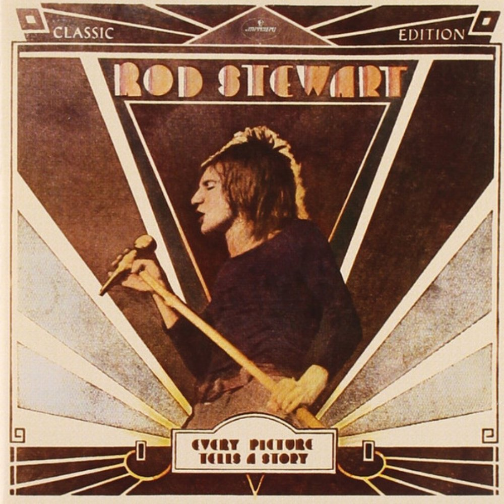

# Every Picture Tells a Story

By **Rod Stewart**

## Album Data

- **Catalog:** Beets
- **Format:** Digital, Album
- **Album:** Every Picture Tells a Story
- **Artist:** Rod Stewart
- **Albumartist:** Rod Stewart
- **Genre:** Pop Rock
- **MusicBrainz Album Artist ID:** [a35237a0-4f47-40a6-b6f3-1e786db23402](https://musicbrainz.org/artist/a35237a0-4f47-40a6-b6f3-1e786db23402)
- **MusicBrainz Album ID:** [c6bfd81d-e3db-3ae2-bb09-457d56101585](https://musicbrainz.org/release/c6bfd81d-e3db-3ae2-bb09-457d56101585)
- **MusicBrainz Release Group ID:** [d4e7be0c-6db3-372e-aee6-e048dbb9ac51](https://musicbrainz.org/release-group/d4e7be0c-6db3-372e-aee6-e048dbb9ac51)
- **Year:** 1998
- **Catalog #:** 314 558 060-2
- **Label:** Mercury Records
- **Total Tracks:** 08

## Album Tracks

### Track 01 - Every Picture Tells a Story

- **Artist:** Rod Stewart
- **Format:** MP3
- **Genre:** Rock
- **Length:** 5:59
- **MusicBrainz Track ID:** [8fb9d952-0d7d-4c52-9483-b13e6e77c8d0](https://musicbrainz.org/recording/8fb9d952-0d7d-4c52-9483-b13e6e77c8d0)
- **Title:** Every Picture Tells a Story
- **Track:** 01
- **Year:** 1998

### Track 02 - Seems Like a Long Time

- **Artist:** Rod Stewart
- **Format:** MP3
- **Genre:** Soft Rock
- **Length:** 4:02
- **MusicBrainz Track ID:** [64d1460f-8c24-46a0-a3e2-8394fc410154](https://musicbrainz.org/recording/64d1460f-8c24-46a0-a3e2-8394fc410154)
- **Title:** Seems Like a Long Time
- **Track:** 02
- **Year:** 1998

### Track 03 - That's All Right

- **Artist:** Rod Stewart
- **Format:** MP3
- **Genre:** Rock And Roll
- **Length:** 6:00
- **MusicBrainz Track ID:** [300deafc-f911-4899-b8ad-3a00d85057df](https://musicbrainz.org/recording/300deafc-f911-4899-b8ad-3a00d85057df)
- **Title:** That's All Right
- **Track:** 03
- **Year:** 1998

### Track 04 - Tomorrow Is Such a Long Time

- **Artist:** Rod Stewart
- **Format:** MP3
- **Genre:** Soft Rock
- **Length:** 3:48
- **MusicBrainz Track ID:** [c7d81656-f78a-4b8e-a8f5-819c75ee93e8](https://musicbrainz.org/recording/c7d81656-f78a-4b8e-a8f5-819c75ee93e8)
- **Title:** Tomorrow Is Such a Long Time
- **Track:** 04
- **Year:** 1998

### Track 05 - Maggie May

- **Artist:** Rod Stewart
- **Format:** MP3
- **Genre:** Soft Rock
- **Length:** 5:50
- **MusicBrainz Track ID:** [ac212fcb-375d-49e9-8a01-e9f064425517](https://musicbrainz.org/recording/ac212fcb-375d-49e9-8a01-e9f064425517)
- **Title:** Maggie May
- **Track:** 05
- **Year:** 1998

### Track 06 - Mandolin Wind

- **Artist:** Rod Stewart
- **Format:** MP3
- **Genre:** Soft Rock
- **Length:** 5:36
- **MusicBrainz Track ID:** [0fb80002-993c-42bd-9d66-a6a22d770b0c](https://musicbrainz.org/recording/0fb80002-993c-42bd-9d66-a6a22d770b0c)
- **Title:** Mandolin Wind
- **Track:** 06
- **Year:** 1998

### Track 07 - (I Know) I'm Losing You

- **Artist:** Rod Stewart
- **Format:** MP3
- **Genre:** Rock And Roll
- **Length:** 5:23
- **MusicBrainz Track ID:** [b725a8e1-12c3-4a69-97ed-3154385ab4c3](https://musicbrainz.org/recording/b725a8e1-12c3-4a69-97ed-3154385ab4c3)
- **Title:** (I Know) I'm Losing You
- **Track:** 07
- **Year:** 1998

### Track 08 - Reason to Believe

- **Artist:** Rod Stewart
- **Format:** MP3
- **Genre:** Soft Rock
- **Length:** 4:10
- **MusicBrainz Track ID:** [f0c5dbc1-6cbb-4eb7-805e-ed48664a141a](https://musicbrainz.org/recording/f0c5dbc1-6cbb-4eb7-805e-ed48664a141a)
- **Title:** Reason to Believe
- **Track:** 08
- **Year:** 1998

## See also

- [Reason To Believe](Reason_To_Believe_2_3.md)
- [Reason To Believe](Reason_To_Believe_2.md)
- [Reason To Believe](Reason_To_Believe.md)
- [CD: Reason To Believe](../../CD/Rod_Stewart/Reason_To_Believe-_The_Complete_Mercury_Studio_Recordings_Disc_1.md)
- [CD: Reason To Believe](../../CD/Rod_Stewart/Reason_To_Believe-_The_Complete_Mercury_Studio_Recordings_Disc_2.md)
- [CD: Reason To Believe](../../CD/Rod_Stewart/Reason_To_Believe-_The_Complete_Mercury_Studio_Recordings_Disc_3.md)
- [CD: ](../../CD/Rod_Stewart/Rod_Stewart.md)
- [Roon: Every Picture Tells A Story](../../Roon/Rod_Stewart/Every_Picture_Tells_A_Story.md)
- [Roon: Reason To Believe](../../Roon/Rod_Stewart/Reason_To_Believe-_The_Complete_Mercury_Recordings.md)
- [Vinyl: Every Picture Tells A Story](../../Vinyl/Rod_Stewart/Every_Picture_Tells_A_Story.md)
- [Vinyl: Gasoline Alley](../../Vinyl/Rod_Stewart/Gasoline_Alley.md)
- [Vinyl: ](../../Vinyl/Rod_Stewart/Rod_Stewart.md)
