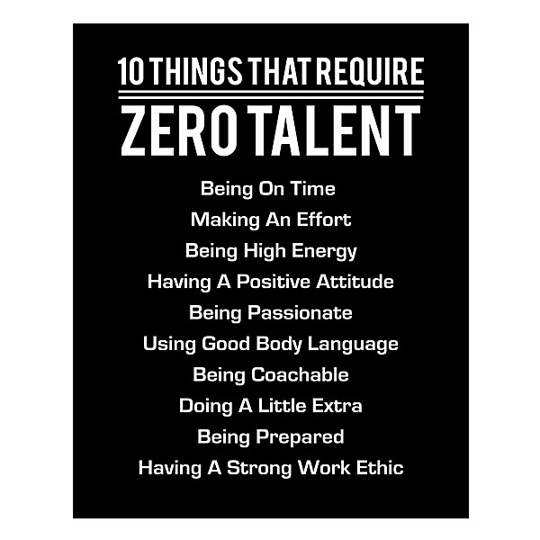

# Reason To Believe

By **Rod Stewart**

## Album Data

- **Catalog:** Beets
- **Format:** Digital, Album
- **Album:** Reason To Believe
- **Artist:** Rod Stewart
- **Albumartist:** Rod Stewart
- **Genre:** Soft Rock
- **MusicBrainz Album Artist ID:** 
- **MusicBrainz Album ID:** 
- **MusicBrainz Release Group ID:** 
- **Year:** 1969
- **Catalog #:** 
- **Label:** 
- **Total Tracks:** 18

## Album Tracks

### Track 01 - Every Picture Tells A Story

- **Artist:** Rod Stewart
- **Format:** ALAC
- **Genre:** Rock
- **Length:** 5:59
- **MusicBrainz Track ID:** 
- **Title:** Every Picture Tells A Story
- **Track:** 01
- **Year:** 1971

### Track 02 - Seems Like A Long Time

- **Artist:** Rod Stewart
- **Format:** ALAC
- **Genre:** Soft Rock
- **Length:** 4:03
- **MusicBrainz Track ID:** 
- **Title:** Seems Like A Long Time
- **Track:** 02
- **Year:** 1971

### Track 03 - That's All Right

- **Artist:** Rod Stewart
- **Format:** ALAC
- **Genre:** Rock And Roll
- **Length:** 6:00
- **MusicBrainz Track ID:** 
- **Title:** That's All Right
- **Track:** 03
- **Year:** 1971

### Track 04 - Tomorrow Is A Long Time

- **Artist:** Rod Stewart
- **Format:** ALAC
- **Genre:** Folk Rock
- **Length:** 3:47
- **MusicBrainz Track ID:** 
- **Title:** Tomorrow Is A Long Time
- **Track:** 04
- **Year:** 1971

### Track 05 - Maggie May

- **Artist:** Rod Stewart
- **Format:** ALAC
- **Genre:** Soft Rock
- **Length:** 5:50
- **MusicBrainz Track ID:** 
- **Title:** Maggie May
- **Track:** 05
- **Year:** 1971

### Track 06 - Mandolin Wind

- **Artist:** Rod Stewart
- **Format:** ALAC
- **Genre:** Soft Rock
- **Length:** 5:36
- **MusicBrainz Track ID:** 
- **Title:** Mandolin Wind
- **Track:** 06
- **Year:** 1971

### Track 07 - (I Know) I'm Losing You

- **Artist:** Rod Stewart
- **Format:** ALAC
- **Genre:** Rock And Roll
- **Length:** 5:24
- **MusicBrainz Track ID:** 
- **Title:** (I Know) I'm Losing You
- **Track:** 07
- **Year:** 1971

### Track 08 - (Find A) Reason To Believe

- **Artist:** Rod Stewart
- **Format:** ALAC
- **Genre:** Soft Rock
- **Length:** 4:10
- **MusicBrainz Track ID:** 
- **Title:** (Find A) Reason To Believe
- **Track:** 08
- **Year:** 1971

### Track 09 - True Blue

- **Artist:** Rod Stewart
- **Format:** ALAC
- **Genre:** Soft Rock
- **Length:** 3:35
- **MusicBrainz Track ID:** 
- **Title:** True Blue
- **Track:** 09
- **Year:** 1972

### Track 10 - Lost Paraguayos

- **Artist:** Rod Stewart
- **Format:** ALAC
- **Genre:** Rock And Roll
- **Length:** 3:59
- **MusicBrainz Track ID:** 
- **Title:** Lost Paraguayos
- **Track:** 10
- **Year:** 1972

### Track 11 - Mama You Been On My Mind

- **Artist:** Rod Stewart
- **Format:** ALAC
- **Genre:** Rock And Roll
- **Length:** 4:29
- **MusicBrainz Track ID:** 
- **Title:** Mama You Been On My Mind
- **Track:** 11
- **Year:** 1972

### Track 12 - Italian Girls

- **Artist:** Rod Stewart
- **Format:** ALAC
- **Genre:** Rock And Roll
- **Length:** 4:56
- **MusicBrainz Track ID:** 
- **Title:** Italian Girls
- **Track:** 12
- **Year:** 1972

### Track 13 - Angel

- **Artist:** Rod Stewart
- **Format:** ALAC
- **Genre:** Rock
- **Length:** 4:06
- **MusicBrainz Track ID:** 
- **Title:** Angel
- **Track:** 13
- **Year:** 1972

### Track 14 - Interludings

- **Artist:** Rod Stewart
- **Format:** ALAC
- **Genre:** Soft Rock
- **Length:** 0:40
- **MusicBrainz Track ID:** 
- **Title:** Interludings
- **Track:** 14
- **Year:** 1972

### Track 15 - You Wear It Well

- **Artist:** Rod Stewart
- **Format:** ALAC
- **Genre:** Soft Rock
- **Length:** 4:24
- **MusicBrainz Track ID:** 
- **Title:** You Wear It Well
- **Track:** 15
- **Year:** 1972

### Track 16 - I'd Rather Go Blind

- **Artist:** Rod Stewart
- **Format:** ALAC
- **Genre:** Soft Rock
- **Length:** 3:53
- **MusicBrainz Track ID:** 
- **Title:** I'd Rather Go Blind
- **Track:** 16
- **Year:** 1972

### Track 17 - Twistin' The Night Away

- **Artist:** Rod Stewart
- **Format:** ALAC
- **Genre:** Vocal Jazz
- **Length:** 3:18
- **MusicBrainz Track ID:** 
- **Title:** Twistin' The Night Away
- **Track:** 17
- **Year:** 1972

### Track 18 - What's Made Milwaukee Famous (Has Made A Loser Out Of Me) [Single Version]

- **Artist:** Rod Stewart
- **Format:** ALAC
- **Genre:** Soft Rock
- **Length:** 2:51
- **MusicBrainz Track ID:** 
- **Title:** What's Made Milwaukee Famous (Has Made A Loser Out Of Me) [Single Version]
- **Track:** 18
- **Year:** 1972

## See also

- [Every Picture Tells a Story](Every_Picture_Tells_a_Story.md)
- [Reason To Believe](Reason_To_Believe_2_3.md)
- [Reason To Believe](Reason_To_Believe_2.md)
- [CD: Reason To Believe](../../CD/Rod_Stewart/Reason_To_Believe-_The_Complete_Mercury_Studio_Recordings_Disc_1.md)
- [CD: Reason To Believe](../../CD/Rod_Stewart/Reason_To_Believe-_The_Complete_Mercury_Studio_Recordings_Disc_2.md)
- [CD: Reason To Believe](../../CD/Rod_Stewart/Reason_To_Believe-_The_Complete_Mercury_Studio_Recordings_Disc_3.md)
- [CD: ](../../CD/Rod_Stewart/Rod_Stewart.md)
- [Roon: Every Picture Tells A Story](../../Roon/Rod_Stewart/Every_Picture_Tells_A_Story.md)
- [Roon: Reason To Believe](../../Roon/Rod_Stewart/Reason_To_Believe-_The_Complete_Mercury_Recordings.md)
- [Vinyl: Every Picture Tells A Story](../../Vinyl/Rod_Stewart/Every_Picture_Tells_A_Story.md)
- [Vinyl: Gasoline Alley](../../Vinyl/Rod_Stewart/Gasoline_Alley.md)
- [Vinyl: ](../../Vinyl/Rod_Stewart/Rod_Stewart.md)
