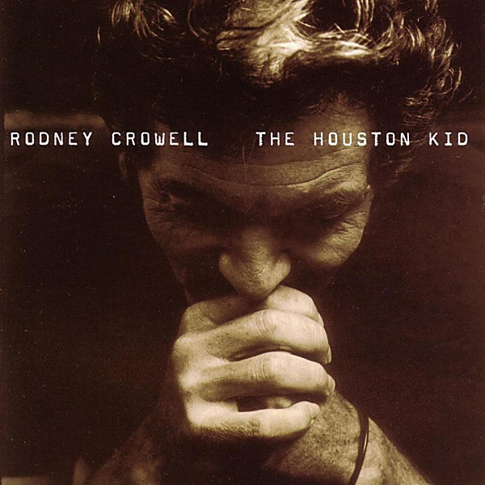

# The Houston Kid

By **Rodney Crowell**

## Album Data

- **Catalog:** Beets
- **Format:** Digital, Album
- **Album:** The Houston Kid
- **Artist:** Rodney Crowell
- **Albumartist:** Rodney Crowell
- **Genre:** Americana
- **MusicBrainz Album Artist ID:** [a201fa9d-5896-423d-b629-327228c62a7c](https://musicbrainz.org/artist/a201fa9d-5896-423d-b629-327228c62a7c)
- **MusicBrainz Album ID:** [34badead-e344-4408-923a-1bd4e9eed5e1](https://musicbrainz.org/release/34badead-e344-4408-923a-1bd4e9eed5e1)
- **MusicBrainz Release Group ID:** [b29da0c7-707d-3d73-927c-e310b957289c](https://musicbrainz.org/release-group/b29da0c7-707d-3d73-927c-e310b957289c)
- **Year:** 2001
- **Catalog #:** SUG-CD-1065
- **Label:** Sugar Hill Records
- **Total Tracks:** 11

## Album Tracks

### Track 01 - Telephone Road

- **Artist:** Rodney Crowell
- **Format:** MP3
- **Genre:** Southern Rock
- **Length:** 3:52
- **MusicBrainz Track ID:** [a7ff2538-c628-4a25-b452-7f37fc211666](https://musicbrainz.org/recording/a7ff2538-c628-4a25-b452-7f37fc211666)
- **Title:** Telephone Road
- **Track:** 01
- **Year:** 2001

### Track 02 - The Rock of My Soul

- **Artist:** Rodney Crowell
- **Format:** MP3
- **Genre:** Southern Rock
- **Length:** 4:50
- **MusicBrainz Track ID:** [14b2606a-2e90-46f0-8d8b-faa6da787c96](https://musicbrainz.org/recording/14b2606a-2e90-46f0-8d8b-faa6da787c96)
- **Title:** The Rock of My Soul
- **Track:** 02
- **Year:** 2001

### Track 03 - Why Don't We Talk About It

- **Artist:** Rodney Crowell
- **Format:** MP3
- **Genre:** Pop
- **Length:** 3:35
- **MusicBrainz Track ID:** [e4d5b9a8-ddb0-483c-8972-c23cfbbc28a2](https://musicbrainz.org/recording/e4d5b9a8-ddb0-483c-8972-c23cfbbc28a2)
- **Title:** Why Don't We Talk About It
- **Track:** 03
- **Year:** 2001

### Track 04 - I Wish It Would Rain

- **Artist:** Rodney Crowell
- **Format:** MP3
- **Genre:** Classic Country
- **Length:** 3:28
- **MusicBrainz Track ID:** [d1fa09c1-c830-4bf7-af08-655a8fcded6a](https://musicbrainz.org/recording/d1fa09c1-c830-4bf7-af08-655a8fcded6a)
- **Title:** I Wish It Would Rain
- **Track:** 04
- **Year:** 2001

### Track 05 - Wandering Boy

- **Artist:** Rodney Crowell
- **Format:** MP3
- **Genre:** Country
- **Length:** 5:56
- **MusicBrainz Track ID:** [ab62e88b-855c-449a-8b20-c1cae6abf33a](https://musicbrainz.org/recording/ab62e88b-855c-449a-8b20-c1cae6abf33a)
- **Title:** Wandering Boy
- **Track:** 05
- **Year:** 2001

### Track 06 - I Walk the Line (Revisited)

- **Artist:** Rodney Crowell
- **Format:** MP3
- **Genre:** Americana
- **Length:** 3:51
- **MusicBrainz Track ID:** [0d744b82-9375-41b9-825b-2455305520e4](https://musicbrainz.org/recording/0d744b82-9375-41b9-825b-2455305520e4)
- **Title:** I Walk the Line (Revisited)
- **Track:** 06
- **Year:** 2001

### Track 07 - Highway 17

- **Artist:** Rodney Crowell
- **Format:** MP3
- **Genre:** Country
- **Length:** 4:54
- **MusicBrainz Track ID:** [5e4b2044-b8aa-4d71-aa8d-8e3b601f15f9](https://musicbrainz.org/recording/5e4b2044-b8aa-4d71-aa8d-8e3b601f15f9)
- **Title:** Highway 17
- **Track:** 07
- **Year:** 2001

### Track 08 - U Don't Know How Much I Hate U

- **Artist:** Rodney Crowell
- **Format:** MP3
- **Genre:** Country Rock
- **Length:** 3:37
- **MusicBrainz Track ID:** [4a058d52-cb21-48e8-a89e-008980cc5a6a](https://musicbrainz.org/recording/4a058d52-cb21-48e8-a89e-008980cc5a6a)
- **Title:** U Don't Know How Much I Hate U
- **Track:** 08
- **Year:** 2001

### Track 09 - Banks of the Old Bandera

- **Artist:** Rodney Crowell
- **Format:** MP3
- **Genre:** Americana
- **Length:** 3:41
- **MusicBrainz Track ID:** [d61fe3b3-ead9-48a3-8244-f322e814fc1d](https://musicbrainz.org/recording/d61fe3b3-ead9-48a3-8244-f322e814fc1d)
- **Title:** Banks of the Old Bandera
- **Track:** 09
- **Year:** 2001

### Track 10 - Topsy Turvy

- **Artist:** Rodney Crowell
- **Format:** MP3
- **Genre:** Americana
- **Length:** 3:47
- **MusicBrainz Track ID:** [f9aec40c-326b-4df0-bdc9-5e1e64481471](https://musicbrainz.org/recording/f9aec40c-326b-4df0-bdc9-5e1e64481471)
- **Title:** Topsy Turvy
- **Track:** 10
- **Year:** 2001

### Track 11 - I Know Love Is All I Need

- **Artist:** Rodney Crowell
- **Format:** MP3
- **Genre:** Americana
- **Length:** 5:19
- **MusicBrainz Track ID:** [442facad-8fea-4177-81a8-c4212d17e518](https://musicbrainz.org/recording/442facad-8fea-4177-81a8-c4212d17e518)
- **Title:** I Know Love Is All I Need
- **Track:** 11
- **Year:** 2001

