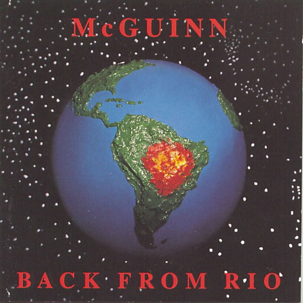

# Back From Rio

By **Roger McGuinn**

## Album Data

- **Catalog:** Beets
- **Format:** Digital, Album
- **Album:** Back From Rio
- **Artist:** Roger Mcguinn
- **Albumartist:** Roger McGuinn
- **Genre:** Folk Rock
- **MusicBrainz Album Artist ID:** [6ec7336b-a56a-4b5d-bcec-575d2b8ed4e1](https://musicbrainz.org/artist/6ec7336b-a56a-4b5d-bcec-575d2b8ed4e1)
- **MusicBrainz Album ID:** [7a723726-5cd5-47c4-b747-11c210612274](https://musicbrainz.org/release/7a723726-5cd5-47c4-b747-11c210612274)
- **MusicBrainz Release Group ID:** [346b50bb-5e86-3fe2-b624-01e4a1c0cc78](https://musicbrainz.org/release-group/346b50bb-5e86-3fe2-b624-01e4a1c0cc78)
- **Year:** 1991
- **Catalog #:** 
- **Label:** 
- **Total Tracks:** 00

## Album Tracks

### Track 00 - I Saw 3 Ships

- **Artist:** Roger McGuinn
- **Format:** MP3
- **Genre:** Folk Rock
- **Length:** 2:07
- **MusicBrainz Track ID:** 
- **Title:** I Saw 3 Ships
- **Track:** 00
- **Year:** 1999

### Track 00 - James Alley Blues

- **Artist:** Roger McGuinn
- **Format:** MP3
- **Genre:** Blues
- **Length:** 3:13
- **MusicBrainz Track ID:** 
- **Title:** James Alley Blues
- **Track:** 00
- **Year:** 1999

### Track 00 - John Henry

- **Artist:** Roger McGuinn
- **Format:** MP3
- **Genre:** Folk Rock
- **Length:** 1:42
- **MusicBrainz Track ID:** 
- **Title:** John Henry
- **Track:** 00
- **Year:** 1999

### Track 00 - John The Revelator

- **Artist:** Roger McGuinn
- **Format:** MP3
- **Genre:** Folk Rock
- **Length:** 2:26
- **MusicBrainz Track ID:** 
- **Title:** John The Revelator
- **Track:** 00
- **Year:** 1999

### Track 12 - Ain't No Mo Cane on de Brasis

- **Artist:** Roger McGuinn
- **Format:** MP3
- **Genre:** Folk Rock
- **Length:** 3:41
- **MusicBrainz Track ID:** 
- **Title:** Ain't No Mo Cane on de Brasis
- **Track:** 12
- **Year:** 1999

### Track 58 - Finnegan's Wake

- **Artist:** Roger McGuinn
- **Format:** MP3
- **Genre:** Folk Rock
- **Length:** 2:31
- **MusicBrainz Track ID:** 
- **Title:** Finnegan's Wake
- **Track:** 58
- **Year:** 1999

## See also

- [The Folk Den Project](The_Folk_Den_Project.md)
