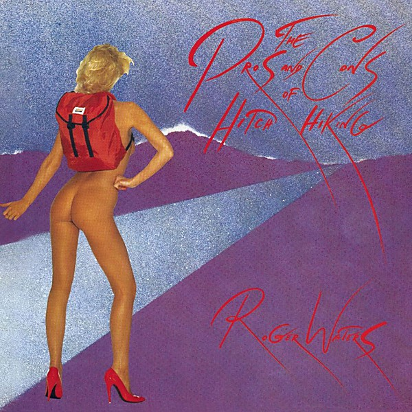

# The Pros and Cons of Hitch Hiking

By **Roger Waters**

## Album Data

- **Catalog:** Beets
- **Format:** Digital, Album
- **Album:** The Pros and Cons of Hitch Hiking
- **Artist:** Roger Waters
- **Albumartist:** Roger Waters
- **Genre:** Progressive Rock
- **MusicBrainz Album Artist ID:** [0f50beab-d77d-4f0f-ac26-0b87d3e9b11b](https://musicbrainz.org/artist/0f50beab-d77d-4f0f-ac26-0b87d3e9b11b)
- **MusicBrainz Album ID:** [6511241e-4e87-4bed-ac22-a012523c58b8](https://musicbrainz.org/release/6511241e-4e87-4bed-ac22-a012523c58b8)
- **MusicBrainz Release Group ID:** [961c7742-3311-32ee-beee-58ac8dbe08f4](https://musicbrainz.org/release-group/961c7742-3311-32ee-beee-58ac8dbe08f4)
- **Year:** 1984
- **Catalog #:** CK 39290
- **Label:** Columbia
- **Total Tracks:** 12

## Album Tracks

### Track 01 - 4

- **Artist:** Roger Waters
- **Format:** ALAC
- **Genre:** Progressive Rock
- **Length:** 3:11
- **MusicBrainz Track ID:** [ca0471a9-979d-4939-8029-09b3d4d2e1f1](https://musicbrainz.org/recording/ca0471a9-979d-4939-8029-09b3d4d2e1f1)
- **Title:** 4
- **Track:** 01
- **Year:** 1984

### Track 02 - 4

- **Artist:** Roger Waters
- **Format:** ALAC
- **Genre:** Space Rock
- **Length:** 4:08
- **MusicBrainz Track ID:** [21c5df36-f038-4755-9ccc-c7bc17cab7a5](https://musicbrainz.org/recording/21c5df36-f038-4755-9ccc-c7bc17cab7a5)
- **Title:** 4
- **Track:** 02
- **Year:** 1984

### Track 03 - 4

- **Artist:** Roger Waters
- **Format:** ALAC
- **Genre:** Progressive Rock
- **Length:** 2:17
- **MusicBrainz Track ID:** [c7657853-4490-4519-8807-3d69cf5ab03d](https://musicbrainz.org/recording/c7657853-4490-4519-8807-3d69cf5ab03d)
- **Title:** 4
- **Track:** 03
- **Year:** 1984

### Track 04 - 4

- **Artist:** Roger Waters
- **Format:** ALAC
- **Genre:** Psychedelic Rock
- **Length:** 2:02
- **MusicBrainz Track ID:** [a70418f6-2193-4528-a07f-fcdb39cef168](https://musicbrainz.org/recording/a70418f6-2193-4528-a07f-fcdb39cef168)
- **Title:** 4
- **Track:** 04
- **Year:** 1984

### Track 05 - 4

- **Artist:** Roger Waters
- **Format:** ALAC
- **Genre:** Space Rock
- **Length:** 4:49
- **MusicBrainz Track ID:** [6a5fbaa3-2d85-492b-8e07-d813ec29a355](https://musicbrainz.org/recording/6a5fbaa3-2d85-492b-8e07-d813ec29a355)
- **Title:** 4
- **Track:** 05
- **Year:** 1984

### Track 06 - 4

- **Artist:** Roger Waters
- **Format:** ALAC
- **Genre:** Progressive Rock
- **Length:** 3:09
- **MusicBrainz Track ID:** [4636877a-9692-4cf6-be4c-9e06d534a8f1](https://musicbrainz.org/recording/4636877a-9692-4cf6-be4c-9e06d534a8f1)
- **Title:** 4
- **Track:** 06
- **Year:** 1984

### Track 07 - 4

- **Artist:** Roger Waters
- **Format:** ALAC
- **Genre:** Progressive Rock
- **Length:** 6:59
- **MusicBrainz Track ID:** [acd3e26e-9af7-480b-a30f-6fcadbbf4c12](https://musicbrainz.org/recording/acd3e26e-9af7-480b-a30f-6fcadbbf4c12)
- **Title:** 4
- **Track:** 07
- **Year:** 1984

### Track 08 - 4

- **Artist:** Roger Waters
- **Format:** ALAC
- **Genre:** Progressive Rock
- **Length:** 1:38
- **MusicBrainz Track ID:** [076b62e0-2f48-4f84-9965-17816bd6ace6](https://musicbrainz.org/recording/076b62e0-2f48-4f84-9965-17816bd6ace6)
- **Title:** 4
- **Track:** 08
- **Year:** 1984

### Track 09 - 4

- **Artist:** Roger Waters
- **Format:** ALAC
- **Genre:** Psychedelic Rock
- **Length:** 3:03
- **MusicBrainz Track ID:** [71d1f6c1-3866-4b8e-9ad7-e569ac2b56bf](https://musicbrainz.org/recording/71d1f6c1-3866-4b8e-9ad7-e569ac2b56bf)
- **Title:** 4
- **Track:** 09
- **Year:** 1984

### Track 10 - 5

- **Artist:** Roger Waters
- **Format:** ALAC
- **Genre:** Space Rock
- **Length:** 4:36
- **MusicBrainz Track ID:** [f65b4a6d-3bb0-4348-bdf0-1c79ed15a2ee](https://musicbrainz.org/recording/f65b4a6d-3bb0-4348-bdf0-1c79ed15a2ee)
- **Title:** 5
- **Track:** 10
- **Year:** 1984

### Track 11 - 5

- **Artist:** Roger Waters
- **Format:** ALAC
- **Genre:** Progressive Rock
- **Length:** 4:48
- **MusicBrainz Track ID:** [8ddd7d6a-f784-42b0-a9c5-4b878220169d](https://musicbrainz.org/recording/8ddd7d6a-f784-42b0-a9c5-4b878220169d)
- **Title:** 5
- **Track:** 11
- **Year:** 1984

### Track 12 - 5

- **Artist:** Roger Waters
- **Format:** ALAC
- **Genre:** Psychedelic Rock
- **Length:** 1:28
- **MusicBrainz Track ID:** [11a0b20e-dc47-4f64-8a79-9dcfcd875930](https://musicbrainz.org/recording/11a0b20e-dc47-4f64-8a79-9dcfcd875930)
- **Title:** 5
- **Track:** 12
- **Year:** 1984

## See also

- [Amused to Death](Amused_to_Death.md)
