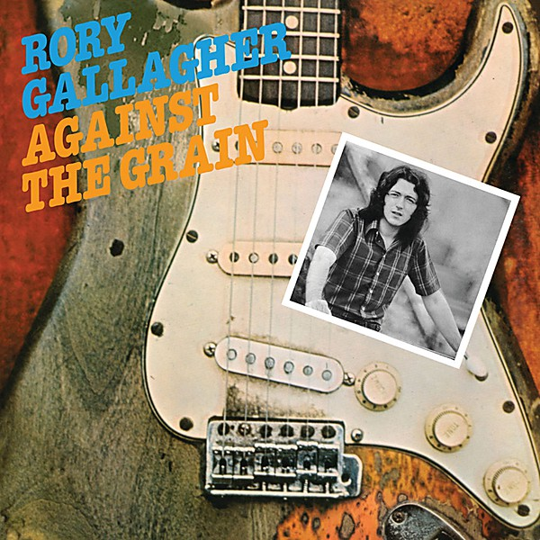

# Against the Grain

By **Rory Gallagher**

## Album Data

- **Catalog:** Beets
- **Format:** Digital, Album
- **Album:** Against the Grain
- **Artist:** Rory Gallagher
- **Albumartist:** Rory Gallagher
- **Genre:** Blues
- **MusicBrainz Album Artist ID:** [933fdeae-ec68-48e9-a752-8bcfd44bc429](https://musicbrainz.org/artist/933fdeae-ec68-48e9-a752-8bcfd44bc429)
- **MusicBrainz Album ID:** [545e503b-50e7-4ff9-8120-44039b2e1a51](https://musicbrainz.org/release/545e503b-50e7-4ff9-8120-44039b2e1a51)
- **MusicBrainz Release Group ID:** [e5e6adaf-eed2-3339-8019-bdbd24be1474](https://musicbrainz.org/release-group/e5e6adaf-eed2-3339-8019-bdbd24be1474)
- **Year:** 2020
- **Catalog #:** 
- **Label:** Universal Music Catalogue
- **Total Tracks:** 10

## Album Tracks

### Track 01 - Let Me In

- **Artist:** Rory Gallagher
- **Format:** MP3
- **Genre:** Rock
- **Length:** 4:03
- **MusicBrainz Track ID:** [e5e8b78e-a445-4cec-b3c3-7b5b2c790f77](https://musicbrainz.org/recording/e5e8b78e-a445-4cec-b3c3-7b5b2c790f77)
- **Title:** Let Me In
- **Track:** 01
- **Year:** 2020

### Track 02 - Cross Me Off Your List

- **Artist:** Rory Gallagher
- **Format:** MP3
- **Genre:** Hard Rock
- **Length:** 4:29
- **MusicBrainz Track ID:** [f19f4a87-8b33-4053-a921-b43ac47aaf74](https://musicbrainz.org/recording/f19f4a87-8b33-4053-a921-b43ac47aaf74)
- **Title:** Cross Me Off Your List
- **Track:** 02
- **Year:** 2020

### Track 03 - Ain’t Too Good

- **Artist:** Rory Gallagher
- **Format:** MP3
- **Genre:** Blues
- **Length:** 3:57
- **MusicBrainz Track ID:** [ac5aa331-4ee5-4570-ab17-9e48a1c9651c](https://musicbrainz.org/recording/ac5aa331-4ee5-4570-ab17-9e48a1c9651c)
- **Title:** Ain’t Too Good
- **Track:** 03
- **Year:** 2020

### Track 04 - Souped‐Up Ford

- **Artist:** Rory Gallagher
- **Format:** MP3
- **Genre:** Blues
- **Length:** 6:27
- **MusicBrainz Track ID:** [217f1db0-0105-4abe-a47f-e8f6f927434d](https://musicbrainz.org/recording/217f1db0-0105-4abe-a47f-e8f6f927434d)
- **Title:** Souped‐Up Ford
- **Track:** 04
- **Year:** 2020

### Track 05 - Bought and Sold

- **Artist:** Rory Gallagher
- **Format:** MP3
- **Genre:** Hard Rock
- **Length:** 3:26
- **MusicBrainz Track ID:** [0c205bbe-9d90-4cf4-b9b7-1ad636091994](https://musicbrainz.org/recording/0c205bbe-9d90-4cf4-b9b7-1ad636091994)
- **Title:** Bought and Sold
- **Track:** 05
- **Year:** 2020

### Track 06 - I Take What I Want

- **Artist:** Rory Gallagher
- **Format:** MP3
- **Genre:** Rock
- **Length:** 4:23
- **MusicBrainz Track ID:** [3495eb0c-ef1d-44b3-a0b5-8b576f75c392](https://musicbrainz.org/recording/3495eb0c-ef1d-44b3-a0b5-8b576f75c392)
- **Title:** I Take What I Want
- **Track:** 06
- **Year:** 2020

### Track 07 - Lost at Sea

- **Artist:** Rory Gallagher
- **Format:** MP3
- **Genre:** Rock
- **Length:** 4:06
- **MusicBrainz Track ID:** [fc69ec72-1949-480c-b6fa-229c0f6fdd42](https://musicbrainz.org/recording/fc69ec72-1949-480c-b6fa-229c0f6fdd42)
- **Title:** Lost at Sea
- **Track:** 07
- **Year:** 2020

### Track 08 - All Around Man

- **Artist:** Rory Gallagher
- **Format:** MP3
- **Genre:** Blues
- **Length:** 6:16
- **MusicBrainz Track ID:** [76670f57-7047-441c-8d15-b5694e14bb87](https://musicbrainz.org/recording/76670f57-7047-441c-8d15-b5694e14bb87)
- **Title:** All Around Man
- **Track:** 08
- **Year:** 2020

### Track 09 - Out on the Western Plain

- **Artist:** Rory Gallagher
- **Format:** MP3
- **Genre:** Country Blues
- **Length:** 3:53
- **MusicBrainz Track ID:** [6779e5f9-ada1-4c31-94ac-ffdeb3699038](https://musicbrainz.org/recording/6779e5f9-ada1-4c31-94ac-ffdeb3699038)
- **Title:** Out on the Western Plain
- **Track:** 09
- **Year:** 2020

### Track 10 - At the Bottom

- **Artist:** Rory Gallagher
- **Format:** MP3
- **Genre:** Rock
- **Length:** 3:21
- **MusicBrainz Track ID:** [187af757-0571-4c42-ae7f-d0dcce122581](https://musicbrainz.org/recording/187af757-0571-4c42-ae7f-d0dcce122581)
- **Title:** At the Bottom
- **Track:** 10
- **Year:** 2020

## See also

- [Vinyl: Against The Grain](../../Vinyl/Rory_Gallagher/Against_The_Grain.md)
- [Vinyl: Calling Card](../../Vinyl/Rory_Gallagher/Calling_Card.md)
- [Vinyl: Irish Tour '74..](../../Vinyl/Rory_Gallagher/Irish_Tour_74.md)
- [Vinyl: ](../../Vinyl/Rory_Gallagher/Rory_Gallagher.md)
