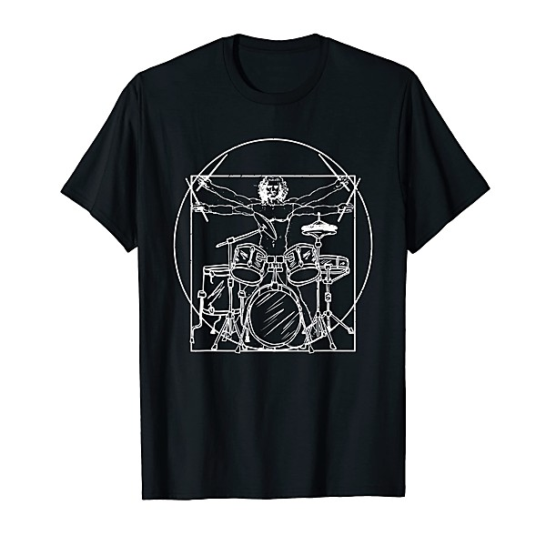

# Shostakovich

By **Royal Concertgebouw Orchestra**

## Album Data

- **Catalog:** Beets
- **Format:** Digital, Album
- **Album:** Shostakovich
- **Artist:** Royal Concertgebouw Orchestra
- **Albumartist:** Royal Concertgebouw Orchestra
- **Genre:** Symphony
- **MusicBrainz Album Artist ID:** 
- **MusicBrainz Album ID:** 
- **MusicBrainz Release Group ID:** 
- **Year:** 1996
- **Catalog #:** 
- **Label:** Decca
- **Total Tracks:** 00

## Album Tracks

### Track 16 - Shostakovich

- **Artist:** Royal Concertgebouw Orchestra
- **Format:** MP3
- **Genre:** Symphony
- **Length:** 3:32
- **MusicBrainz Track ID:** 
- **Title:** Shostakovich
- **Track:** 16
- **Year:** 1996

### Track 01 - Shostakovich

- **Artist:** Riccardo Chailly/Royal Concertgebouw Orchestra
- **Format:** MP3
- **Genre:** Symphony
- **Length:** 2:38
- **MusicBrainz Track ID:** 
- **Title:** Shostakovich
- **Track:** 01
- **Year:** 1996

### Track 02 - Shostakovich

- **Artist:** Riccardo Chailly/Royal Concertgebouw Orchestra
- **Format:** MP3
- **Genre:** Symphony
- **Length:** 1:44
- **MusicBrainz Track ID:** 
- **Title:** Shostakovich
- **Track:** 02
- **Year:** 1996

### Track 03 - Shostakovich

- **Artist:** Riccardo Chailly/Royal Concertgebouw Orchestra
- **Format:** MP3
- **Genre:** Symphony
- **Length:** 3:48
- **MusicBrainz Track ID:** 
- **Title:** Shostakovich
- **Track:** 03
- **Year:** 1996

### Track 08 - Shostakovich

- **Artist:** Riccardo Chailly/Royal Concertgebouw Orchestra
- **Format:** MP3
- **Genre:** Symphony
- **Length:** 3:06
- **MusicBrainz Track ID:** 
- **Title:** Shostakovich
- **Track:** 08
- **Year:** 1996

### Track 09 - Shostakovich

- **Artist:** Riccardo Chailly/Royal Concertgebouw Orchestra
- **Format:** MP3
- **Genre:** Symphony
- **Length:** 2:38
- **MusicBrainz Track ID:** 
- **Title:** Shostakovich
- **Track:** 09
- **Year:** 1996

### Track 10 - Shostakovich

- **Artist:** Riccardo Chailly/Royal Concertgebouw Orchestra
- **Format:** MP3
- **Genre:** Symphony
- **Length:** 3:02
- **MusicBrainz Track ID:** 
- **Title:** Shostakovich
- **Track:** 10
- **Year:** 1996

### Track 11 - Shostakovich

- **Artist:** Riccardo Chailly/Royal Concertgebouw Orchestra
- **Format:** MP3
- **Genre:** Symphony
- **Length:** 3:24
- **MusicBrainz Track ID:** 
- **Title:** Shostakovich
- **Track:** 11
- **Year:** 1996

### Track 12 - Shostakovich

- **Artist:** Riccardo Chailly/Royal Concertgebouw Orchestra
- **Format:** MP3
- **Genre:** Symphony
- **Length:** 2:36
- **MusicBrainz Track ID:** 
- **Title:** Shostakovich
- **Track:** 12
- **Year:** 1996

### Track 13 - Shostakovich

- **Artist:** Riccardo Chailly/Royal Concertgebouw Orchestra
- **Format:** MP3
- **Genre:** Symphony
- **Length:** 3:44
- **MusicBrainz Track ID:** 
- **Title:** Shostakovich
- **Track:** 13
- **Year:** 1996

### Track 14 - Shostakovich

- **Artist:** Riccardo Chailly/Royal Concertgebouw Orchestra
- **Format:** MP3
- **Genre:** Symphony
- **Length:** 3:38
- **MusicBrainz Track ID:** 
- **Title:** Shostakovich
- **Track:** 14
- **Year:** 1996

### Track 15 - Shostakovich

- **Artist:** Riccardo Chailly/Royal Concertgebouw Orchestra
- **Format:** MP3
- **Genre:** Symphony
- **Length:** 2:29
- **MusicBrainz Track ID:** 
- **Title:** Shostakovich
- **Track:** 15
- **Year:** 1996

### Track 04 - Shostakovich

- **Artist:** Riccardo Chailly/Royal Concertgebouw Orchestra/Peter Masseurs/Ronald Brautigam
- **Format:** MP3
- **Genre:** Symphony
- **Length:** 5:37
- **MusicBrainz Track ID:** 
- **Title:** Shostakovich
- **Track:** 04
- **Year:** 1996

### Track 05 - Shostakovich

- **Artist:** Riccardo Chailly/Royal Concertgebouw Orchestra/Peter Masseurs/Ronald Brautigam
- **Format:** MP3
- **Genre:** Symphony
- **Length:** 8:03
- **MusicBrainz Track ID:** 
- **Title:** Shostakovich
- **Track:** 05
- **Year:** 1996

### Track 06 - Shostakovich

- **Artist:** Riccardo Chailly/Royal Concertgebouw Orchestra/Peter Masseurs/Ronald Brautigam
- **Format:** MP3
- **Genre:** Symphony
- **Length:** 1:43
- **MusicBrainz Track ID:** 
- **Title:** Shostakovich
- **Track:** 06
- **Year:** 1996

### Track 07 - Shostakovich

- **Artist:** Riccardo Chailly/Royal Concertgebouw Orchestra/Peter Masseurs/Ronald Brautigam
- **Format:** MP3
- **Genre:** Symphony
- **Length:** 6:39
- **MusicBrainz Track ID:** 
- **Title:** Shostakovich
- **Track:** 07
- **Year:** 1996

