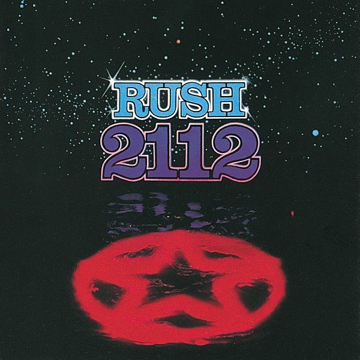

# 2112

By **Rush**

## Album Data

- **Catalog:** Beets
- **Format:** Digital, Album
- **Album:** 2112
- **Artist:** Rush
- **Albumartist:** Rush
- **Genre:** Progressive Metal
- **MusicBrainz Album Artist ID:** [534ee493-bfac-4575-a44a-0ae41e2c3fe4](https://musicbrainz.org/artist/534ee493-bfac-4575-a44a-0ae41e2c3fe4)
- **MusicBrainz Album ID:** [e709a8fb-2ea0-42ab-b074-b7df32df6a4e](https://musicbrainz.org/release/e709a8fb-2ea0-42ab-b074-b7df32df6a4e)
- **MusicBrainz Release Group ID:** [9243ac59-9390-37e1-abee-fcf31fb8035f](https://musicbrainz.org/release-group/9243ac59-9390-37e1-abee-fcf31fb8035f)
- **Year:** 2012
- **Catalog #:** 
- **Label:** 
- **Total Tracks:** 00

## Album Tracks

### Track 10 - Tom Sawyer

- **Artist:** Rush
- **Format:** AAC
- **Genre:** Progressive Rock
- **Length:** 5:00
- **MusicBrainz Track ID:** 
- **Title:** Tom Sawyer
- **Track:** 10
- **Year:** 2005

## See also

- [R30 [Disc 1]](R30_[Disc_1].md)
- [Roon: 2112 (Remastered)](../../Roon/Rush/2112_Remastered.md)
- [Roon: Clockwork Angels](../../Roon/Rush/Clockwork_Angels.md)
- [Roon: Moving Pictures (40th Anniversary Super Deluxe)](../../Roon/Rush/Moving_Pictures_40th_Anniversary_Super_Deluxe.md)
- [Roon: Moving Pictures](../../Roon/Rush/Moving_Pictures.md)
- [Vinyl: 2112](../../Vinyl/Rush/2112.md)
- [Vinyl: ](../../Vinyl/Rush/Rush.md)
