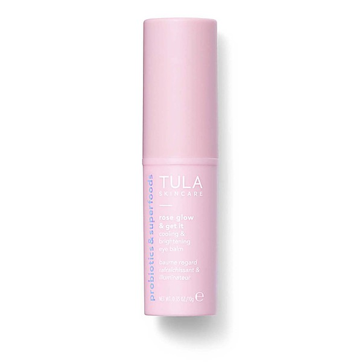

# Life Moves 7"

By **RVIVR**

## Album Data

- **Catalog:** Beets
- **Format:** Digital, Album
- **Album:** Life Moves 7"
- **Artist:** Rvivr
- **Albumartist:** RVIVR
- **Genre:** punk rock
- **MusicBrainz Album Artist ID:** [https](https://musicbrainz.org/artist/https)
- **MusicBrainz Album ID:** [https](https://musicbrainz.org/release/https)
- **MusicBrainz Release Group ID:** 
- **Year:** 2008
- **Catalog #:** 
- **Label:** 
- **Total Tracks:** 24

## Album Tracks

### Track 13 - Rain Down

- **Artist:** RVIVR
- **Format:** MP3
- **Genre:** Punk Rock
- **Length:** 2:44
- **MusicBrainz Track ID:** 
- **Title:** Rain Down
- **Track:** 13
- **Year:** 0000

### Track 14 - Edge Of Living

- **Artist:** RVIVR
- **Format:** MP3
- **Genre:** Punk Rock
- **Length:** 2:39
- **MusicBrainz Track ID:** 
- **Title:** Edge Of Living
- **Track:** 14
- **Year:** 0000

### Track 15 - Breathe Out

- **Artist:** RVIVR
- **Format:** MP3
- **Genre:** Electronic
- **Length:** 2:49
- **MusicBrainz Track ID:** 
- **Title:** Breathe Out
- **Track:** 15
- **Year:** 0000

### Track 16 - Real Mean

- **Artist:** RVIVR
- **Format:** MP3
- **Genre:** Pop Punk
- **Length:** 2:04
- **MusicBrainz Track ID:** 
- **Title:** Real Mean
- **Track:** 16
- **Year:** 0000

### Track 17 - Cut The Cord

- **Artist:** RVIVR
- **Format:** MP3
- **Genre:** Pop Punk
- **Length:** 3:14
- **MusicBrainz Track ID:** 
- **Title:** Cut The Cord
- **Track:** 17
- **Year:** 0000

### Track 18 - Grandma

- **Artist:** RVIVR
- **Format:** MP3
- **Genre:** Pop Punk
- **Length:** 2:14
- **MusicBrainz Track ID:** 
- **Title:** Grandma
- **Track:** 18
- **Year:** 0000

### Track 19 - Life and Death

- **Artist:** RVIVR
- **Format:** MP3
- **Genre:** Pop Punk
- **Length:** 2:15
- **MusicBrainz Track ID:** 
- **Title:** Life and Death
- **Track:** 19
- **Year:** 0000

### Track 20 - Animal Hands

- **Artist:** RVIVR
- **Format:** MP3
- **Genre:** Pop Punk
- **Length:** 3:46
- **MusicBrainz Track ID:** 
- **Title:** Animal Hands
- **Track:** 20
- **Year:** 0000

### Track 21 - Cold In You Bones

- **Artist:** RVIVR
- **Format:** MP3
- **Genre:** Pop Punk
- **Length:** 2:43
- **MusicBrainz Track ID:** 
- **Title:** Cold In You Bones
- **Track:** 21
- **Year:** 0000

### Track 22 - Pause

- **Artist:** RVIVR
- **Format:** MP3
- **Genre:** Pop Punk
- **Length:** 1:06
- **MusicBrainz Track ID:** 
- **Title:** Pause
- **Track:** 22
- **Year:** 0000

### Track 23 - Breathe In

- **Artist:** RVIVR
- **Format:** MP3
- **Genre:** Pop Punk
- **Length:** 2:48
- **MusicBrainz Track ID:** 
- **Title:** Breathe In
- **Track:** 23
- **Year:** 0000

### Track 24 - Change On Me

- **Artist:** RVIVR
- **Format:** MP3
- **Genre:** Pop Punk
- **Length:** 6:15
- **MusicBrainz Track ID:** 
- **Title:** Change On Me
- **Track:** 24
- **Year:** 0000

## See also

- [DIRTY WATER EP](DIRTY_WATER_EP.md)
- [RVIVR](RVIVR.md)
