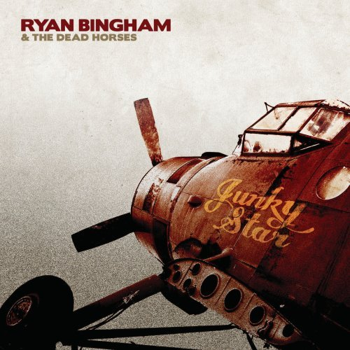

# Junky Star

By **Ryan Bingham & The Dead Horses**

## Album Data

- **Catalog:** Beets
- **Format:** Digital, Album
- **Album:** Junky Star
- **Artist:** Ryan Bingham & The Dead Horses
- **Albumartist:** Ryan Bingham & The Dead Horses
- **Genre:** Americana
- **MusicBrainz Album Artist ID:** [a4506310-0364-467a-8312-d05aa526e4b3](https://musicbrainz.org/artist/a4506310-0364-467a-8312-d05aa526e4b3)
- **MusicBrainz Album ID:** [327732e8-b903-4af3-bb80-d39175bc4c6c](https://musicbrainz.org/release/327732e8-b903-4af3-bb80-d39175bc4c6c)
- **MusicBrainz Release Group ID:** [7f0d5272-db8c-4a56-aade-e96619aad305](https://musicbrainz.org/release-group/7f0d5272-db8c-4a56-aade-e96619aad305)
- **Year:** 2010
- **Catalog #:** HUMP085
- **Label:** HumpHead
- **Total Tracks:** 12

## Album Tracks

### Track 01 - The Poet

- **Artist:** Ryan Bingham & The Dead Horses
- **Format:** AAC
- **Genre:** Americana
- **Length:** 4:57
- **MusicBrainz Track ID:** [3d0d1955-5bad-4793-b685-bfa713c451cb](https://musicbrainz.org/recording/3d0d1955-5bad-4793-b685-bfa713c451cb)
- **Title:** The Poet
- **Track:** 01
- **Year:** 2010

### Track 02 - The Wandering

- **Artist:** Ryan Bingham & The Dead Horses
- **Format:** AAC
- **Genre:** Americana
- **Length:** 3:08
- **MusicBrainz Track ID:** [627099b8-a372-4cac-8bf9-b9c4c6d35a9f](https://musicbrainz.org/recording/627099b8-a372-4cac-8bf9-b9c4c6d35a9f)
- **Title:** The Wandering
- **Track:** 02
- **Year:** 2010

### Track 03 - Strange Feelin' in the Air

- **Artist:** Ryan Bingham & The Dead Horses
- **Format:** AAC
- **Genre:** Americana
- **Length:** 4:45
- **MusicBrainz Track ID:** [afc67b91-a626-4e2c-978c-c06a5c221afd](https://musicbrainz.org/recording/afc67b91-a626-4e2c-978c-c06a5c221afd)
- **Title:** Strange Feelin' in the Air
- **Track:** 03
- **Year:** 2010

### Track 04 - Junky Star

- **Artist:** Ryan Bingham & The Dead Horses
- **Format:** AAC
- **Genre:** Americana
- **Length:** 4:49
- **MusicBrainz Track ID:** [e048b4e0-14be-4168-a915-6d0dbea19cb3](https://musicbrainz.org/recording/e048b4e0-14be-4168-a915-6d0dbea19cb3)
- **Title:** Junky Star
- **Track:** 04
- **Year:** 2010

### Track 05 - Depression

- **Artist:** Ryan Bingham & The Dead Horses
- **Format:** AAC
- **Genre:** Americana
- **Length:** 4:53
- **MusicBrainz Track ID:** [08b3ad8f-b824-44c1-a92d-cad7926654a5](https://musicbrainz.org/recording/08b3ad8f-b824-44c1-a92d-cad7926654a5)
- **Title:** Depression
- **Track:** 05
- **Year:** 2010

### Track 06 - Hallelujah

- **Artist:** Ryan Bingham & The Dead Horses
- **Format:** AAC
- **Genre:** Americana
- **Length:** 5:00
- **MusicBrainz Track ID:** [06289173-34d3-4647-881f-2bad2ab76988](https://musicbrainz.org/recording/06289173-34d3-4647-881f-2bad2ab76988)
- **Title:** Hallelujah
- **Track:** 06
- **Year:** 2010

### Track 07 - Yesterday's Blues

- **Artist:** Ryan Bingham & The Dead Horses
- **Format:** AAC
- **Genre:** Americana
- **Length:** 4:14
- **MusicBrainz Track ID:** [daa1510c-f841-42df-bede-88d17e0f5790](https://musicbrainz.org/recording/daa1510c-f841-42df-bede-88d17e0f5790)
- **Title:** Yesterday's Blues
- **Track:** 07
- **Year:** 2010

### Track 08 - Direction of the Wind

- **Artist:** Ryan Bingham & The Dead Horses
- **Format:** AAC
- **Genre:** Americana
- **Length:** 4:29
- **MusicBrainz Track ID:** [58160377-1629-4e34-a840-a9b9176d41b9](https://musicbrainz.org/recording/58160377-1629-4e34-a840-a9b9176d41b9)
- **Title:** Direction of the Wind
- **Track:** 08
- **Year:** 2010

### Track 09 - Lay My Head on the Rail

- **Artist:** Ryan Bingham & The Dead Horses
- **Format:** AAC
- **Genre:** Americana
- **Length:** 3:01
- **MusicBrainz Track ID:** [7d3e4e2d-6161-4343-b8a0-90641f7775fe](https://musicbrainz.org/recording/7d3e4e2d-6161-4343-b8a0-90641f7775fe)
- **Title:** Lay My Head on the Rail
- **Track:** 09
- **Year:** 2010

### Track 10 - Hard Worn Trail

- **Artist:** Ryan Bingham & The Dead Horses
- **Format:** AAC
- **Genre:** Americana
- **Length:** 3:55
- **MusicBrainz Track ID:** [2d3ca102-dfa8-4828-9699-f60626c2d9b1](https://musicbrainz.org/recording/2d3ca102-dfa8-4828-9699-f60626c2d9b1)
- **Title:** Hard Worn Trail
- **Track:** 10
- **Year:** 2010

### Track 11 - Self-Righteous Wall

- **Artist:** Ryan Bingham & The Dead Horses
- **Format:** AAC
- **Genre:** Americana
- **Length:** 5:18
- **MusicBrainz Track ID:** [caf6a7f0-ec94-4640-be0c-53fbc9654f0d](https://musicbrainz.org/recording/caf6a7f0-ec94-4640-be0c-53fbc9654f0d)
- **Title:** Self-Righteous Wall
- **Track:** 11
- **Year:** 2010

### Track 12 - All Choked Up Again

- **Artist:** Ryan Bingham & The Dead Horses
- **Format:** AAC
- **Genre:** Americana
- **Length:** 6:12
- **MusicBrainz Track ID:** [f5133956-fc0d-4f38-b4e6-c09c395569df](https://musicbrainz.org/recording/f5133956-fc0d-4f38-b4e6-c09c395569df)
- **Title:** All Choked Up Again
- **Track:** 12
- **Year:** 2010

