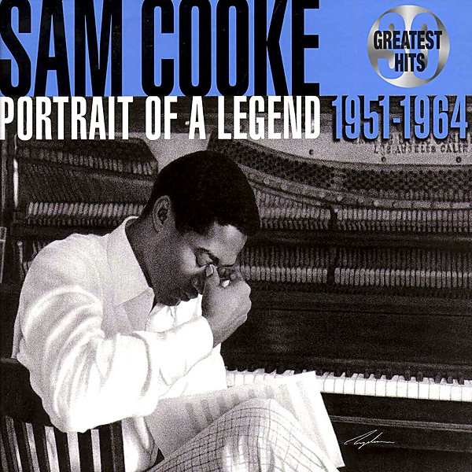

# Greatest Hits

By **Sam Cooke**

## Album Data

- **Catalog:** Beets
- **Format:** Digital, Album
- **Album:** Greatest Hits
- **Artist:** Sam Cooke
- **Albumartist:** Sam Cooke
- **Genre:** Soul
- **MusicBrainz Album Artist ID:** [6c8fd0be-d961-454c-aee0-4366a6dbc993](https://musicbrainz.org/artist/6c8fd0be-d961-454c-aee0-4366a6dbc993)
- **MusicBrainz Album ID:** [6e7ec185-85f3-4738-aaf6-c108da0d311d](https://musicbrainz.org/release/6e7ec185-85f3-4738-aaf6-c108da0d311d)
- **MusicBrainz Release Group ID:** [7d6a308c-169f-3eef-b29d-cba196f94844](https://musicbrainz.org/release-group/7d6a308c-169f-3eef-b29d-cba196f94844)
- **Year:** 1998
- **Catalog #:** 
- **Label:** 
- **Total Tracks:** 00

## Album Tracks

### Track 00 - You Send Me

- **Artist:** Sam Cooke
- **Format:** AAC
- **Genre:** Soul
- **Length:** 2:44
- **MusicBrainz Track ID:** 
- **Title:** You Send Me
- **Track:** 00
- **Year:** 0000

## See also

- [Unknown Album](Unknown_Album.md)
