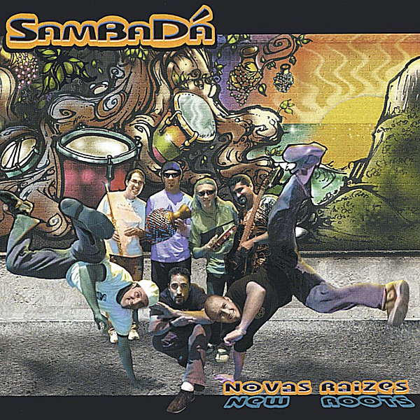

# Novas Raizes - New Roots

By **Sambadá**

## Album Data

- **Catalog:** Beets
- **Format:** Digital, Album
- **Album:** Novas Raizes - New Roots
- **Artist:** Sambadá
- **Albumartist:** Sambadá
- **Genre:** Funk
- **MusicBrainz Album Artist ID:** 
- **MusicBrainz Album ID:** 
- **MusicBrainz Release Group ID:** 
- **Year:** 2004
### Track 03 - Ela Deu O Radio

- **Artist:** Sambadá
- **Format:** ALAC
- **Genre:** Funk
- **Length:** 6:44
- **MusicBrainz Track ID:** 
- **Title:** Ela Deu O Radio
- **Track:** 03
- **Year:** 2004

### Track 04 - Axe Axe

- **Artist:** Sambadá
- **Format:** ALAC
- **Genre:** Funk
- **Length:** 5:53
- **MusicBrainz Track ID:** 
- **Title:** Axe Axe
- **Track:** 04
- **Year:** 2004

### Track 05 - Liberia

- **Artist:** Sambadá
- **Format:** ALAC
- **Genre:** Funk
- **Length:** 5:21
- **MusicBrainz Track ID:** 
- **Title:** Liberia
- **Track:** 05
- **Year:** 2004

### Track 06 - Rojao

- **Artist:** Sambadá
- **Format:** ALAC
- **Genre:** Funk
- **Length:** 3:45
- **MusicBrainz Track ID:** 
- **Title:** Rojao
- **Track:** 06
- **Year:** 2004

### Track 07 - Nasci Para Bailar

- **Artist:** Sambadá
- **Format:** ALAC
- **Genre:** Funk
- **Length:** 7:04
- **MusicBrainz Track ID:** 
- **Title:** Nasci Para Bailar
- **Track:** 07
- **Year:** 2004

### Track 08 - Pego Meu Violao

- **Artist:** Sambadá
- **Format:** ALAC
- **Genre:** Funk
- **Length:** 4:37
- **MusicBrainz Track ID:** 
- **Title:** Pego Meu Violao
- **Track:** 08
- **Year:** 2004

### Track 09 - The Cruz I

- **Artist:** Sambadá
- **Format:** ALAC
- **Genre:** Funk
- **Length:** 2:27
- **MusicBrainz Track ID:** 
- **Title:** The Cruz I
- **Track:** 09
- **Year:** 2004

### Track 10 - The Cruz II

- **Artist:** Sambadá
- **Format:** ALAC
- **Genre:** Funk
- **Length:** 4:04
- **MusicBrainz Track ID:** 
- **Title:** The Cruz II
- **Track:** 10
- **Year:** 2004

### Track 11 - The Cruz III

- **Artist:** Sambadá
- **Format:** ALAC
- **Genre:** Funk
- **Length:** 2:04
- **MusicBrainz Track ID:** 
- **Title:** The Cruz III
- **Track:** 11
- **Year:** 2004

### Track 12 - Berimbau Ja Cancou

- **Artist:** Sambadá
- **Format:** ALAC
- **Genre:** Funk
- **Length:** 4:05
- **MusicBrainz Track ID:** 
- **Title:** Berimbau Ja Cancou
- **Track:** 12
- **Year:** 2004

### Track 13 - Vem CA Samba

- **Artist:** Sambadá
- **Format:** ALAC
- **Genre:** Funk
- **Length:** 5:10
- **MusicBrainz Track ID:** 
- **Title:** Vem CA Samba
- **Track:** 13
- **Year:** 2004

### Track 14 - Ze

- **Artist:** Sambadá
- **Format:** ALAC
- **Genre:** Funk
- **Length:** 7:04
- **MusicBrainz Track ID:** 
- **Title:** Ze
- **Track:** 14
- **Year:** 2004

### Track 15 - Nao Despere

- **Artist:** Sambadá
- **Format:** ALAC
- **Genre:** Funk
- **Length:** 3:26
- **MusicBrainz Track ID:** 
- **Title:** Nao Despere
- **Track:** 15
- **Year:** 2004

### Track 16 - SambaDá Batucada

- **Artist:** Sambadá
- **Format:** ALAC
- **Genre:** Funk
- **Length:** 5:07
- **MusicBrainz Track ID:** 
- **Title:** SambaDá Batucada
- **Track:** 16
- **Year:** 2004

### Track 17 - Untitled

- **Artist:** Sambadá
- **Format:** ALAC
- **Genre:** Funk
- **Length:** 0:04
- **MusicBrainz Track ID:** 
- **Title:** Untitled
- **Track:** 17
- **Year:** 2004

