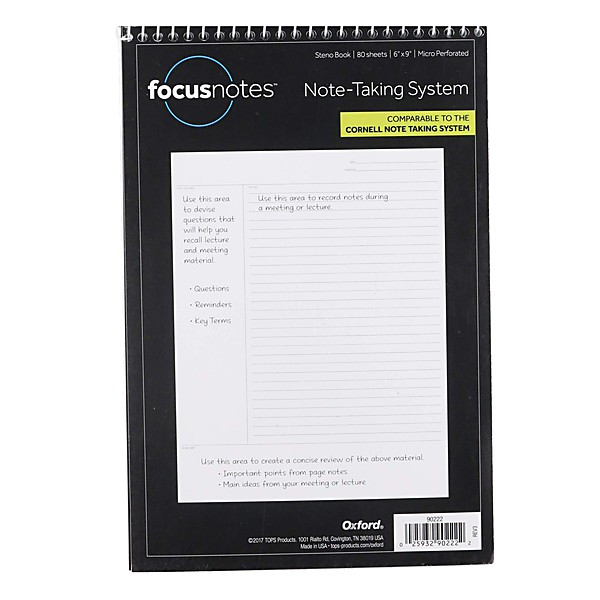

# 1950

By **Sammy Kaye Orchestra (Don Cornell)**

## Album Data

- **Catalog:** Beets
- **Format:** Digital, Album
- **Album:** 1950
- **Artist:** Sammy Kaye Orchestra (don Cornell)
- **Albumartist:** Sammy Kaye Orchestra (Don Cornell)
- **Genre:** Unknown
- **MusicBrainz Album Artist ID:** 
- **MusicBrainz Album ID:** 
- **MusicBrainz Release Group ID:** 
- **Year:** 1950
- **Catalog #:** 
- **Label:** 
- **Total Tracks:** 00

## Album Tracks

### Track 00 - It Isn't Fair

- **Artist:** Sammy Kaye Orchestra (Don Cornell)
- **Format:** AAC
- **Genre:** Unknown
- **Length:** 3:22
- **MusicBrainz Track ID:** 
- **Title:** It Isn't Fair
- **Track:** 00
- **Year:** 1950

