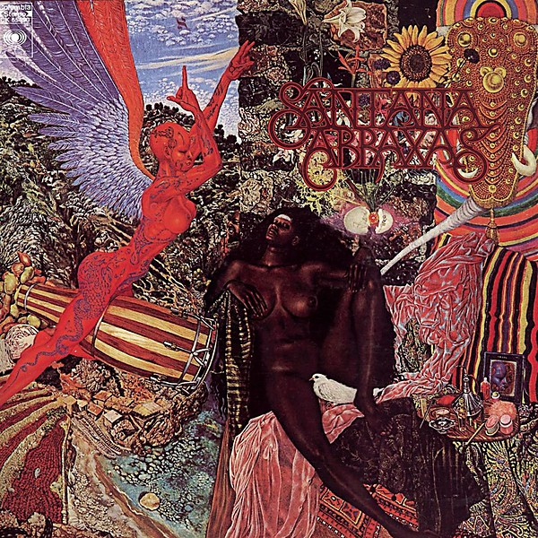

# Abraxas

By **Santana**

## Album Data

- **Catalog:** Beets
- **Format:** Digital, Album
- **Album:** Abraxas
- **Artist:** Santana
- **Albumartist:** Santana
- **Genre:** Psychedelic Rock
- **MusicBrainz Album Artist ID:** [9a3bf45c-347d-4630-894d-7cf3e8e0b632](https://musicbrainz.org/artist/9a3bf45c-347d-4630-894d-7cf3e8e0b632)
- **MusicBrainz Album ID:** [e91c52c3-5cb5-43ad-91df-16edeb97ded5](https://musicbrainz.org/release/e91c52c3-5cb5-43ad-91df-16edeb97ded5)
- **MusicBrainz Release Group ID:** [43424c73-fc58-36b0-b9cf-f8b057ac0603](https://musicbrainz.org/release-group/43424c73-fc58-36b0-b9cf-f8b057ac0603)
- **Year:** 2014
- **Catalog #:** 07822-19080-2
- **Label:** Arista
- **Total Tracks:** 13

## Album Tracks

### Track 01 - (Da Le) Yaleo

- **Artist:** Santana
- **Format:** ALAC
- **Genre:** Pop Rock
- **Length:** 5:55
- **MusicBrainz Track ID:** [0dc7ee06-f8a3-457d-94eb-040ee3f87c8e](https://musicbrainz.org/recording/0dc7ee06-f8a3-457d-94eb-040ee3f87c8e)
- **Title:** (Da Le) Yaleo
- **Track:** 01
- **Year:** 1999

### Track 04 - Africa Bamba

- **Artist:** Santana
- **Format:** ALAC
- **Genre:** Pop Rock
- **Length:** 4:44
- **MusicBrainz Track ID:** [04bf80a4-0218-4bc3-8c69-dfd2901c71cc](https://musicbrainz.org/recording/04bf80a4-0218-4bc3-8c69-dfd2901c71cc)
- **Title:** Africa Bamba
- **Track:** 04
- **Year:** 1999

### Track 07 - Maria Maria

- **Artist:** Santana
- **Format:** ALAC
- **Genre:** Soul
- **Length:** 4:24
- **MusicBrainz Track ID:** [221be129-ea4c-47c9-aebd-9e8e478d5dc7](https://musicbrainz.org/recording/221be129-ea4c-47c9-aebd-9e8e478d5dc7)
- **Title:** Maria Maria
- **Track:** 07
- **Year:** 1999

### Track 08 - Migra

- **Artist:** Santana
- **Format:** ALAC
- **Genre:** Pop Rock
- **Length:** 5:30
- **MusicBrainz Track ID:** [75dfef8a-d2e2-4083-97db-96824dc533fc](https://musicbrainz.org/recording/75dfef8a-d2e2-4083-97db-96824dc533fc)
- **Title:** Migra
- **Track:** 08
- **Year:** 1999

### Track 11 - El farol

- **Artist:** Santana
- **Format:** ALAC
- **Genre:** Smooth Jazz
- **Length:** 4:53
- **MusicBrainz Track ID:** [1cb7ffb8-40a7-4200-afe6-23053be393c3](https://musicbrainz.org/recording/1cb7ffb8-40a7-4200-afe6-23053be393c3)
- **Title:** El farol
- **Track:** 11
- **Year:** 1999

### Track 12 - Primavera

- **Artist:** Santana
- **Format:** ALAC
- **Genre:** Soul
- **Length:** 6:20
- **MusicBrainz Track ID:** [f2d2b26b-d6d5-43d9-8c7c-6b16b92b9f65](https://musicbrainz.org/recording/f2d2b26b-d6d5-43d9-8c7c-6b16b92b9f65)
- **Title:** Primavera
- **Track:** 12
- **Year:** 1999

### Track 10 - Wishing It Was

- **Artist:** Santana featuring Eagle‐Eye Cherry
- **Format:** ALAC
- **Genre:** Soul
- **Length:** 4:54
- **MusicBrainz Track ID:** [3f1750ef-6a9e-4703-92a5-643592aa22e3](https://musicbrainz.org/recording/3f1750ef-6a9e-4703-92a5-643592aa22e3)
- **Title:** Wishing It Was
- **Track:** 10
- **Year:** 1999

### Track 13 - The Calling / Day of Celebration

- **Artist:** Santana featuring Eric Clapton / Santana
- **Format:** ALAC
- **Genre:** Soul
- **Length:** 6:47
- **MusicBrainz Track ID:** [d2f9f1eb-3f72-48ac-83eb-d2b8ffd7712b](https://musicbrainz.org/recording/d2f9f1eb-3f72-48ac-83eb-d2b8ffd7712b)
- **Title:** The Calling / Day of Celebration
- **Track:** 13
- **Year:** 1999

### Track 03 - Put Your Lights On

- **Artist:** Santana featuring Everlast
- **Format:** ALAC
- **Genre:** Alternative Rock
- **Length:** 4:47
- **MusicBrainz Track ID:** [0eb6f9ae-1985-436b-ac4f-4c5202f83e5f](https://musicbrainz.org/recording/0eb6f9ae-1985-436b-ac4f-4c5202f83e5f)
- **Title:** Put Your Lights On
- **Track:** 03
- **Year:** 1999

### Track 06 - Do You Like the Way

- **Artist:** Santana featuring Lauryn Hill & CeeLo Green
- **Format:** ALAC
- **Genre:** Soul
- **Length:** 5:56
- **MusicBrainz Track ID:** [49bf8824-424d-4991-b607-d45c346d08b2](https://musicbrainz.org/recording/49bf8824-424d-4991-b607-d45c346d08b2)
- **Title:** Do You Like the Way
- **Track:** 06
- **Year:** 1999

### Track 09 - Corazón espinado

- **Artist:** Santana featuring Maná
- **Format:** ALAC
- **Genre:** Soul
- **Length:** 4:38
- **MusicBrainz Track ID:** [63b25f95-86c2-42bd-bb79-f223e173d1d7](https://musicbrainz.org/recording/63b25f95-86c2-42bd-bb79-f223e173d1d7)
- **Title:** Corazón espinado
- **Track:** 09
- **Year:** 1999

### Track 02 - Love of My Life

- **Artist:** Santana featuring Dave Matthews
- **Format:** ALAC
- **Genre:** Pop Rock
- **Length:** 5:49
- **MusicBrainz Track ID:** [8fb52b94-09cb-4107-860a-e65bd0580e2c](https://musicbrainz.org/recording/8fb52b94-09cb-4107-860a-e65bd0580e2c)
- **Title:** Love of My Life
- **Track:** 02
- **Year:** 1999

### Track 05 - Smooth

- **Artist:** Santana featuring Rob Thomas
- **Format:** ALAC
- **Genre:** Rock
- **Length:** 5:00
- **MusicBrainz Track ID:** [fd635cea-3510-4d4b-930d-9ed69f754685](https://musicbrainz.org/recording/fd635cea-3510-4d4b-930d-9ed69f754685)
- **Title:** Smooth
- **Track:** 05
- **Year:** 1999

## See also

- [Supernatural](Supernatural.md)
- [Ultimate Santana](Ultimate_Santana.md)
- [Roon: Abraxas](../../Roon/Santana/Abraxas.md)
- [Roon: Africa Speaks](../../Roon/Santana/Africa_Speaks.md)
- [Roon: Blessings and Miracles](../../Roon/Santana/Blessings_and_Miracles.md)
- [Roon: Borboletta](../../Roon/Santana/Borboletta.md)
- [Roon: Caravanserai](../../Roon/Santana/Caravanserai.md)
- [Roon: Guitar Heaven](../../Roon/Santana/Guitar_Heaven-_The_Greatest_Guitar_Classics_Of_All_Time_Deluxe_Version.md)
- [Roon: Lotus (Live at Osaka Kosei Nenkin Kaikan, Osaka, Japan - July 1973)](../../Roon/Santana/Lotus_Live_at_Osaka_Kosei_Nenkin_Kaikan__Osaka__Japan_-_July_1973.md)
- [Roon: Santana](../../Roon/Santana/Santana.md)
- [Roon: Supernatural (Legacy Edition)](../../Roon/Santana/Supernatural_Legacy_Edition.md)
- [Roon: Welcome](../../Roon/Santana/Welcome.md)
- [Vinyl: Abraxas](../../Vinyl/Santana/Abraxas.md)
- [Vinyl: ](../../Vinyl/Santana/Santana.md)
- [Vinyl: "Woodstock (Saturday, August 16, 1969)"](../../Vinyl/Santana/Woodstock_Saturday__August_16__1969.md)
